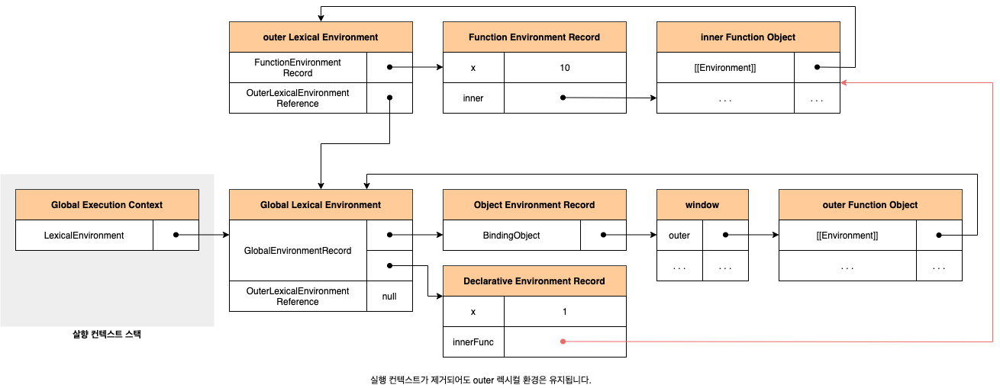
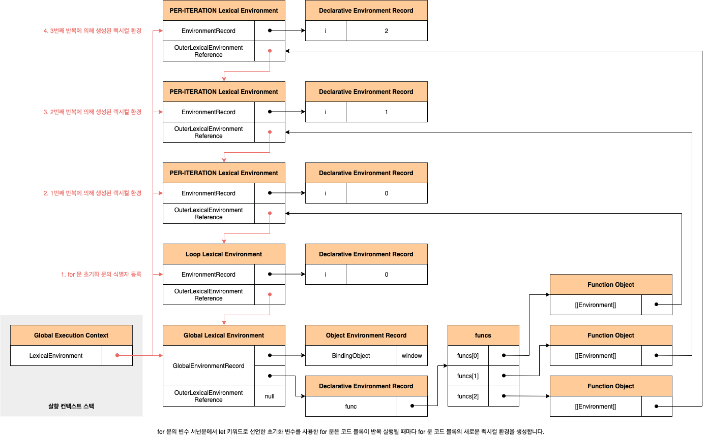

# 클로저

클로저는 자바스크립트 고유의 개념이 아닙니다. 함수를 일급 객체로 취급하는 함수형 프로그래밍 언어에서 사용되는 중요한 특성입니다. 클로저는 자바스크립트 고유의 개념이 아니므로 클로저의 정의가 ECMAScript 사양에 등장하지 않았습니다. MDN에서는 클로저에 대해 다음과 같이 정의하고 있습니다.

> 클로저는 함수와 그 함수가 선언된 렉시컬 환경과의 조합입니다. (A closure is the combination of a function and the lexical environment within which that function was declared)

## 1. 렉시컬 스코프

자바스크립트 엔진은 함수를 어디서 호출했는지가 아니라 함수를 어디에 정의했는지에 따라 상위 스코프를 결정합니다. 이를 **렉시컬 스코프**(정적 스코프)라고 합니다. 스코프에 실체는 실행 켄텍스트의 렉시컬 환경입니다. 이 렉시컬 환경은 자신의 **외부 렉시컬 환경에 대한 참조**(Outer Lexical Environment Reference)를 통해 상위 렉시컬 환경과 연결됩니다. 렉시컬 환경의 **외부 렉시컬 환경에 대한 참조**에 저장할 참조값이 바로 상위 렉시컬 환경에 대한 참조이며, 이것이 상위 스코프입니다.

## 2. 함수 객체의 내부 슬롯 \[[Environment]]

함수의 정의가 평가되어 함수 객체를 생성할 떄 자신이 정의된 환경에 의해 결정된 상위 스코프의 참조를 함수 객체 자신의 내부 슬롯 `[[Evnironment]]`에 저장합니다. 이때 자신의 내부 슬롯 `[[Environment]]`에 저장된 상위 스코프의 참조는 현재 실행 중인 실행 컨텍스트의 렉시컬 환경을 가리킵니다. 함수 렉시컬 환경의 구성 요소인 외부 렉시컬 환경에 대한 참조에는 함수 객체의 내부 슬롯 `[[Environment]]`에 저장된 렉시컬 환경의 참조가 할당됩니다.

```javascript
const x = 1;

function foo() {
  const x = 10;
  bar();
}

function bar() {
  console.log(x);
}

foo();
```

![함수 객체의 내부 슬롯 [[Environment]]에는 상위 스코프가 저장됩니다.](../_images/javascript-closure01.png)

## 3. 클로저와 렉시컬 환경

외부 함수보다 중첩 함수가 더 오래 유지되는 경우 중첩 함수는 이미 생명 주기가 종료한 외부 함수의 변수를 참조할 수 있습니다. 이러한 중첩 함수를 **클로저**(Closure)라고 부릅니다. 자바스크립트의 모든 함수는 자신의 상위 스코프를 기억한다고 했습니다. 가비지 컬렉터는 누군가가 참조하고 있는 메모리 공간을 함부로 해제하지 않습니다. 따라서 모든 함수가 기억하는 상위 스코프는 함수를 어디서 호출하든 상관없이 유지됩니다. 따라서 함수는 언제나 자신이 기억하는 상위 스코프의 식별자를 참조할 수 있으며, 식별자에 바인딩된 값을 변경할 수도 있습니다.

```javascript
const x = 1;

function outer() {
  const x = 10;
  const inner = function () {
    console.log(x);
  };

  return inner;
}

const innerFunc = outer();
innerFunc(); // 10
```



자바스크립트의 모든 함수는 상위 스코프를 기억하므로 이론적으로 모든 함수는 클로저입니다. 하지만 일반적으로 모든 함수를 크로저라고 하지는 않습니다. 상위 스코프의 어떤 식별자도 참조하지 않는 경우 대부분의 모던 브라우저는 최적화를 통해 상위 스코프를 기억하지 않습니다. 참조하지도 않는 식별자를 기억하는 것은 메모리 낭비이기 때문입니다. 따라서 이런 경우는 클로저라고 할 수 없습니다. 외부 함수보다 중첩 함수의 생명주기가 짧은 경우, 중첩 함수는 클로저였지만 외부 함수보다 일찍 소멸되기 때문에 생명 주기가 종료된 외부 함수의 식별자를 참조할 수 있다는 클로저의 본질에 부합하지 않습니다. 따라서 이런 경우도 일반적으로 클로저라고 하지 않습니다. 클로저는 중첩 함수가 상위 스코프의 식별자를 참조하고 있고 중첩 함수가 외부 함수보다 더 오래 유지되는 경우에 한정하는 것이 일반적입니다.

클로저에 의해 참조되는 상위 스코프의 변수를 **자유 변수**(Free Variable)라고 부릅니다. **클로저**(Closure)란 **함수가 자유 변수에 대해 닫혀있다**라는 의미입니다. 이를 좀 더 알기 쉽게 의역하자면 **자유 변수에 묶여있는 함수**라고 할 수 있습니다. 이론적으로 클로저는 상위 스코프를 기억해야 하므로 불필요한 메모리의 점유를 걱정할 수도 있겠습니다. 하지만 모던 자바스크립트 엔진은 최적화가 잘 되어 있어서 클로저가 참조하고 있지 않는 식별자는 기억하지 않습니다. 즉, 상위 스코프의 식별자 중에서 기억해야 할 식별자만 기억합니다.

## 4. 자주 발생하는 실수

```javascript
var funcs = [];

for (var i = 0; i < 3; i += 1) {
  funcs[i] = function () {
    return i;
  };
}

for (var j = 0; j < funcs.length; j += 1) {
  console.log(focus[j]());
}
```

이때 `funcs` 배열의 요소로 추가된 3개의 함수가 `0`, `1`, `2`를 반환할 것으로 기대했다면 아쉽지만 그렇지 않습니다. `for` 문의 변수 선운문에서 `var` 키워드로 선언한 `i` 변수는 블록 레벨 스코프가 아닌 함수 레벨 스코프를 갖기 때문에 전역 변수입니다. 전역 분수 `i`에는 `0`, `1`, `2`가 순차적으로 할당됩니다. 따라서 `funcs` 배열의 요소로 추가한 함수를 호출하면 전역 변수 `i`를 참조하여 `i`의 값 `3`이 출력됩니다. 클로저를 사용해 위 예제를 바르게 동작하는 코드로 만들어봅시다.

```javascript
var funcs = [];

for (var i = 0; i < 3; i += 1) {
  funcs[i] = (function (id) {
    return function () {
      return id;
    };
  })(i);
}

for (var j = 0; j < funcs.length; j += 1) {
  console.log(funcs[j]());
}
```

즉시 실행 함수의 매개변수 `id`는 즉시 실행 함수가 반환한 중첩 함수의 상위 스코프에 존재합니다. 즉시 실행 함수가 반환한 중첩 함수는 자신의 상위 스코프(즉시 실행 함수의 렉시컬 환경)를 기억하는 클로저이고, 매개변수 `id`는 즉시 실행 함수가 반환한 중첩 함수에 묶여있는 자유 변수가 되어 그 값이 유지됩니다. ES6의 `let` 키워드를 사용하면 이 같은 번거로움이 깔끔하게 해결됩니다.

```javascript
const funcs = [];

for (let i = 0; i < 3; i += 1) {
  funcs[i] = function () {
    return i;
  };
}

for (let i = 0; i < funcs.length; i += 1) {
  console.log(funcs[i]());
}
```

`for` 문의 벼수 선운문에서 `let` 키워드로 선언한 변수를 사용하면 `for` 문의 코드 블록이 반복 실행될 때마다 `for` 문 코드 블록의 새로운 렉시컬 환경이 생성됩니다. 만약 `for` 문의 코드 블록 내에서 정의한 함수가 있다면 이 함수의 상위 스코프는 `for` 문의 코드 블록이 반복 실행될 때마다 생성된 `for` 문 코드 블록의 새로운 렉시컬 환경입니다.



이처럼 `var` 키워드로 사용하지 않는 ES6 반복문(`for...in`문, `for ... of`문, `while` 문 등)은 코드 블록을 반복 실행할 때마다 새로운 렉시컬 환경을 생서앟여 반복할 당시의 상태를 마치 스냅숏 찍는 것처럼 저장합니다. 단, 이는 반복문의 코드 블록 내부에서 함수를 정의할 때 의미가 있습니다. 반복문의 코드 블록 내부에 함수 정의가 없는 반복문이 생성하는 새로운 렉시컬 환경은 반복 직후, 아무도 참조하지 않기 떄문에 가비지 컬렉션의 대상이 됩니다.

## 5. 출처

- 모던 자바스크립트 Deep Dive - 이웅모
