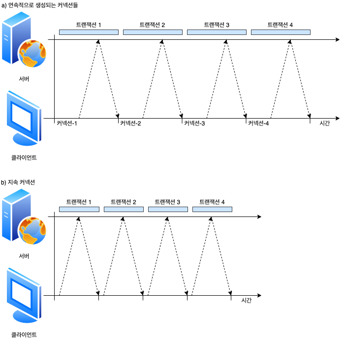
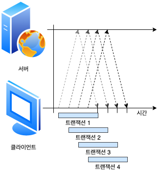
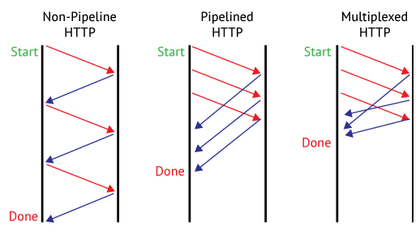
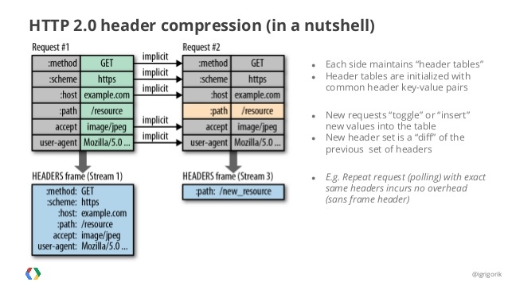

# HTTP

## 1 프로토콜 버전

오늘날 쓰이고 있는 HTTP 프로토콜은 버전이 여러 가지입니다. HTTP 프로토콜의 여러 변형을 모두 잘 다루려면 HTTP 애플리케이션이 일을 열심히 해야 합니다.

##### HTTP/0.9

1991년의 HTTP 프로토타입은 HTTP/0.9로 알려져 있습니다. 이 프로토콜은 심각한 디자인 결함이 다수 있고 구식 클라이언트하고만 같이 사용할 수 있습니다. HTTP/9.0은 오직 GET 메서드만 지원하고, 멀티미디어 콘텐츠에 대한 MIME 타입이나, HTTP 헤더, 버전 번호는 지원하지 않습니다. HTTP/9.0는 원래 간단한 HTML 객체를 받아 오기 위해 만들어진 것입니다. HTTP/9.0는 금방 HTTP/1.0으로 대체되었습니다.

HTTP 버전 0.9는 HTTP 프로토콜의 초기 버전입니다. 그것은 오늘날 HTTP 가 갖고 있는 요청과 응답 메시지의 시초이지만, 훨씬 단순한 프로토콜로 되어 있습니다. HTTP/0.9 메시지도 마찬가지로 요청과 응답으로 이루어져 있지만, 요청은 그저 메서드와 요청 URL을 갖고 있을 뿐이며, 응답은 오직 엔터티로만 되어 있습니다. 버전 정보도 없고(그 시절엔 최초이지 유일한 버전이었습니다), 상태 코드나 사유 구절도 없으며, 헤더도 포함되어 있지 않습니다. 이와 같은 지나칠 정도의 단순함 때문에, HTTP/0.9로는 다양한 상황에 대응할 수 없습니다.

##### HTTP/1.0

1.0은 처음으로 널리 쓰이기 시작한 HTTP 버전입니다. HTTP/1.0은 버전 번호, HTTP 헤더, 추가 메서드, 멀티미디어 객체 처리를 추가했습니다. HTTP/1.0은 시각적으로 매력적인 웹페이지와 상호작용하는 폼을 실현했고, 이는 월드 와이드 웹을 대세로 만들었습니다. HTTP/1.0은 결코 잘 정의된 명세가 아닙니다. HTTP가 상업적, 학술적으로 급성장하던 시기에 만들어진, 잘 동작하는 용례들의 모음에 가깝습니다.

##### HTTP/1.0+

1990년대 중반, 월드 와이드 웹이 급격히 팽창하고 상업적으로도 성공하면서 여러 유명 웹 클라이언트 서버 들은 그에 따른 요구를 만족시키기 위해 발 빠르게 HTTP에 기능을 추가해갔습니다. 오래 지속되는 `keep-alive` 커넥션, 가상 호스팅 지원, 프락시 연결 지원을 포함해 많은 기능이 공식적이지 않지만 사실상의 표준으로 HTTP에 추가되었습니다. 이 규격 외의 확장된 HTTP 버전을 흔히 HTTP/1.0+라고 부릅니다.

##### HTTP/1.1

HTTP/1.1은 HTTP 설계의 구조적 결함 교정, 두드러진 성능 최적화, 잘못된 기능 제거에 집중했습니다. 뿐만 아니라 HTTP/1.1은 더 복잡해진 웹 애플리케이션과 배포(1990년대 후반에 이미 쓰이고 있었습니다)를 지원합니다. HTTP/1.1은 현재 HTTP 버전입니다.

##### HTTP/2.0

HTTP/2.0은, HTTP/1.1 성능 문제를 개선하기 위해 구글의 SPDY 프로토콜을 기반으로 설계가 진행 중인 프로토콜입니다.

## 2. HTTP/1.1의 단점

### 2.1 동작 방식

- Connection당 하나의 요청을 처리 하도록 설계
- 동시 전송이 불가능하고 요청과 응답이 순차적으로 이루어짐
- HTTP 문서 안에 포함된 다수의 리소스(Image, CSS, Script)를 처리하려면 요청할 리소스 개수에 비례해서 Latency(대기 시간)는 길어짐


### 2.2 RTT(Round Trip Time) 증가

앞서 말한것처럼 HTTP/1.1의 경우 일반적으로 하나의 Connection에 하나의 요청을 처리하게 됩니다. 이렇다 보니 매 요청별로 Connection을 만들게 되고 TCP 상에서 동작하는 HTTP의 특성상 3-Way Handshake가 반복적으로 일어나고 또한 불필요한 RTT 증가와 네트워크 지연을 초래하여 성능을 저하 시키게 됩니다.

### 2.3 HOL(Head of Line) Blocking - 특정 응답의 지연

HTTP/1.1의 Connection당 하나의 요청처리를 개선할 수 있는 기법중 Pipelining이 존재하는데 이것은 하나의 Connection을 통해서 다수개의 파일을 요청/응답 받을 수 있는 기법을 말합니다. 이 기법을 통해서 어느정도의 성능 향상을 꾀 할 수 있으나 큰 문제점이 하나 있습니다.


하나의 TCP 연결에서 3개의 이미지(a.png, b.png, c.png)를 얻으려고 한다. 순서대로 첫번째 이미지를 요청하고 응답받고 다음 이미지를 요청하게 되는데, 만약 첫번째 이미지를 요청하고 응답이 지연되면 위의 그림과 같이 두, 세번째 이미지는 당연히 첫번째 이미지의 응답처리가 완료되기 전까지 대기하게 되며 이와 같은 현상을 HTTP의 Head of Line Blocking이라 부르며 파이프 라이닝의 큰 문제점 중 하나입니다.

### 2.4 무거운 Header 구조 (특히 Cookie)

HTTP/1.1의 헤더에는 많은 메타정보들이 저장되어 있습니다. 사용자가 방문한 웹페이지는 다수의 HTTP 요청이 발생하게 되는데 이 경우 매 요청시 마다 중복된 헤더값을 전송하게 되며(별도의 Domain Sharding을 하지 않았을 경우) 또한 해당 Domain에 설정된 Cookie 정보도 매 요청시 마다 헤더에 포함되어 전송되며 어쩔 땐 요청을 통해서 전송하려는 값보다 헤더 값이 더 큰 경우도 비일비재 합니다.

## 3. HTTP/1.1의 단점 보완을 위한 커넥션 관리

### 3.1 병렬 커넥션

HTTP 클라이언트가 여러 개의 커넥션을 맺음으로서 여러 개의 HTTP 트랜잭션을 병렬로 처리할 수 있게 합니다.


#### 병렬 커넥션은 페이지를 더 빠르게 내려받습니다.

단일 커넥션의 대역폭 제한과 커넥션이 동작하지 않고 있는 시간을 활용하면, 객체가 여러 개 있는 웹페이지를 더 빠르게 내려받을 수 있을 것입니다. 하나의 커넥션으로 객체들을 로드할 때의 대역폭 제한과 시간을 줄일 수 있다면 더 빠르게 로드할 수 있을 것입니다. 각 커넥션의 지연 시간을 겹치게 하면 총 지연 시간을 줄일 수 있고, 클라이언트의 인터넷 대역폭을 한 개의 커넥션이 다 써버리는 것이 아니라면 나버지 객체를 내려받는 데에 남은 대역폭을 사용할 수 있습니다.

#### 병렬 커넥션이 항상 더 빠르지는 않습니다.

병렬 커넥션이 일반적으로 더 빠르기는 하지만, 항상 그렇지는 않습니다. 클라이언트의 네트워크 대역폭이 좁을 때는 대부분 시간을 데이터를 전송하는 데만 쓸 것입니다. 여러 개의 객체를 병렬로 내려받는 경우, 이 제한된 대역폭 내에서 각 객체를 전송받는 것은 느리기 때문에 성능상의 장점은 거의 없어집니다.

또한 다수의 커넥션은 메모리를 많이 소모하고 자체적인 성능 문제를 발생시킵니다. 복잡한 웹페이지는 수십 개에서 수 백 개의 객체를 포함합니다. 클라이언트가 수백개의 커넥션을 열 수도 있겠지만, 서버는 다른 여러 사용자의 요청도 함께 처리해야 하기 때문에 수백 개의 커넥션을 호용하는 경우는 드뭅니다. 브라우저는 실제로 병렬 커넥션을 사용하기는 하지만 적은 수의 병렬 커넥션만을 허용합니다. 서버는 특정 클라이언트로부터 과도한 수의 커넥션이 맺어졌을 경우, 그것을 임의로 끊어버릴 수 있습니다.

#### 병렬 커넥션은 더 빠르게 느껴질 수 있습니다.

병렬 커넥션이 페이지를 항상 더 빠르게 로드하지는 않습니다. 병렬 커넥션이 실제로 페이지를 더 빠르게 내려받는 것은 아니지만, 화면에 여러 개의 객체가 동시에 보이면서 내려받고 있는 상황을 볼 수 있기 때문에 사용자는 더 바르게 내려받고 있는 것처럼 느낄 수 있습니다. 사실 사람들은 페이지의 총 다운로드 시간이 더 걸린다 하더라도, 화면 전체에서 여러 작업이 일어나는 것을 눈으로 확인할 수 있으면 그 것을 더 빠르다고 여깁니다.

### 3.2 지속 커넥션

웹 클라이언트는 보통 같은 사이트에 여러 개의 커넥션을 맺습니다. 서버에 HTTP 요청을 하기 시작한 애플리케이션은 웹페이지 내의 리소스를 가져오기 위해서 그 서버에 또 요청하게 될 것입니다. 이 속성을 사이트 **지역성**(Site Locality)라 부릅니다.

따라서 HTTP/1.1을 지원하는 기기는 처리가 완료된 후에도 TCP 커넥션을 유지하여 앞으로 있을 HTTP 요청에 재사용할 수 있습니다. 처리가 완료된 후에도 계속 연결된 상태로 있는 TCP 커넥션을 지속 커넥션이라고 부릅니다. 비지속 커넥션은 각 처리가 끝날 때마다 커넥션을 끊지만, 지속 커넥션은 클라이언트나 서버가 커넥션을 끊기 전까지는 트랜잭션 간에도 커넥션을 유지합니다. 해당 서버에 이미 맺어져 있는 지속 커넥션을 재사용함으로써, 커넥션을 맺기 위한 준비작업에 따르는 시간을 절약할 수 있습니다. 게다가 이미 맺어져 잇는 커넥션은 TCP의 느린 시작으로 인한 지연을 피함으로써 더 빠르게 데이터를 전송할 수 있습니다.

#### 지속 커넥션 vs 병렬 커넥션

앞서 봤듯이, 병렬 커넥션은 여러 객체가 있는 페이지를 더 빠르게 전송합니다. 하지만 병렬 커넥션에는 다음과 같은 몇 가지 단점이 있습니다.

- 각 트랜젝션마다 새로운 커넥션을 맺고 끊기 때문에 시간과 대역폭이 소요됩니다.
- 각각의 새로운 커넥션은 TCP 느린 시작 때문에 성능이 떨어집니다.
- 시제로 연결할 수 있는 병렬 커넥션의 수에는 제한이 있습니다.

지속 커넥션은 병렬 커넥션에 비해 몇 가지 장점이 있습니다. 커넥션을 맺기 위한 사잔 작업과 지연을 줄여주고, 튜닝된 커넥션을 유지하며, 커넥션의 수를 줄여줍니다. 하지만 지속 커넥션을 잘못 관리할 경우, 곘고 연결된 상태로 잇는 수많은 커넥션이 쌀이게 될 것입니다. 이는 로컬의 리소스 그리고 원격의 클라이언트와 서버의 리소스에 불필요한 소모를 발생시킵니다.

지속 커넥션은 병렬 커넥션과 함께 사용될 때에 가장 효과적입니다. 오늘날 웹 애플리케이션은 적은 수의 병렬 커넥션만을 맺고 그것을 유지합니다. 두 가지 지속 커넥션 타입이 잇는데, HTTP/1.0에는 **keep-alive** 커넥션이 있고 HTTP/1.1에는 **지속** 커넥션이 있습니다.

#### HTTP/1.0+의 Keep-Alive 커넥션

많은 HTTP/1.0 브라우저와 서버들은 일찍부터 다소 실험적이었던 keep-alive 커넥션이라는 지속 커넥션을 지원하기 위해 확장되었습니다. 이 초기의 지속 커넥션은 상호 운용과 관련된 설계에 문제가 있었지만, 아직 많은 클라이언트와 서버는 이 초기 keep-alive 커넥션을 사용하고 있습니다. 그리고 그 설계상의 문제는 HTTP/1.1에서 수정되었습니다. keep-alive 커넥션의 성능상의 장점은 커넥션을 맺고 끊는 데 필요한 작업이 없어서 시간이 단축되는 것입니다.



#### Keep-Alive 동작

keep-alive는 사용하지 않기로 결정되어 HTTP/1.1 명세에서 빠졌습니다. 하지만 아직도 브라우저와 서버 간에 keep-alive 핸드셰이크가 널리 사용되고 있기 때문에, HTTP 애플리케이션은 그것을 처리할 수 있게 개발해야 합니다. HTTP/1.0 keep-alive 커넥션을 구현할 클라이언트는 커넥션을 유지하기 위해서 요청에 `Connection: Keep-Alive` 헤더를 포함시킵니다. 이 요청을 받은 서버는 그다음 요청도 이 커넥션을 통해 받고자 한다면, 응답 메시지에 같은 헤더를 포함시켜 응답합니다. 응답에 `Connection: Keep-Alive` 헤더가 없으면, 클라이언트는 서버가 keep-alive`를 지원하지 않으며, 응답 메시지가 전송되고 나면 서버 커넥션을 끊을 것이라 추정합니다.

#### Keep-Alive 옵션

Keep-Alive 헤더는 커넥션을 유지하기를 바라는 요청일 뿐입니다. 클라이언트나 서버가 keep-alive 요청을 받았다고 해서 무조건 그것을 따를 필요는 없습니다. 언제든지 현재의 keep-alive 커넥션을 끊을 수 있으며 keep-alive 커넥션에서 처리되는 트랜잭션의 수를 제한할 수도 있습니다. keep-alive의 종닥은 Keep-Alive 헤더의 쉼표로 구분된 옵션들로 제어할 수 있습니다.

- **timeour 파라미터**: Keep-Alive 응답 헤더를 통해 보닙니다. 이는 커넥션이 얼마간 유지될 것인지를 의미하빈다. 하지만 이대로 동작한다는 보장은 없습니다.
- **max 파아미터**: Keep-Alive 응답 헤더를 통해 보냅니다. 이는 커넥션이 몇 개의 HTTP 트랜잭션을 처리할 떄까지 유지될 것인지를 의미합니다. 하지만 이대로 동작한다는 보장은 없습니다.
- Keep-Alive 헤더는 진단이나 디버깅을 주목적으로 하는, 처리되지는 않는 임의의 속성들을 지원하기도 합니다. 그 문법은 `이름[=값]` 같은 식입니다.

Keep-Alive 헤더 사용은 선택 사항이지만, `Connection: Keep-Alive` 헤더가 있을 때만 사용할 수 있습니다. 다음 예는 서버가 약 5개의 추가 트랜잭션이 처리될 동안 커넥션을 유지하거나, 2분 동안 커넥션을 유지하라는 내용의 Keep-Alive 응답 헤더입니다.

```
Connection: Keep-Alive
Keep-Alive: max=5, timeout=120
```

#### Keep-Alive 커넥션 제한과 규칙

- keep-alive는 HTTP/1.0에서 기본으로 사용되지는 않습니다. 클라이언트는 keep-alive 커넥션을 사용하기 위해 `Connection: Keep-Alive` 요청 헤더를 보내야 합니다.
- 커넥션을 계속 유지하려면 모든 메시지에 `Connection-Alive` 헤더를 보내야 합니다. 만약 클라이언트가 `Connection: Keep-Alive` 헤더를 보내지 않으면 서버는 요청을 처리한 후 커넥션을 끊을 것입니다.
- 클라이언트는 `Connection: Keep-Alive` 응답 헤더가 없는 것을 보고 서버가 응답 후에 커넥션을 끊을 것임을 알 수 있습니다.
- 커넥션이 끊어지기 전에 엔터티 본문의 길이를 알 수 있어야 커넥션을 유지할 수 있습니다. 이 말은 엔터티 본문이 정확한 Content-Length 값과 함께 **멀티파트 미디어 형식**(Multipart Media Type)을 가지거나 **청크 전송 인코딩**(Chunked Transfer Encoding)으로 인코드 되어야 함을 뜻합니다. keep-alive 커넥션에서 잘못된 Content-Length 값을 보내는 것은 좋지 않은데, 트랜잭션이 끝나느 시점에 기존 메시지의 끝과 새로운 메시지의 시작점을 정확히 알 수 없기 때문입니다.
- 프락시와 게이트웨이 Connection 헤더의 규칙을 철저히 지켜야 합니다. 프라시와 게이트웨이는 메시지를 전달하거나 캐시에 넣기 전에 Connection 헤더에 명시된 모든 헤더 필드와 Connection 헤더를 저거해야 합니다.
- 정석대로라면 keep-alive 커넥션은 Connection 헤더를 인식하지 못하는 프락시 서버와 맺어지면 안 됩니다. 이는 뒤에서 설명할 멍청한(dumb) 프락시로 인해 발생할 문제를 예방하기 위한 것이지만, 현실적으로 그것이 쉽진 않습니다.
- 기술적으로 HTTP/1.0을 따르는 기기로부터 받는 모든 Connection 헤더 필든는 무시해야 합니다. 오래된 프락시 서버로부터 실수로 전달될 수 있기 때문입니다. 실제로, 어던 클라이언트나 서버는 오래된 프락시에 행(hang)이 걸릴 수 잇는 위험이 있음에도 이 규칙을 지키지 않기도 합니다.
- 클라이언트는 응답 전체를 모두 받기 전에 커넥션이 끊어졌을 경우, 별다른 문제가 없으면 요청을 다시 보낼 수 잇게 준비되어 있어야 합니다. 그렇지 않으면 요청이 반복될 경우 문제가 발생할 수 있습니다.

#### Keep-Alive와 멍청한(dumb) 프락시

##### Connection 헤더의 무조건 전달

문제는 프락시에서 시작되는데, 프락시는 Connection 헤더를 이해하지 못해서 해당 헤더들을 삭제하지 않고 요청 그대로 다음 프락시에 전달합니다. 오래되고 단순한 수많은 프락시들이 Connection 헤더에 대한 처리 없이 요청을 그대로 전달합니다. 하지만 Connection 헤더는 **홉별**(Hop-By-Hop) 헤더입니다. 여기서부터 문제가 시작됩니다.

웹 서버가 프락시로부터 `Connection: Keep-Alive` 헤더를 받으면, 웹 서버는 프락시가 커넥션을 유지하자고 요청하는 것으로 잘못 판단하게 됩니다. 웹 서버는 문제될 게 없으면 프락시와 커넥션을 유지하는 것에 동의를 하고 `Connection: Keep-Alive` 헤더를 포함하여 응답합니다. 웹 서버는 프라시와 keep-alive 커넥션이 맺어져 있는 상태로 keep-alive 규칙에 맞게 통신을 하는 것으로 판단합니다. 프락시는 서버로부터 받은 `Connection: Keep-Alive` 헤더를 포함하고 잇는 응답 메시지를 클라이언트에게 전달합니다. 클라이언트는 이 헤더를 통해 프락시가 커넥션을 유지하는 것에 동의했다고 추정합니다. 이 시점에 클라이언트와 서버는 커넥션을 유지하고 있다고 생각합니다. 하지만 정작 프락시는 keep-alive를 전혀 이해하지 못합니다.

프락시는 keep-alive를 전혀 모르지만, 받았던 모든 데이터를 그대로 클라이언트에게 전달하고 나서 서버가 커넥션을 끊기를 기다립니다. 하지만 서버는 프락시가 자신에게 커넥션을 유지하기를 요청한 것으로 알고 잇기 땜누에 커넥션을 끊지 않습니다. 따라서 프락시는 커넥션이 끊어지기 전까지는 계속 커넥션이 끊어지기를 기다리게 됩니다. 클라이언트가 응답 메시지를 받으면, 다음 요청을 보내기 시작하는데-, 커넥션이 유지되고 잇는 파릭시에 그 요청을 보냅니다. 프락시는 같은 커넥션상에서 다른 요청이 오는 경우는 예상하지 못하기 때문에, 그 요청은 프락시로부터 무시되고 브라우저는 아무런 응답 없이 로드 중 이라는 표시만 나옵니다.

##### 프락시와 홉별 헤더

이런 종류의 잘못된 통신을 피하려면, 프락시는 Connection 헤더와 Connection 헤더에 명시된 헤더들을 절대 전달하면 안 됩니다. 따라서 프락시가 `Connectionn: Keep-Alive` 헤더를 받으면 Connection 헤더뿐안 아니라 Keep-Alive란 이름의 헤더도 전달하면 안됩니다. 또한, Connection 헤더의 값으로 명시되지 않는 Proxy-Authenticate, Proxy-Connection, Transfer-Encoding, Upgrade와 같은 홉별 헤더들 역시 전달하거나 캐시하면 안 됩니다.

#### Proxyt-Connection 살펴보기

넥스케이프의 브라우저 및 프락시 개발자들은 모든 웹 애플리케이션이 HTTP 최신 버전을 주언하지 않아도, 모든 헤더를 무조건 전달하는 문제를 해결할 수 있는 기발한 차선책을 제시했습니다. 그 차선책은, 클라이언트의 요청이 중개서버를 통해 이어지는 경우 모든 헤더를 무저건 전달하는 문제를 해결하기 위해 Proxy-Connection이라는 헤더를 사용하는 것입니다 (하지만 모든 상황에서 동작하지는 않습니다). Proxy-Connection은 프락시를 별도로 설정할 수 잇는 현대의 브라우저들에서 지원하고 있으며, 많은 프락시들도 이것을 인식합니다.

넷스케이프는 멍청한 프락시 문제를 해결하기 위해 브라우저에서 일반적으로 전달하는 Connection 헤더 대신에 비표준인 Proxy-Connection 확장 헤더를 프락시에게 전달합니다. 프락시가 Proxy-Connection 헤더를 무조건 전달하더라도 웹 서버는 그것을 무시하기 때문에 별문제가 되지 않습니다. 하지만 영리한 프락시(지속 커넥션 핸드셰이킹을 이해할 수 있는)라면, 의미 없는 Proxy-Connection 헤더를 Connection 헤더로 바꿈으로써 원하던 효과를 얻게 됩니다.


이 ㅂ아식은 클라이언트와 서버 사이에 한 개의 프락시만 있는 경우에서만 동작합니다. 하지만 멍청한 프락시의 양옆에 열리한 프락시가 있다면 잘못된 헤더를 만들어내는 문제가 다시 발생합니다. 게다 문제를 발생시키는 프락시들은 방화벽, 캐시 서버, 혹은 리버스 프락시 서버 가속기와 같이 네트워크상에서 **보이지 않는** 경우가 많습니다. 블라우저는 이러한 기기들을 볼 수 없으므로 Proxy-Connection 헤더를 보내지 못합니다. 보이지 않는 웹 애플리케이션들이 지속 커넥션을 명확히 구현하는 것은 중요합니다.

#### HTTP/1.1의 지속 커넥션

HTTP/1.1에서는 keep-alive 커넥션을 지원하지 않는 대신, 설계가 더 개선된 지속 커넥션을 지원합니다. 지속 커넥션의 목적은 keep-alive 커넥션과 같지만 그에 비해 더 잘 동작하빈다. HTTTP/1.0의 keep-alive 커넥션과 달리 HTTP/1.1의 지속 커넥션은 기본으로 활성화되어 있습니다. HTTP/1.1에서는 별도 설정을 하지 않는 한, 모든 커넥션을 지속 커넥션으로 취급합니다. HTTP/1.1 애플리케이션은 트랜잭션이 끝나 ㄴ다음 커넥션을 끊으려면 `Connection: close` 헤더를 명시해야 합니다. 이는 keep-alive 커넥션이 선택 사항이 아닐 뿐만 아니라 지원 자체를 하지 않는다는 점에서 이전 HTTP 프로토콜과는 크게 다릅니다.

HTTP/1.1 클라이너트는 응답에 `Connection: close` 헤더가 업으면 응답 후에도 HTTP/1.1 커넥션을 계속 유지하자는 것으로 추정합니다. 하지만 클라이언트와 서버는 언제든지 커넥션을 끊을 수 있습니다. `Connection: close`를 보내지 않는 것이 서버가 커넥션을 영원히 유지하겠다는 것을 뜻하지는 않습니다.

#### 지속 커넥션의 제한과 규칙

- 클라이언트가 요청에 `Connection: close` 헤더를 포함해 보냈으면, 클라이언트는 그 커넥션으로 추가적인 요청을 보낼 수 없습니다.
- 클라이언트가 해당 커넥션으로 추가적인 요청을 보내지 않을 것이라면, 마지막 요청에 `Connection: close` 헤더를 보내야 합니다.
- 커넥션에 있는 모든 메시지가 자신의 길이 정보를 정확히 가지고 있을 때에만 커넥션을 지속시킬 수 있스빈다. 예를 들어 엔터티 본문은 정확한 Content-Length 값을 가지거나 **청크 전송 인코딩**(Chunked Transfer Encoding)으로 인코드 되어 있어야 합니다.
- HTTP/1.1 프락시는 클라이언트와 서버 각각에 대해 별도의 지속 커넥션을 맺고 관리해야 합니다.
- HTTP/1.1 프락시 서버는 클라이언트가 커넥션 관련 기능에 대한 클라이언트의 지원 범위를 알고 있지 않은 한 지속 커넥션을 맺으면 안 됩니다. 앞서 설명했듯이 오래된 프락시가 Connection 헤더를 전달하는 문제가 발생할 수 있기 때문입니다. 현실적으로 쉽지는 않으며, 많은 벤더가 이 규칙을 지키지 않습니다.
- 서버는 메시지를 전송하는 중간에 커넥션을 끊지 않을 것이고 커넥션을 끊기 전에 적어도 한 개의 요청에 대해 응답을 할 것이긴 하지만, HTTP/1.1 기기는 Connection 헤더의 값과는 상관없이 언제든지 커넥션을 끊을 수 있습니다.
- HTTP/1.1 애플리케이션은 중간에 끊어지는 커넥션을 복구할 수 있어야만 합니다. 클라이언트는 다시 보내도 문제가 없는 요청이라면 가능한 한 다시 보내야 합니다.
- 클라이언트는 전체 응답을 받기 전에 커넥션이 끊어지면, 요청을 반복해서 보내도 문제가 없는 경우에도 요청을 다시 보낼 준비가 되어 있어야 합니다.
- 하나의 사용자 클라이언트는 서버의 과부하를 방지하기 위해서, 넉넉잡아 두 개의 지속 커넥션만을 유지해야 합니다. 따라서 N명의 사용자가 서버로 접근하려 한다면, 프락시는 서버나 상위 프락시에 넉넉잡아 2N개의 커넥셔을 유지해야 합니다.

### 3.3 파이프라인 커넥션

HTTP/1.1은 지속 커넥션을 통해서 요청을 파이프라이닝할 수 있습니다. 이는 keep-alive 커넥션의 성능을 더 높여줍니다. 여러 개의 요청은 응답이 도착하기 전까지 큐에 쌓입니다. 첫 번째 요청이 네트워크를 통해 지구 반대편에 있는 서버로 전달되면, 거이에 이어 두 번째 세 번째 요청이 전달될 수 있습니다. 이는 대기 시간이 긴 네트워크 상황에 네트워크상의 왕복으로 인한 시간을 줄여서 성능을 높여줍니다. 파이프라인에는 여러 가지 제약 사항이 있습니다.

- HTTP 클라이언트는 커넥션이 지속 커넥션인지 확인하기 전까지는 파이프라인을 이어서는 안 됩니다.
- HTTP 응답을 요청 순서와 같게 와야 합니다. HTTP 메시지는 순번이 매겨져 있지 않아서 응답이 순서 없이 오면 순서에 맞게 정렬시킬 방법이 없습니다.
- HTTP 클라이언트는 커넥션이 언제 끊어지더라도, 완료되지 않은 요청이 파이프라인에 있으면 언제든 다시 요청을 보낼 준비가 되어 있어야 합니다. 클라이언트가 지속 커넥션을 맺고 나서 바로 10개의 요청을 보낸다고 하더라도 서버는 5개의 요청만 처리하고 커넥션을 임의로 끊을 수 있습니다. 남은 5개의 요청은 실패할 것이고 클라이언트는 예상치 못하게 끊긴 커넥션을 다시 맺고 요청을 보낼 수 있어야 합니다.
- HTTP 클라이언트는 POST 요청같이 반복해서 보낼 경우 문제가 생기는 요청은 파이프라인을 통해 보내면 안됩니다. 에러가 발생하면 파이프라인을 통한 요청 중에 어떤 것들이 서버에서 처리되었는지 클라이언트가 알 방법이 없습니다. POST와 같은 **비멱등**(Nonidempotent) 요청을 재차 보내면 문제가 생길 수 있기 때문에, 문제가 있는 상황에서 그런 위험한 메서드로 요청을 보내서는 안됩니다.



### 3.4 단점 보완을 위한 추가적인 방법

#### 3.4.1 Image Spriting

웹 페이지를 구성하는 다양한 아이콘 이미지 파일의 요청 횟수를 줄이기 위해 아이콘을 하나의 큰 이미지로 만든다음 CSS에서 해당 이미지의 좌표 값을 지정해 표시합니다.

#### 3.4.2 Minify CSS/Javascript

HTTP를 통해서 전송되는 데이터의 용량으 줄이기 위해 CSS, Javascript 코드를 축소하여 적용하기도 합니다.

#### 3.4.3 Data URI Scheme

Data URI 스킴은 HTML 문서내 이미지 리소스를 Base64로 인코딩된 이미지 데이터로 직접 기술하는 방식이고 이를 통해 요청 수를 줄이기도 합니다.

#### 3.4.4 Load Faster

- 스타일시트를 HTML 문서 상위에 배치
- 스크립트를 HTML 문서 하단에 배치

## 4. SPDY

위의 노력들에 불구하고 HTTP/1.1의 단점을 근본적으로 해결 할 수 없었습니다. 구글은 더 빠른 Web을 실현하기 위해 Troughput 관점이 아닌 Latency 관점에서 HTTP를 고속화한 SPDY(스피디)라 불리는 새로운 프로토콜을 구현했습니다. 다만 SPDY는 HTTP를 대체하는 프로토콜이 아니고 HTTP를 통한 전송을 재 정의하는 형태로 구현되어 있었습니다.SPDY는 실제 HTTP/1.1에 비해 상당히 성능이 향상되고 요훌적이였습니다. 이는 HTTP/2 초안의 참고 규격이 됩니다.

## 5. HTTP/2

HTTP/2는 HTTP가 유선상에서 표현 방법을 대치하는 것입니다. 이것은 프로토콜을 완전히 다시 작성하는게 아니라 HTTP 메소드, 상태 코드 및 의미는 동일하며 프로토콜을 나타내기 위해 HTTP/1.x와 동일한 API (일부 작은 추가 기능 포함)를 사용 할 수 있어야 합니다. HTTP/2의 초점은 성능에 있습니다. 특히 최종 사용자가 대기 시간, 네트워크 및 서버 리소스 사용을 인식합니다. 주요 목표 중 하나는 **브라우저에서 웹 사이트로의 단일 연결을 허용**하는 것입니다.

### 5.1 Multiplexed Streams

한 커넥션으로 동시에 여러개의 메시지를 주고 받을 수 있으며, 응답은 순서에 상관없이 steam으로 주고 받습니다. HTTP/1.1의 Connection Keep-Alive, Pipelining의 개선이라고 보면 됩니다.



### 5.2 Stream Prioritization

크라이언트가 요청한 HTML 문서안에 CSS 파일 1개와 Image 파일 2개가 존재하고 이를 클라이언트가 각각 요청하고 난 후 Image 파일보다 CSS 파일의 수신이 늦어지는 경우 브라우저의 렌더링이 늦어지는 문제가 발생하는데 HTTP/2의 경우 리소스간 의존관계(우선순위)를 설정하여 이런 문제를 해결하고 있다.

### 5.3 Server Push

서버는 클라이언트 요청에 대해 요청하지도 않은 리소스를 마음대로 보내줄 수 있다. 클라이언트(브라우저)가 HTML 문서를 요청했고 해당 HTML에 여러개의 리소스(CSS, Image)가 포함되어 있는 경우 HTTP/1.1에서 클라이언트는 요청한 HTML 문서를 수신한 후 HTML 문서를 해석하면서 필요한 리소스를 재 요청하는 반면 HTTP/2에선 Server Push 기법을 통해서 클라이언트가 요청하지도 않은 (HTML 문서에 포함된 리소스) 리소스를 Push해주는 방법으로 클라이언트의 요청을 최소화 해서 성능 향상을 이끌어 냅니다. 이를 PUSH_PROMISE라고 부르며 PUSH_PROMISE를 통해서 서버가 전송한 리소스에 대해서 클라이너트는 요청을 하지 않습니다.

### 5.4 Header Compression

HTTP/2는 Header 정보를 압축하기 위해 Header Table과 Huffman Encoding 기법을 사용해 처리하는데 이를 HPACK 압축방식이라고 부르며 별도의 명세서(RFC 7531)로 관리하고 있습니다.



위 그림처럼 클라이언트가 두번의 요청을 보낸다고 가정하면 HTTP/1.x의 경우 두개의 요청 Header에 중복된 값이 존재해도 그냥 중복 전송합니다. 하지만 HTTP/2에선 Header에 중복값이 존재하는 경우 Static/Dynamic Header Table 개념을 사용하여 중복 Header를 검출하고 중복된 Header는 Index 값만 전송하고 중복되지 않은 Header 점보의 값은 Huffman Encoding 기법으로 인코딩 처리하여 전송합니다.


## 6. 출처

- [나만 모르고 있던 - HTTP/2 - pop it](https://www.popit.kr/%EB%82%98%EB%A7%8C-%EB%AA%A8%EB%A5%B4%EA%B3%A0-%EC%9E%88%EB%8D%98-http2/)
- [HTTP/1.1 VS HTTP/2 - 한량 개발자](https://ijbgo.tistory.com/26)
- HTTP 완벽 가이드 - 프로그래밍 인사이트
