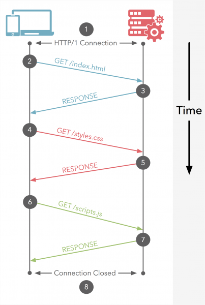
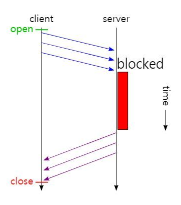

# HTTP/2

## 1 프로토콜 버전

오늘날 쓰이고 있는 HTTP 프로토콜은 버전이 여러 가지입니다. HTTP 프로토콜의 여러 변형을 모두 잘 다루려면 HTTP 애플리케이션이 일을 열심히 해야 합니다.

##### HTTP/0.9

1991년의 HTTP 프로토타입은 HTTP/0.9로 알려져 있습니다. 이 프로토콜은 심각한 디자인 결한이 다수 있고 구식 클라이언트하고만 같이 사용할 수 있습니다. HTTP/9.0은 오직 GET 메서드만 지원하고, 멀티미디어 콘텐츠에 대한 MIMe 타입이나, HTTP 헤더, 버전 번호는 지원하지 않습니다. HTTP/9.0는 원래 간단한 HTML 객체를 받아 오기 위해 만들어진 것입니다. HTTP/9.0는 금방 HTTP/1.0으로 대체되었씁니다.

##### HTTP/1.0

1.0은 처음으로 널리 쓰이기 시작한 HTTP 버전입니다. HTTP/1.0은 버전 번호, HTTP 헤더, 추가 메서드, 멀티미디어 객체 처리를 추가했습니다. HTTP/1.0은 시각적으로 매력적인 웹페이지와 상호작용하는 폼을 실현했고, 이는 월드 와이드 웹을 대세로 만들었습니다. HTTP/1.0은 결코 잘 정의된 명세가 아닙니다. HTTP가 상업적, 학술적으로 급성장하던 시기에 만들어진, 잘 동작하는 용례들의 모음에 가깝습니다.

##### HTTP/1.0+

1990년대 중반, 월드 와이드 웹이 급격히 팽창하고 상업적으로도 성공하면서 여러 유명 웹 클라이언트 서버 들은 그에 따른 요구를 만족시키기 위해 발 빠르게 HTTP에 기능을 추가해갔습니다. 오래 지속되는 `keep-alive` 커넥션, 가상 호스팅 지원, 프락시 연결 지원을 포함해 많은 기능이 공식적이지 않지만 사실상의 표준으로 HTTP에 추가되었습니다. 이 규격 외의 확장된 HTTP 버전을 흔히 HTTP/1.0+라고 부릅니다.

##### HTTP/1.1

HTTP/1.1은 HTTP 설계의 구조적 결함 교정, 두드러진 성능 최적화, 잘못된 기능 제거에 집중했습니다. 뿐만 아니라 HTTP/1.1은 더 복잡해진 웹 애플리케이션과 배포(1990년대 후반에 이미 쓰이고 있었습니다)를 지원합니다. HTTP/1.1은 현재 HTTP 버전입니다.

##### HTTP/2.0

HTTP/2.0은, HTTP/1.1 성능 문제를 개선하기 위해 구글의 SPDY 프로토콜을 기반으로 설계가 진행 중인 프로토콜입니다.

## 2. HTTP/1.1

### 2.1 동작 방식

- Connection당 하나의 요청을 처리 하도록 설계
- 동시 전송이 불가능하고 요청과 응답이 순차적으로 이루어짐
- HTTP 문서 안에 포함된 다수의 리소스(Image, CSS, Script)를 처리하려면 요청할 리소스 개수에 비례해서 Latency(대기 시간)는 길어짐

### 2.2 단점

#### 2.2.1 HOL(Head of Line) Blocking - 특정 응답의 지연

Web 환경에서 HOLB는 실제로 두 종류가 존재합니다.

1. HTTP HOL Blocking
2. TCP HOL Blocking

HTTP/1.1의 Connection당 하나의 요청처리를 개선할 수 있는 기법중 Pipelining이 존재하는데 이것은 하나의 Connection을 통해서 다수개의 파일을 요청/응답 받을 수 있는 기법을 말합니다. 이 기법을 통해서 어느정도의 성능 향상을 꾀 할 수 있으나 큰 문제점이 하나 있습니다.

하나의 TCP 연결에서 3개의 이미지(a.png, b.png, c.png)를 얻으려고 한다. 순서대로 첫번째 이미지를 요청하고 응답받고 다음 이미지를 요청하게 되는데, 만약 첫번째 이미지를 요청하고 응답이 지연되면 위의 그림과 같이 두, 세번째 이미지는 당연히 첫번째 이미지의 응답처리가 완료되기 전까지 대기하게 되며 이와 같은 현상을 HTTP의 Head of Line Blocking이라 부르며 파이프 라이닝의 큰 문제점 중 하나입니다.

#### 2.2.2 RTT(Round Trip Time) 증가

앞서 말한것처럼 HTTP/1.1의 경우 일반적으로 하나의 Connection에 하나의 요청을 처리하게 됩니다. 이렇다 보니 매 요청별로 Connection을 만들게 되고 TCP 상에서 동작하는 HTTP의 특성상 3-Way Handshake가 반복적으로 일어나고 또한 불필요한 RTT 증가와 네트워크 지연을 초래하여 성능을 저하 시키게 됩니다.

#### 2.2.3 무거운 Header 구조 (특히 Cookie)

HTTP/1.1의 헤더에는 많은 메타정보들이 저장되어 있습니다. 사용자가 방문한 웹페이지는 다수의 HTTP 요청이 발생하게 되는데 이 경우 매 요청시 마다 중복된 헤더값을 전송하게 되며(별도의 Domain Sharding을 하지 않았을 경우) 또한 해당 Domain에 설정된 Cookie 정보도 매 요청시 마다 헤더에 포함되어 전송되며 어쩔 땐 요청을 통해서 전송하려는 값보다 헤더 값이 더 큰 경우도 비일비재 합니다.

### 2.3 단점 극복 방법

#### 2.3.1 Image Spriting

웹 페이지를 구성하는 다양한 아이콘 이미지 파일의 요청 횟수를 줄이기 위해 아이콘을 하나의 큰 이미지로 만든다음 CSS에서 해당 이미지의 좌표 값을 지정해 표시합니다.

#### 2.3.2 Domain Sharding

요즘 브라우저들은 HTTP/1.1이 단점을 극복하기 위해 다수의 Connection을 생성해서 병렬로 요청을 보내기도 합니다. 하지만 브라우저 별로 Domain당 Connection 개수의 제한이 존재하고 이 또한 HTTP/1.1의 근본적인 해결책은 아닙니다.

#### 2.3.3 Minify CSS/Javascript

HTTP를 통해서 전송되는 데이터의 용량으 줄이기 위해 CSS, Javascript 코드를 축소하여 적용하기도 합니다.

#### 2.3.4 Data URI Scheme

Data URI 스킴은 HTML 문서내 이미지 리소스를 Base64로 인코딩된 이미지 데이터로 직접 기술하는 방식이고 이를 통해 요청 수를 줄이기도 합니다.

#### 2.3.5 Load Faster

- 스타일시트를 HTML 문서 상위에 배치
- 스크립트를 HTML 문서 하단에 배치

## 3. SPDY

위의 노력들에 불구하고 HTTP/1.1의 단점을 근본적으로 해결 할 수 없었습니다. 구글은 더 빠른 Web을 실현하기 위해 Troughput 관점이 아닌 Latency 관점에서 HTTP를 고속화한 SPDY(스피디)라 불리는 새로운 프로토콜을 구현했습니다. 다만 SPDY는 HTTP를 대체하는 프로토콜이 아니고 HTTP를 통한 전송을 재 정의하는 형태로 구현되어 있었습니다.SPDY는 실제 HTTP/1.1에 비해 상당히 성능이 향상되고 요훌적이였습니다. 이는 HTTP/2 초안의 참고 규격이 됩니다.

## 4. HTTP/2

HTTP/2는 HTTP가 유선상에서 표현 방법을 대치하는 것입니다. 이것은 프로토콜을 완전히 다시 작성하는게 아니라 HTTP 메소드, 상태 코드 및 의미는 동일하며 프로토콜을 나타내기 위해 HTTP/1.x와 동일한 API (일부 작은 추가 기능 포함)를 사용 할 수 있어야 합니다. HTTP/2의 초점은 성능에 있습니다. 특히 최종 사용자가 대기 시간, 네트워크 및 서버 리소스 사용을 인식합니다. 주요 목표 중 하나는 **브라우저에서 웹 사이트로의 단일 연결을 허용**하는 것입니다.

### 4.1 Multiplexed Streams

한 커넥션으로 동시에 여러개의 메시지를 주고 받을 수 있으며, 응답은 순서에 상관없이 steam으로 주고 받습니다. HTTP/1.1의 Connection Keep-Alive, Pipelining의 개선이라고 보면 됩니다.

### 4.2 Stream Prioritization

크라이언트가 요청한 HTML 문서안에 CSS 파일 1개와 Image 파일 2개가 존재하고 이를 클라이언트가 각각 요청하고 난 후 Image 파일보다 CSS 파일의 수신이 늦어지는 경우 브라우저의 렌더링이 늦어지는 문제가 발생하는데 HTTP/2의 경우 리소스간 의존관계(우선순위)를 설정하여 이런 문제를 해결하고 있다.

### 4.3 Server Push

서버는 클라이언트 요청에 대해 요청하지도 않은 리소스를 마음대로 보내줄 수 있다. 클라이언트(브라우저)가 HTML 문서를 요청했고 해당 HTML에 여러개의 리소스(CSS, Image)가 포함되어 있는 경우 HTTP/1.1에서 클라이언트는 요청한 HTML 문서를 수신한 후 HTML 문서를 해석하면서 필요한 리소스를 재 요청하는 반면 HTTP/2에선 Server Push 기법을 통해서 클라이언트가 요청하지도 않은 (HTML 문서에 포함된 리소스) 리소스를 Push해주는 방법으로 클라이언트의 요청을 최소화 해서 성능 향상을 이끌어 냅니다. 이를 PUSH_PROMISE라고 부르며 PUSH_PROMISE를 통해서 서버가 전송한 리소스에 대해서 클라이너트는 요청을 하지 않습니다.

### 4.4 Header Compression

HTTP/2는 Header 정보를 압축하기 위해 Header Table과 Huffman Encoding 기법을 사용해 처리하는데 이를 HPACK 압축방식이라고 부르며 별도의 명세서(RFC 7531)로 관리하고 있습니다.

위 그림처럼 클라이언트가 두번의 요청을 보낸다고 가정하면 HTTP/1.x의 경우 두개의 요청 Header에 중복된 값이 존재해도 그냥 중복 전송합니다. 하지만 HTTP/2에선 Header에 중복값이 존재하는 경우 Static/Dynamic Header Table 개념을 사용하여 중복 Header를 검출하고 중복된 Header는 Index 값만 전송하고 중복되지 않은 Header 점보의 값은 Huffman Encoding 기법으로 인코딩 처리하여 전송합니다.

## 5. 출처

- [나만 모르고 있던 - HTTP/2 - pop it](https://www.popit.kr/%EB%82%98%EB%A7%8C-%EB%AA%A8%EB%A5%B4%EA%B3%A0-%EC%9E%88%EB%8D%98-http2/)
- [HTTP/1.1 VS HTTP/2 - 한량 개발자](https://ijbgo.tistory.com/26)
- HTTP 완벽 가이드 - 프로그래밍 인사이트
