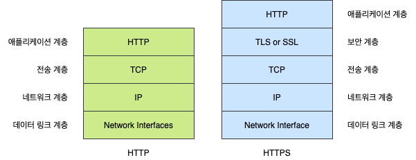

# SSL

HTTP는 **IP, TCP, HTTP**로 구성된 **프로토콜 스택**에서 최상위 계층입니다. HTTP에 보안 기능을 더한 HTTPS는 TLS 혹은 SSL이라 불리기도하며 HTTP와 TCP 사이에 있는 **암호화**(Cryptographic Encryption) 계층입니다. 실제 통신 내용을 상세히 살펴보면 클라이언트와 서버간 공유하는 암호화키를 가지고 암호화된 데이터가 송수신 되는 방식입니다.

## 1. SSL과 TLS

SSL(Secure Socket Layer)과 TLS(Transport Layer Security Protocol)은 같은 의미입니다. 네스케이프에 의해서 SSL이 발명되었고, 이것이 점차 폭넓게 사용되다가 **표준화 기구인 IETF의 관리로 변경되면서 TLS라는 이름으로 바뀌었습니다.** TLS 1.0은 SSL 3.0을 계승합니다. 하지만 TLS라는 이름보다 SSL이라는 이름이 훨씬 많이 사용되고 있습니다.

## 2. SSL의 암호화

SSL의 핵심은 암호화입니다. SSL은 보안과 성능상의 이유로 두가지 암호화 기법을 혼용해서 사용하고 있는데, SSL 동작방법을 이해하기 위해서는 이 함호화 기법들에 대한 이해가 필요합니다.

### 2.1 대칭키

암호를 만드는 행위인 암호화를 할 때 사용하는 일종의 비밀번호를 키(key)라고 합니다. 이 키에 따라서 암호화된 결과가 달라지기 때문에 키를 모르면 암호를 푸는 행위인 복호화를 할 수 없습니다. 대칭키는 **동일한 키로 암호화와 복호화를 같이 할 수 았는 방식**의 암호화 기법을 의미합니다. 즉 암호화를 할 때 1234라는 값을 사용했다면 복호화를 할 떄 1234라는 값을 입력해야 합니다.

### 2.2 공개키

대칭키의 방식은 단점이 있습니다. 암호를 주고 받는 사람들 사이에 대칭키를 전달하는 것이 어렵다는 점입니다. 대칭키가 유출되면 키를 획득한 공격자는 암호의 내용을 복호화할 수 있기 대문에 암호가 무용지물이 되기 때문입니다. 이런 배경에서 나온 암호화 방식이 공개키 방식입니다.

공객키 방식은 두개의 키를 갖게 되는데 A키로 암호화를 하면 B키로 복호화할 수 있고, B키로 암호화하면 A키로 복호화할 수 있는 방식입니다. 이 방식에 착안해서 두개의 키 중 하나를 **비공개키**(private key)로 하고, 나머지를 **공개키**(public key)로 지정합니다. 비공개키는 자신만이 가지고 있고, 공개키를 타인에게 제공합니다. 공객키를 제공 받은 타인은 공개키를 이용해서 정보를 암호화합니다. 암호화한 정보를 비공개키를 가지고 있는 사람에게 전송하니다. 비공개키의 소쥬자는 이 키를 이용해서 암호화된 정보를 복호화합니다. 이 과정에서 **공개키가 유출된다고해도 비공키를 모르면 정보를 복호화할 수 없기 때문에 안전**합니다. 공개키로는 암호화할 수 있지만 복호화는 할 수 없기 때문입니다.

이 방식은 이렇게 응용할 수 있습니다. 비공개키의 소유자는 비공개키를 이용해서 정보를 암호화 한 후에 공개키와 함께 암호화된 정보를 전송합니다. 정보와 공개키를 획득한 사람은 공개키를 이용해서 암호화된 정보를 복호화 합니다. 이 과정에서 공개키가 유출된다면 의도하지 않은 공격자에 의해서 데이터가 복호화 될 위험이 있습니다. 이런 위험에도 불구하고 비공개키를 이용해서 암호화하는 이유가 무엇일까요? 그것은 이것이 데이터를 보호하는 것이 목적이 아니기 때문입니다. 암호화된 데이터를 공개키를 가지고 복호화 할 수 있다는 것은 그 데이터가 공개키와 쌍을 이루는 비공개키에 의해서 암호화 되었다는 것을 의미합니다. 즉 공개키가 데이터를 제공한 사람의 신원을 보장해주게 되는 것입니다. 이러한 것을 전자 서명이라고 부릅니다.

## 3. SSL 인증서

SSL 인증서는 클라이언트와 서버간의 통신을 제 3가 보증해주는 전자화된 문서입니다 클라이언트가 서버에 접속한 직후에 서버는 클라이언트에게 이 인증서 정보를 전달하게 됩니다. 클라이언트는 이 인증서 정보가 신뢰할 수 있는 것인지를 검증 한 후에 다음 절차를 수행하게 됩니다.

### 3.1 SSL과 SSL 디지털 인증서 장점

- 통신 내용이 공격자에게 노출되는 것을 막을 수 있습니다.
- 클라이언트가 접속하려는 서버가 신뢰할 수 있는 서버인지 판단할 수 있습니다.
- 통신 내용의 악의적인 변경을 방지할 수 있습니다.

### 3.2 SSL 인증서의 역할

SSL 인증서의 역할은 다소 복잡하기 때문에 인증서의 매커니즘을 이해하기 위한 몇가지 지식들을 알고 있어야 합니다. 인증서의 기능은 크게 두가지가 있습니다. 아래 두가지를 이해하는 것이 인증서를 이해하는 핵심입니다.

1. 클라이언트가 접속한 서버가 신뢰할 수 있는 서버임을 보장합니다.
2. SSL 통신에 사용할 공개키를 클라이언트에게 제공합니다.

### 3.3 CA

인증서의 역할은 클라이언트가 접속한 서버가 클라이언트가 의도한 서버가 맞는지를 보장합니다. 이 역할을 하는 민간기업들이 있는데 이런 기업들을 **CA**(Certification authority) 혹은 Root Certificate라고 부릅니다. CA는 아무 기업이나 할 수 있는 것이 아니고 신뢰성이 엄격하게 공인된 기업들만 참여할 수 있습니다.

SSL을 통해서 암호화된 통신을 제공하려는 서비스는 CA를 통해서 인증서를 구입해야 합니다. CA는 서비스의 신뢰성을 다양한 방법으로 평가하게 됩니다.

### 3.4 SSL 인증서 내용

SSL 인증서에는 다음과 같은 정보가 포함되어 있습니다.

1. 서비스의 정보 (인증서를 발급한 CA, 서비스의 도메인 등등)
2. 서버 측 공개키 (공개키의 내용, 공개키의 암호화 방법)

인증서의 재용은 위와 같이 크게 2가지로 구분할 수 있습니다. 1번은 클라이언트가 접속한 서버가 클라이언트가 의도한 서버가 맞는지에 대한 내용을 담고 있고, 2번은 서버와 통신할 때 사용할 공개키와 그 공개키의 암호화 방법들의 정보를 담고 있습니다. 서비스의 도메인, 공개키와 같은 정보는 서비스가 CA로부터 인증서를 구입할 때 제출해야합니다.

위와 같은 내용은 CA에 의해서 암호화 됩니다. 이 때 사용하는 암호화 기법은 공개키 방식입니다. CA는 자신의 CA 비공개키를 이용해서 서버가 제출한 인증서를 암호화하는 것입니다. CA의 비공개키는 절대로 유출되어서는 안됩니다.

#### 3.4.1 CA를 브라우저는 알고 있습니다.

인증서를 이해하는데 꼭 알고 있어야 하는 것이 CA의 리스트입니다. **브라우저는 내부적으로 CA의 리스트를 미리 파악**하고 있습니다. 이 말은 브라우저의 소스코드 안에 CA의 리스트가 들어있다는 것입니다. 브라우저가 미리 파악하고 있는 CA의 리스트에 포함되어야만 공인된 CA가 될 수 있습니다. CA의 리스트와 함께 각 CA의 공개키를 브라우저는 이미 알고 있습니다.

## 4. SSL의 동작 방법

SSL은 암호화된 데이터를 전송하기 위해서 공개키와 대칭키를 혼합해서 사용합니다. 즉 클라이언트와 서버가 주고받는 실제 정보는 대칭키 방식으로 암호화하고, 대칭키 방식으로 암호화된 실제 정보를 보호화할 때 사용할 대칭키는 공개키 방식으로 암호화해서 클라이언트와 서버가 주고 받게 됩니다.

- **실제 데이터**: 대칭키
- **대칭키의 키**: 공개키

컴퓨터와 컴퓨터가 네트워크를 이용해서 통신할 때는 **악수 -> 전송 -> 세션 종료** 3가지 단계가 있습니다.

### 4.1 악수 (Handshake)

실제 데이터를 주고 받기 전에 클라이언트와 서버는 일종의 인사인 Handshake를 합니다. 이 과정을 통해서 서로 상대방이 존재하는지, 또 상대방과 데이터를 주고 받기 위해서는 어떤 방법을 사용해야 하는지를 파악합니다.

SSL 방식을 이용해서 통신을 하는 브라우저와 서버 역시 Handshake를 하는데, 이 떄 SSL 인증서를 주고 받게됩니다. 인증서에 포함된 서버 즉 공개키의 역할은 무엇일까요?

공개키는 이상적인 통신 방법입니다. 암호화와 복호화를 할 때 사용하는 키가 서로 다르기 때문에 메시지를 전송하는 쪽이 공개키로 데이터를 암호화하고, 수신받는 쪽이 비공개키로 데이터를 복호화하면 되기 때문입니다. 그런데 SSL에서는 이 방식을 사용하지 않습니다. 왜냐하면 공개키 방식의 암호화는 매우 많은 컴퓨터 자원을 사용하기 때문입니다. 반면 암호화와 복호화에 사용되는 키가 동일한 대칭키 방식은 적은 컴퓨터 자원으로 암호화를 수행할 수 있기 때문에 효율적이지만 수신측과 송신측이 동일한 키를 공유해야 하기 때문에 보안의 문제가 발생합니다. 그래서 **SSL은 공개키와 대칭키의 장점을 혼합한 방식을 사용**합니다. 그 Handshake 단계에서 클라이언트와 서버가 통신하는 과정을 순서대로 살펴보면 다음과 같습니다.

#### 4.1.1 클라이언트가 서버에 접속합니다. 이 단계를 Client Hello라고 합니다.

이 단계에서 주고 받는 정보는 아래와 같습니다.

- **클라이언트 측에서 생성한 랜덤 데이터**
- **클라이언트가 지원하는 암호화 방식들:** 클라이언트와 서버가 지원하는 암호화 방식이 서로 다를 수 있기 때문에 상호간에 어떤 암호화 방식을 사용할 것인지에 대한 협상을 해야 합니다. 이 협상을 위해서 클라이언트 측에서 자신이 사용할 수 있는 암호화 방식을 전송하게 됩니다.
- **세션 아이디:** 이미 SSL 핸드쉐이킹을 했다면 비용과 시간을 절약하기 위해서 기존의 세션을 재활용하게 되는데 이 때 사용할 연결에 대한 식별자를 서버 측으로 전송합니다.

#### 4.1.2 서버는 Client Hello에 대한 응답으로 Server Hello를 하게 됩니다.

이 단계에서 주고 받는 정보는 아래와 같습니다

- **서버 측에서 생성한 랜덤 데이터**
- **서버가 선택한 클라이언트의 암호화 방식:** 클라이언트가 전달한 암호화 방식 중에서 서버 쪽에서도 사용할 수 있는 암호화 방식을 선택해서 클라이언트로 전달합니다. 이로써 암호화 방식에 대한 협상이 종료되고, 서버와 클라이언트는 이 암호화 방식을 이용해서 정보를 교환하게 됩니다.
- **인증서**

#### 4.1.3 클라이언트는 서버의 인증서가 CA에 의해서 발급된 것인지를 확인합니다.

웹 브라우저가 서버에 접속할 때 서버는 제일 먼저 인증서를 제공합니다. 브라우저는 이 인증서를 발급한 CA가 자신이 내장한 CA의 리스트에 있는지를 확인합니다. 확인 결과 서버를 통해 다운받은 인증서가 **내장된 CA 리스트에 포함되어 있다면 해당 CA의 공개키를 이용해서 인증서를 복호화**합니다. CA의 공개키를 이용해서 인증서를 복호화 할 수 있다는 것은 이 인증서가 CA의 비공개키에 의해서 암호화 된 것을 의미합니다. 해당 CA의 비공개 키를 가지고 있는 CA는 해당 CA 밖에 없기 때문에 서버가 제공한 인증서가 CA에 의해서 발급된 것이라는 것을 의미합니다. CA의 검토를 통과했다는 것은 해당 서비스가 신뢰할 수 있다는 것을 의미합니다. 이것이 CA와 브라우저가 특정 서버를 인증하는 과정입니다.

#### 4.1.4 Pre Master Secret을 생성합니다.

클라이너트는 1번과 2번의 랜덤 데이터를 조합해서 **pre master secret**이라는 키를 생성합니다. 이 키는 뒤에서 살펴볼 세션 단계에서 데이터를 주고 받을 때 암호화하기 위해서 사용될 것입니다. 이 땍 사용할 암호화 기법은 대칭키이기 때문에 **pre master secret** 값은 제 3자에게 절대로 노출 되어서는 안됩니다.

서버로부터 받은 인증서 안에 들어있는 서버의 공개키로 **pre master secret** 값을 암호화해서 서버로 전송하면 서버는 자신의 비공개키로 안전하게 복호화 할 수 있습니다.

#### 4.1.5 서버는 클라이언트가 전송한 pre master secret를 복호화합니다.

이로서 서버와 클라이언트가 모두 pre master secret 값을 공유하게 되었습니다. 그리고 서버와 클라이언트는 모두 일련의 과정을 거쳐서 pre master secret 값을 master secret 값으로 만듭니다. master secret은 session key를 생성하는데 이 session key 값을 이용해 서버와 클라이언트는 데이터 대칭키 방식으로 암호화한 후에 주고 받게 됩니다. 이렇게해서 세션키를 클라이언트와 서버가 모두 공유하게 됩니다.

#### 4.1.6 클라이언트와 서버는 핸드쉐이크 단계의 종료를 서로에게 알립니다.

### 4.2 세션

세션은 실제로 서버와 클라이언트가 데이터를 주고받는 단계입니다. 이 단계에서 핵심은 정보를 상대방에게 전송하기 전에 session key 값을 이용해서 대칭키 방식으로 암호화 한다는 점입니다. 암호화된 정보는 상대방에게 전송될 것이고, 상대방도 세션키 값을 알고 있기 때문에 암호를 복호화 할 수 있습니다.

### 4.3 세션 종료

데이터의 전송이 끝나면 SSL 통신이 끝났음을 서로에게 알려줍니다 이 때 통신에서 사용한 대칭키인 세션키를 폐기하게 됩니다.

## 5. 출처

- [[정보 보안] SSL(Secure Socket Layer) 이란 - 길은 가면, 뒤에 있다](https://12bme.tistory.com/80)
- HTTP 완벽 가이드 - 프로그래밍 인사이트
