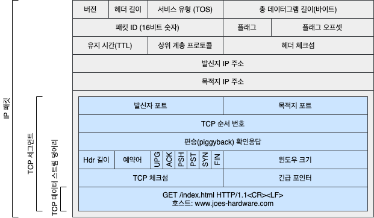
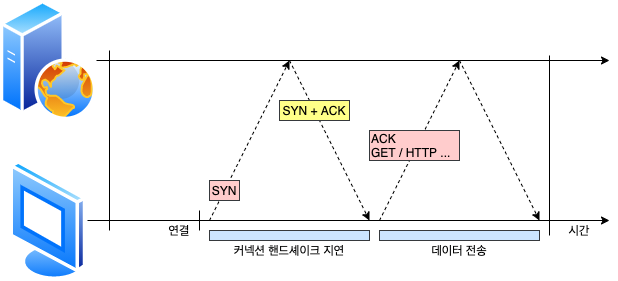

# TCP

전 세계 모든 HTTP 통신은 지구상의 컴퓨터와 네트워크 장비에서 널리 쓰이고 있는 패킷 교환 네트워크 프로토콜들의 계층화된 집합인 TCP/IP를 통해 이루어집니다. 세계 어디서든 클라이언트 애플리케이션은 서버 애플리케이션으로 TCP/IP 커넥션을 맺을 수 있습니다. 일단 커넥션이 맺어지면 클라이언트와 서버 컴퓨터 간에 주고받는 메시지들은 손실 혹은 손상되거나 순서가 바뀌지 않고 안전하게 전달됩니다.

## 1. 데이터 스트림

HTTP가 메시지를 전송하고자 할 경우, 현재 연결되어 있는 TCP 커넥션을 통해서 메시지 데이터의 내용을 순서대로 보냅니다. TCP는 세그먼트라는 단위로 데이터 스트림을 잘게 나누고, 세그먼트를 IP 패킷이라고 불리는 봉투에 담아서 인터넷을 통해 데이터를 전달합니다.



## 2. TCP 커넥션



### 2.1 연결 성립(Connection Establishment)

1. 클라이언트는 새로운 TCP 커넥션을 생성하기 위해 작은 TCP 패킷(보통 40~60바이트)을 서버에게 보냅니다. 그 패킷은 **SYN**이라는 특별한 플래그를 가지는데, 이 요청이 커넥션 생성 요청이라는 듯입니다.
2. 서버가 그 커넥션을 받으면 몇 가지 커넥션 매개변수를 산출하고, 커넥션 요청이 받아들여졌음을 의미하는 **SYN**과 **ACK** 플래그를 포함한 TCP 패킷을 클라이언트에게 보냅니다.
3. 마지막으로 클라이언트는 커넥션이 잘 맺어졌음을 알리기 위해서 서버에게 다시 확인응답 신호를 보냅니다. 오늘날의 TCP 클라이언트가 이 확인응답 패킷과 함께 데이터를 보낼 수 있습니다.

### 2.2 연결 해제(Connection Termination)

1. 클라이언트가 연결을 종료하겠다는 FIN 플래그를 전송합니다.
2. 서버는 클라이언트의 요청(FIN)을 받고 알겠다는 확인 메세지로 ACK를 보냅니다. 그리고 데이터를 모두 보낼 때까지 잠시 TIME_OUT 됩니다.
3. 데이터를 모두 보내고 통신이 끝났으면 연결이 종료되었다고 클라이언트에게 FIN 플래그를 전송합니다.
4. 클라이언트는 FIN 메세지를 확인했다는 메세지(ACK)를 보냅니다.
5. 클라이언트의 ACK 메세지를 받은 서버는 소켓 연결을 Close 합니다.
6. 클라이언트는 아직 서버로부터 받지 못한 데이터가 있을 것을 대비해 일정 시간 동안 세션을 남겨놓고 잉여 패킷을 기다리는 과정을 거칩니다. (TIME_WAIT)

### 2.3 플래그

- SYN: synchoriniz sequence number
- ACK: acknowledgement

TCP Header에는 Code Bit(Flag bit)라는 부분이 존재합니다. 이 부분은 총 6Bit로 이루어져 있으며 각각 한 bit들이 의미를 갖고 있습니다. **Urg-Ack-Psh-Rst-Syn-Fin** 순서로 되어 있으며 해당 위치의 비트가 1이면 해당 패킷이 어떠한 내용을 담고 있는 패킷인지를 나타냅니다. SYN 패킷을 경우엔 000010이 되고 ACK 패킷일 경우에는 010000이 됩니다.

ACK 번호는 수신해야할 다음 바이트 번호입니다. ACK 번호는 누적 값으로서 수신자는 해당 번호 이전의 모든 바이트를 안전하게 받았음을 의미합니다.

### 2.4 왜 2-Way가 아닌 3-Way인가?

비유를 들어봅시다. 일단 클라이언트가 자신의 목소리가 들리는지 물어봅니다(SYN). 서버는 클라이언트의 목소리가 들린다고 말합니다(SYN + 1). 그리고 자신의 목소리가 들리는지 물어봅니다(ACK). 클라이언트는 서버의 목소리가 들린다고 말합니(ACK + 1). TCP connection은 양방향성(bidirectional) connection 입니다. 클라이언트에서 서버에게 존재를 알리고 패킷을 보낼 수 있다는 것을 알리듯, 서버에서도 클라이언트에게 존재를 알리고 패킷을 보낼 수 있다는 신호를 보내야 합니다. 그렇기 때문에 2-way-hanshake로는 부족합니다.

### 2.5 Randomized Sequence Number

처음 클라이언트에서 SYN 패킷을 보낼 때 Sequence Number에는 랜덤한 숫자가 담겨집니다. 초기 Sequence Number를 ISN이라고 합니다. ISN이 0부터 시작하지 않고 난수를 생성해서 number를 설정하는 이유는 무엇일까요? Connection을 맺을 때 사용하는 포트(port)는 유한 범위 내에서 사용하고 시간이 지남에 따라 재사용됩니다. 따라서 두 통신 호스트가 과거에 사용된 포트 번호 쌍을 사용하는 가능성이 존재합니다. 서버 측에서 패킷의 SYN을 보고 패킷을 구분하게 되는데 난수가 아닌 순차적인 Number가 전송되면 이전의 connection으로부터 오는 패킷으로 인식할 수 있습니다. 이러한 문제가 발생할 가능성을 줄이기 위해서 난수로 ISN을 설정하는 것입니다.

## 3. 커넥션 유지

컴퓨터는 항상 TCP 커넥션을 여러 개 가지고 있습니다. TCP는 포트 번호를 통해서 이런 여러 개의 커넥션을 유지합니다. 포트 번호는 회사 직원의 내선 전화와 같습니다 회사의 대표 전화번호는 안내 데스크로 연결되고 내선 전화는 해당 직원으로 연결되듯이 IP 주소는 해당 컴퓨터에 연결되고 포트 번호는 해당 애플리케이션으로 연결됩니다. TCP 커넥션은 **발신자 IP 주소**, **발신자 포트**, **수신자 IP 주소**, **수신자 포트** 네 가지 값으로 식별합니다. 이 네가지 값으로 유일한 커넥션을 생성합니다 서로 다릊 두 개의 TCP 커넥션은 내가지 주소 구성요소 값이 모두 같을 수 없습니다.

## 4. TCP의 성능에 대한 고려

HTTP는 TCP 바로 위에 있는 계층이기 때문에 HTTP 트랜잭션의 성능은 그 아래 계층인 TCP 성능에 영향을 받습니다.

### 4.1 HTTP 트랜잭션 지연

트랜잭션을 처리하는 시간은 TCP 커넥션을 설정하고, 요청을 전송하고, 응답 메시지를 보내는 것에 비하여 상당히 짧습니다. 클라이언트나 서버가 너무 많은 데이터를 내려받거나 복잡하고 동적인 자원들을 실행하지 않는 한, 대부분의 HTTP 지연은 TCP 네트워크 지연 때문에 발생합니다.

### 4.2 확인응답 지연

인터넷 자체가 패킷 전송을 완벽히 보장하지는 않기 때문에, TCP는 성공적인 데이터 전송을 보장하기 위해서 자체적인 확인 체계를 가집니다. 각 TCP 세그먼트는 순번과 데이터 무결성 체크섬을 가집니다. 각 세그먼트의 수신자는 세그먼트를 온전히 받으면 작은 확인응답 패킷을 송신자에게 반환합니다. 만약 송신자가 특정 시간 안에 확인응답 메시지를 받지 못하면 패킷이 파기되었거나, 오류가 있는 것으로 판단하고 데이터를 다시 전송합니다.

확인응답은 그 크기가 작기 때문에, TCP는 같은 방향으로 송출되는 데이터 패킷에 확인응답을 **편승**(Piggyback) 시킵니다. TCP는 송출 데이터 패킷과 확인응답을 하나로 묶음으로써 네트워크를 좀 더 효율적으로 사용합니다. 확인응답이 같은 방향으로 가는 데이터 패킷에 편승되는 경우를 늘리기 위해서, 많은 TCP 스택은 **확인응답 지연** 알고리즘을 구현합니다. 확인응답 지연은 송출할 확인응답을 특정 시간 동안 버퍼에 저장해 두고, 확인응답을 편승시키기 위한 송출 데이터 패킷을 찾습니다. 만약 일정 시간 안에 송출 데이터 패킷을 찾지 못하면 확인응답은 별도 패킷을 만들어 전송됩니다.

안타깝게도 요청과 응답 두 가지 형식으로만 이루어지는 HTTP 동작 방식은, 확인 응답이 송출 데이터 패킷에 편승할 기회를 감소시킵니다. 막상 편승할 패킷을 찾으려고 하면 해당 방향으로 송출될 패킷이 많지 않기 때문에, 확인응답 지연 알고리즘으로 인한 지연이 자주 발생합니다. 운영체제에 따라 다르지만, 지연의 원인이 되는 확인응답 지연 관련 기능을 수정하거나 비활성활할 수 있습니다.

TCP 스택에 있는 매개변수를 수정할 때는, 지금 무엇을 하고 있는지 항상 잘 알고 수정해야 합니다. TCP의 내부 알고리즘은 잘못 만들어진 애플리케이션으로부터 인터넷을 보호하도록 셀계되어 있습니다. TCP 설정을 수정하려고 한다면, TCP의 내부 알고리즘이 피하려고 하는 문제를 애플리케이션이 발생시키지 않을 것이라고 확신 할 수 있어야 합니다.

### 4.3 TCP 느린 시작(Slow Start)

TCP의 데이터 전송 속도는 TCP 커넥션이 만들어진 지 얼마나 지났는지에 따라 달라질 수 있습니다. TCP 커넥션은 시간이 지나면서 자체적으로 **튜닝**되어서, 처음에는 커넥션의 최대 속도를 제한하고 데이터가 성공적으로 전송됨에 따라서 속도 제한을 높여나갑니다. 이렇게 조율하는 것을 TCP 느린 시작이라고 부르며, 이는 인터넷의 급작스러운 부하와 혼잡을 방지하는 데 쓰입니다.

TCP 느린 시작은 TCP가 한 번에 전송할 수 있는 패킷의 수를 제한합니다. 간단히 말해서, 패킷이 성공적으로 전달되는 각 시점에 송신자는 추가로 2개의 패킷을 저 전송할 수 있는 권한을 얻습니다. HTTP 트랙잭션에서 전송할 데이터의 양이 많으면 모든 패킷을 한 번에 전송할 수 없습니다. 그 대신 한 개의 패킷만 전송하고 확인응답을 기다려야 합니다. 확인응답을 받으면 2개의 패킷을 보낼 수 있으며, 그 패킷 각각에 대한 확인응답을 받으면 총 4개의 패킷을 보낼 수 있게 됩니다. 이를 **혼잡 윈도를 연다**(Opening The Congestion Window)라고 합니다.

이 혼잡제어 기능 때문에, 새로운 커넥션은 이미 어느 정도 데이터를 주고받은 **튜닝**된 커넥션보다 느립니다. **튜닝**된 커넥션은 더 빠르기 때문에, HTTP에는 이미 존재하는 커넥션을 재사용하는 기능이 있습니다.

### 4.4 네이글(Nagle)알고리즘과 TCP_NODELAY

애플리케이션이 어떤 크기의 데이터든지 TCP 스팩으로 전송 할 수 있도록, TCP는 데이터 스트림 인터페이스를 제공합니다. 하지만 각 TCP 세그먼트는 40바이트 상당의 플래그 헤더를 포함하여 전송하기 때문에, TCP가 작은 크기의 데이터를 포함한 많은 수의 패킷을 전송한다면 네트워크 성능은 크게 떨어집니다.

네이글 알고리즘은 네트워크 효율을 위해서, 패킷을 전송하기 전에 많은 양의 TCP 데이터를 한 개의 덩어리로 합칩니다. 네이글 알고리즘은 세그먼트가 최대 크기(패킷의 최대 크기는 LAN 상에서 1,500바이트 정도, 인터넷 상에서는 수백 바이트 정도입니다)가 되지 않으면 전송을 하지 않습니다. 다만 다른 모든 패킷이 확인응답을 받았을 경우에는 최대 크기보다 작은 패킷의 전송을 허락합니다. 다른 패킷들이 아직 전송 중이면 데이터는 버퍼에 저장됩니다. 전송되고 나서 확인응답을 기다리던 패킷이 확인응답을 받았거나 전송하기 충분할 만큼의 패킷이 쌓였을 때 버퍼에 저장되어 있던 데이터가 전송됩니다.

네이글 알고리즘은 HTTP 성능 관련해 여러 문제를 발생시킵니다. 첫 번째로, 크기가 작은 HTTP 메시지는 패킷을 채우지 못하기 때문에, 앞으로 생길지 생기지 않을지 모르는 추가적인 데이터를 기다리며 지연될 것입니다. 두 번째로, 네이글 알고리즘은 확인응답 지연과 함께 쓰일 경우 형편없이 동작합니다. 네이글 알고리즘은 확인 응답이 도착할 떄까지 데이터를 전송을 멈추고 있는 반면, 확인응답 지연 알고리즘 확인응답을 100~200밀리초 지연시킵니다.

HTTP 애플리케이션은 성능 향상을 위해서 HTTP 스택에 TCP_NODELAY 파라미터 값을 설정하여 네이글 알고리즘을 비활성화하기도 합니다. 이 설정을 한다면, 작은 크기의 패킷이 너무 많이 생기지 않도록 큰 크기의 데이터 덩어리를 만들어야 합니다.

### 4.5 TIME_WAIT의 누적과 포트 고갈

상황에서는 문제를 발생시키지 않습니다. 하지만 성능 측정을 하는 사람이라면, 결국에는 이 문제에 봉착하게 될 것이고 생각하지도 못했던 성능상의 문제가 생긴것으로 오해할 수 있으니 특별히 조심해야 합니다.

TCP 커넥션의 종단에서 TCP 커넥션을 끊으면, 종단에서는 커넥션의 IP 주소와 포트 번호를 메모리의 작은 **제어영역**(Control Block)에 기록해 놓습니다. 이 정보는 같은 주소와 포트 번호를 사용하는 새로운 TCP 커넥션이 일정 시간 동안에는 생성되지 않게 하기 위한 것으로, 보톤 세그먼트이 최대 생명주기에 두 배 정도(**2MSL**이라고 불리며 보통 2분 정도)의 시간 동안만 유지됩니다. 이는 이전 커넥션과 관련된 패킷이 그 커넥션과 같은 주소와 포트 번호를 가지는 새로운 커넥션에 삽입되는 문제를 방지합니다. 실제로 이 알고리즘은 특정 커넥션이 생성되고 닫힌 다음, 그와 같은 IP 주소와 포트 번호를 가지는 커넥션이 2분 이내에 또 생성되는 것을 막아줍니다.

현대의 빠른 라우터들 덕분에 커넥션이 닫힌 후에 중복되는 패킷이 생기는 경우는 거의 없어졌습니다. @MSL을 더 짧은 시간으로 수정하는 운영체제도 있지만, 이 값 수정은 조심해야 합니다. 만약 이전 커넥션의 패킷이 그 커넥션과 같은 연결 값으로 생성된 커넥션에 삽입되면, 패킷은 중복되고 TCP 데이터는 충돌할 것입니다.

일반적올 2MSL의 커넥션 종료 지연이 문자가 되지는 않지만, 성능시험을 하는 상황에서는 문제가 될 수 있습니다. 성능 측정 대상 서버는 클라이언트가 접속할 수 있는 IP 주소의 개수를 제한하고, 그 서버에 접속하여 부하를 발생시킬 컴퓨터의 수는 적기 때문입니다. 게다가 일반적으로 서버는 HTTP의 기본 TCP 포트인 80번을 사용합니다. 이런 상황에서는 가능한 연결의 조합이 제한되며, TIME_WAIT로 인해 서 순간순간 포트를 재활용하는 것이 불가능해집니다.

각각 한 개의 클라이언트와 웹 서버가 있고, TCP 커넥션을 맺기 위한 네 개의 값이 있다고 해봅니다. 이 중에서 세개는 고정되어 있고 반신지 포트만 변경할 수 있습니다.

```
<발신지 IP 주소, 발신지 포트, 목적지 IP 주소, 목적지 포트>
```

클라이언트가 서버에 접속할 댸마다, 유일한 커넥션을 생성하기 위해서 새로운 발신지 포트를 씁니다. 하지만 사용할 수 있는 발신지 포트의 수는 제한되어 있고(60,000개로 가정) 2MSL초 동안(120초로 가정) 커넥션이 재사용될 수 없으므로, 초당 500개(60,000 / 120 = 500)로 커넥션이 제한됩니다. 서버가 초당 500개 이상의 트랜잭션을 처리할 만큼 빠르지 않다면 TIME_WAIR 포트 고갈은 일어나지 않습니다. 이 문제를 해결하기 위해 부하를 생성하는 장비를 더 많이 사용하거나 클라이언트와 서버가 더 많은 커넥션을 맺을 수 있도록 여러 개의 가상 IP 주소를 쓸 수도 있습니다.

포트 고갈 문제를 겪지 않더라도, 커넥션을 너무 많이 맺거나 대기 상태로 있는 제어 블록이 너무 많아지는 상황은 주의해야 합니다. 커넥션이나 제어 블록이 너무 많이 생기면 극심하게 느려지는 운영체제도 있습니다.

## 5. 출처

- [[TCP] 3-way-handshake & 4-way-handshake -\_Jbee](https://asfirstalways.tistory.com/356)
- HTTP 완벽 가이드 - 프로그래밍 인사이트
