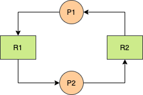
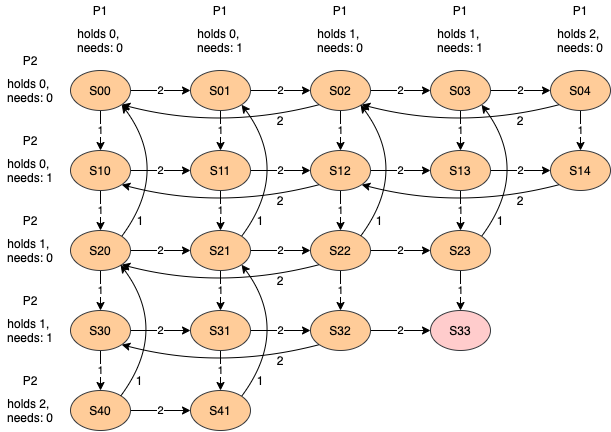
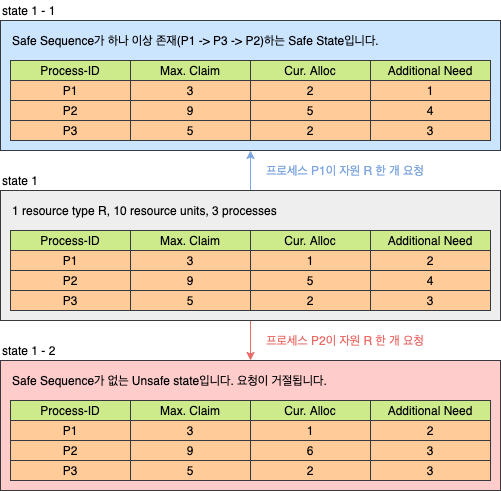
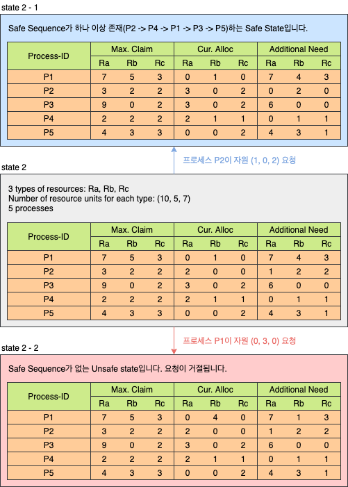
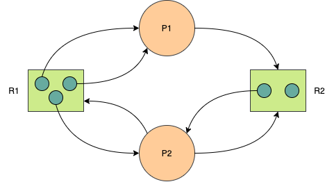

# Deadlock

## 1. Deadlock의 개념

- Blocked/Asleep State
  - 프로세스가 특정 이벤트를 기다리는 상태입니다.
  - 프로세스가 필요한 자원을 기다리는 상태입니다.
- Deadlock State
  - 프로세스가 발생 가능성이 없는 이벤트를 기다리는 경우입니다. (프로세스가 Deadlock 상태)
  - 시스템 내에 Deadloc에 빠진 프로세스가 있는 경우입니다. (시스템이 Deadlock 상태)

### 1.1 자원의 분류

#### 1.1.1 선점 가능 여부에 따른 분류

- **Preemptible Rresources**
  - 선점 당한 후, 돌아와도 문제가 발생하지 않는 자원입니다.
  - Precessor, Memory 등
- **Non-preemptible Resources**
  - 선점 당하면, 이후 진행에 문제가 발생하는 자원입니다.
  - Disk Drive 등

#### 1.1.2 할당 단위에 따른 분류

- **Total Allocation Resources**
  - 자원 전체를 프로세스에게 할당합니다.
  - Processor, Disk Drive 등
- **Partitioned Allocation Resources**
  - 하나의 자원을 여러 조각으로 나누어, 여러 프로세스들에게 할당합니다.
  - Memory 등

#### 1.1.3 동시 사용 가능 여부에 따른 분류

- **Exclusive Allocation Resources**
  - 한 순간에 한 프로세스만 사용 가능한 자원입니다.
  - Processor, Memory, Disk Drive 등
- **Shared Allocation Resources**
  - 여러 프로세스가 동시에 사용 가능한 자원입니다.
  - Program(SW), Shared Data 등

#### 1.1.4 재사용 가능 여부에 따른 분류

- **SR (Serially-Reusable Resources)**
  - 시스템 내에 항상 존재하는 자원입니다.
  - 사용이 끝나면, 다른 프로세스가 사용 가능합니다.
  - Processor, Memory, Disk Drice, Program 등
- **CR (Consumable Resources)**
  - 한 프로세스가 사용한 후에 사라지는 자원입니다.
  - signal, message 등

### 1.2 Deadlock을 발생시킬 수 있는 자원의 형태

- Non-preemptible resources
- Exclusive Allocation Resources
- Serially Reusable Resources

## 2. Deadlock Model

- Deadlock 발생 프로세스의 특성
  - Hold and wait (Partial allocation)
  - Circular wait

##### 예제 가정

- 2개의 프로세스와 Atype의 자원 2개(unit) 존재합니다.
- 프로세스는 한 번에 자원 하나만 요청/반납 가능합니다.

## 2.1 Graph Model

- **Node**
  - 프로세스 노드(P~1~, P~2~)
  - 자원 노드(R~1~, R~2~)
- **Edge**
  - 자원에서 프로세스(R~j~ -> P~i~): 자원이 프로세스에 할당 됨
  - 프로세스에서 자원(P~i~ -> R~j~): 프로세스가 자원을 요청 (대기 중)

## 2.2 State Transition Model

## 3. Deadlock 해결 방법들

### 3.1 Deadlock Prevention

4개의 Deadlock 발생 필요 조건 중 하나를 제거하면 Deadlock이 절대 발생하지 않습니다. 하지만 자원 낭비가 발생하고, 비현실적인 방법입니다.

- **모든 자원을 공유 허용** (Exclusive use of resources)
  - 현실적으로 불가능합니다.
- **모든 자원에 대해 선점을 허용** (Non-preemptible resources)
  - 현실적으로 불가능합니다.
  - 유사한 방법으로 프로세스가 할당 받을 수 없는 자원을 요청한 경우, 기존에 가지고 잇던 자원을 모두 반납하고 잡업을 취소하는 방법이 있습니다. 하지만 심각한 자원 낭비가 발생합니다.
- **필요 자원 한번에 모두 할당** (Hold and wait)
  - 필요하지 않은 순간에도 자원을 가지고 있어야 하므로 자원 낭비가 발생합니다.
  - 무한 대기 현상이 발생할 수 있습니다.
- **자원들에 순서를 부여** (Circular wait)
  - Totally allocation을 일반화 한 방법입니다.
  - 프로세스는 순서의 증가 방향으로만 자원 요청이 가능합니다.
  - 자원 낭비가 발생합니다.

### 3.2 Deadlock Avoidance

- 시스템의 상태를 계속 감시하다가, 시스템이 Deadlock 상태가 될 가능성이 있는 해당 자원 할당 요청을 보류합니다.
- 시스템을 항상 Safe state로 유지합니다.
  - **Safe state**: 모든 프로세스가 정상적으로 종료 가능한 상태입니다. Safe sequence가 존재하여, Deadlock 상태가 되지 않을 수 있음을 보장합니다.
  - **Unsafe state**: Deadlock 상태가 될 가능성이 있습니다. 반드시 발생한다는 의미는 아닙니다.
- **High Overhead**: 항상 시스템을 감시하고 있어야 합니다.
- **Low Resource Utilization**: Safe state를 유지하기 위해 사용되지 않는 자원이 존재합니다.
- **Not Practical**: 프로세스 수와 자원 수가 고정되어야 하며, 필요한 최대 자원 수를 알고 있어야 합니다.

##### 예제 가정

- 프로세스의 수가 고정됩니다. (비현실적 조건)
- 자원의 종류와 수가 고정됩니다. (비현실적 조건)
- 프로세스가 요구하는 자원 및 최대 수량을 알고 있습니다. (비현실적 조건)
- 프로세스는 자원을 사용 후 반드시 반납합니다.

#### 3.2.1 Dijksra's Banker's Algorithm

- 자원이 한 종류만 있다고 가정합니다.
- 자원을 할당했다고 가정한 결과가 Safe Sequence가 존재하는 Safe State일 때만 요청을 수락합니다.

#### 3.2.2 Habermann's Algorithm

- Dijksra's Algorithm의 확장으로, 여러 종류의 자원을 고려합니다.

### 3.3 Deadlock Detection

- Deadlock 방지를 위한 사전 작업을 하지 않아 Deadlock이 발생 가능합니다.
- 주기적으로 Deadlock 발생을 확인합니다.

#### 3.3.1 Resource Allocation Graph (RAG)

- Deadlock 검출을 위해 사용합니다.
- **지향성 그래프**(Directed Graph), **이분 그래프**(Bipartite Graph)
  - 전체 노드는 자원의 집합과 프로세스의 집합으로 구성됩니다.
  - Edge는 자원과 프로세스 사이에만 존재합니다.

#### 3.3.2 Graph Reduction

- 주어진 RAG에서 Edege를 하나씩 지워나가는 방법입니다.
- 더 이상 Unblocked Process가 없을 때까지, Unblocked Process에 연결된 모든 Edge를 제거합니다.
  - **Unblocked process**: 요청한 모든 자원을 현재 남아있는 자원의 개수로 전부 할당받을 수 있는 프로세스입니다.
  - 모든 Edge가 제거 된다면 현재 상태에서 Deadlock이 없습니다.
  - 일부 Edge가 남는다면 현재 하나 이상의 프로세스가 Deadlock이 상태입니다.
- 검사 주기와 Node의 개수에 영향을 받습니다. (High Overhead)

#### 3.3.3 Deadlock Avoidance vs Detection

- **Deadlock Avoidance**
  - 앞으로 일어날 일을 고려해, 최악의 경우를 생각합니다.
  - Deadlock이 발생하지 않습니다.
- **Deadlock Detection**
  - 현재 상태만 고려해, 최선의 경우를 생각합니다.
  - Deadlock 발생 시 Recovery 과정이 필요합니다.

### 3.4 Deadlock Recovery

Deadlock을 검출 한 후 해결하는 과정입니다.

#### 3.4.1 Process Termination

- Deadlock 상태인 프로세스 중 일부를 종료 시킵니다.
- 강제 종료 된 프로세스는 이후 재시작 됩니다.
- **Termination cost model**: 종료 시킬 프로세스를 선택하는 방법
  - 우선순위(Process priority)
  - 종류(Process Type)
  - 총 수행 시간(Accumulated execution time of the process)
  - 남은 수행 시간(Remaining time of the process)
  - Etc...

#### 3.4.2 Resource Preemption

- Deadlock 상태 해결을 위해 선점할 자원을 선택합니다.
- 선점 된 자원을 가지고 있는 프로세스에서 자원을 빼았습니다.
  - 자원을 빼앗긴 프로세스는 강제 종료 됩니다.
  - Deadlock 상태가 아닌 프로세스가 종료 될 수도 있습니다.
- **Preemption cost model**: 선점할 자원을 선택하는 방법

### 3.4.3 Checkpoint-restart method

- 프로세스의 수행 중 특정 지점(checkpoint)마다 context를 저장합니다.
- Rollback을 위해 사용합니다. 프로세스 강제 종료 후, 가장 최근의 checkpoint에서 재시작합니다.

## 4. 출처

- [운영체제 강의 - HCP Lab.KOREATECH](https://www.youtube.com/watch?v=xvoEsy2zJnc)
