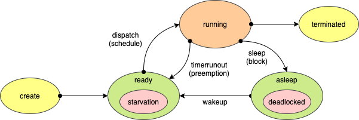
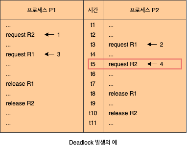

# Deadlock

## 1. Deadlock의 개념

- Blocked/Asleep State
  - 프로세스가 특정 이벤트를 기다리는 상태입니다.
  - 프로세스가 필요한 자원을 기다리는 상태입니다.
- Deadlock State
  - 프로세스가 발생 가능성이 없는 이벤트를 기다리는 경우입니다. (프로세스가 Deadlock 상태)
  - 시스템 내에 Deadloc에 빠진 프로세스가 있는 경우입니다. (시스템이 Deadlock 상태)

### 1.1 자원의 분류

#### 1.1.1 선점 가능 여부에 따른 분류

- **Preemptible Rresources**
  - 선점 당한 후, 돌아와도 문제가 발생하지 않는 자원입니다.
  - Precessor, Memory 등
- **Non-preemptible Resources**
  - 선점 당하면, 이후 진행에 문제가 발생하는 자원입니다.
  - Disk Drive 등

#### 1.1.2 할당 단위에 따른 분류

- **Total Allocation Resources**
  - 자원 전체를 프로세스에게 할당합니다.
  - Processor, Disk Drive 등
- **Partitioned Allocation Resources**
  - 하나의 자원을 여러 조각으로 나누어, 여러 프로세스들에게 할당합니다.
  - Memory 등

#### 1.1.3 동시 사용 가능 여부에 따른 분류

- **Exclusive Allocation Resources**
  - 한 순간에 한 프로세스만 사용 가능한 자원입니다.
  - Processor, Memory, Disk Drive 등
- **Shared Allocation Resources**
  - 여러 프로세스가 동시에 사용 가능한 자원입니다.
  - Program(SW), Shared Data 등

#### 1.1.4 재사용 가능 여부에 따른 분류

- **SR (Serially-Reusable Resources)**
  - 시스템 내에 항상 존재하는 자원입니다.
  - 사용이 끝나면, 다른 프로세스가 사용 가능합니다.
  - Processor, Memory, Disk Drice, Program 등
- **CR (Consumable Resources)**
  - 한 프로세스가 사용한 후에 사라지는 자원입니다.
  - signal, message 등

### 1.2 Deadlock을 발생시킬 수 있는 자원의 형태

- Non-preemptible resources
- Exclusive Allocation Resources
- Serially Reusable Resources

## 2. Deadlock Model

## 2.1 Graph Model

## 2.2 State Transition Model

## 3. Deadlock 해결 방법들

### 3.1 Deadlock Prevention

### 3.2 Deadlock Avoidance

### 3.3 Deadlock Detection and Recovery
