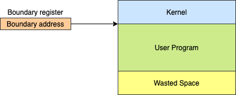
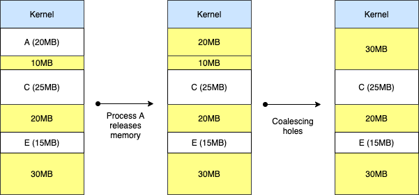

# 메인 메모리 관리

## 1. Address Binding

프로그램의 논리 주소를 실제 메모리의 물리 주소로 매핑하는 작업입니다.

### 1.1 Compile time binding

- 프로세스가 메모리에 적재될 위치를 컴파일러가 알 수 있는 경우입니다.
- 위치가 변하지 않습니다.
- 프로그램 전체가 메모리에 올라가야 합니다.

### 1.2 Load time binding

- 메모리 적재 위치를 컴파일 시점에서 모르면, 대체 가능한 상대 주소를 생성합니다.
- **적재 시점**(Load time)에 시작 주소를 상대 주소에 반영하여 사용자 코드 상의 주소를 재설정합니다.
- 프로그램 전체가 메모리에 올라가야 합니다.

### 1.3 Run-time binding (Execution time binding)

- Address binding을 수행시간(Ready -> Running)까지 연기합니다.
  - 프로세스가 수행 도중 다른 메모리 위치로 이동할 수 있습니다.
- 하드웨어의 도움이 필요합니다.
  - **MMU**(Memory Management Unit)
- 대부분의 OS가 사용합니다.

## 2. 메모리 낭비 방지

### 2.1 Dynamic Loading

- 프로그램이 실행하는데 반드시 필요한 루틴/데이터만 적재합니다.
- 모든 루틴을 교체 가능한 형태로 디스크에 저장합니다.
- 실제 호출 전까지는 루틴을 메모리에 적제하지 않습니다.
  - 메인 프로그램만 메모리에 적재하여 수행합니다.
  - 루틴의 호출 시점에 Address Binding을 수행합니다.
- 메모리 공간을 효율적으로 사용할 수 있습니다.

### 2.2 Swapping

- **Swap-out**: 프로세서 할당이 끝나고 수행 완료 된 프로세스는 swap-device로 보냅니다.
- **Swap-in**: 새롭게 시작하는 프로세스를 메모리에 적재합니다.

## 3. 연속할당 (Continuous Memoru Allocation)

- 프로세스를 하나의 연속된 메모리 공간에 할당하는 정책입니다.
- 메모리 구성 정책
  - 메모리에 동시에 올라갈 수 있는 프로세스 수 (Muliprogramming degree)
  - 각 프로셋스에게 할당되는 메모리 공간 크기
  - 메모리 분할 방법

### 4. Uni-programming

- 하나의 프로세스만 메모리 상에 존재합니다.
- 가장 간단한 메모리 관리 기법입니다.

##### 프로그램이 메모리의 크기보다 큰 문제

Overlay structure를 사용하여 해결합니다.

- 메모리에 현재 필요한 영역만 적재합니다.
- 사용자 혹은 프로그래머가 프로그램의 흐름 및 자료구조를 모두 알고 있어야 합니다.

##### 커널(Kernel) 보호

경계 레지스터(Boundary register)를 사용합니다.

##### Low ststem resource utilization & Low system preformance

Multi-programming 을 사용합니다.

## 5. Multi-programming

### 5.1 Fixed Partition Multi-programming (FPM)

- 메모리 공간을 고정된 크기로 미리 분활합니다.
- 각 프로세스는 하나의 **분할**(Partition)에 적재합니다.
- 메모리 관리가 간편합니다. (Low overhead)
- 시스템 자원이 낭비 될 수 있습니다. (Internal fragmentation, External fragmentation)

##### 커널 및 사용자 영역 보호

경계 레지스터(Boundaryt register)를 사용합니다.

##### Fragmentation (단편화)

- 메모리가 낭비 됩니다.
- **내부 단편화**(Internal fragmentation): Pratition 크기가 Process 크기보다 클 때 발생합니다.
- **외부 단편화**(External fragmentation): 남은 전체 메모리가 Process의 크기보다 크지만, 남은 Pration의 크기가 Process 크기보다 작을 떄 발생합니다.

### 5.2 Variable Partition Multi-programming (VPM)

- 초기에는 전체가 하나의 영역입니다.
- 프로세스를 처리하는 과정에서 메모리 공간이 동적으로 분할됩니다.
  - 내부 단편화(Internal fragmentation)가 발생하지 않습니다.

#### 5.2.1 배치 전략 (Placement Strategies)

##### 최초 적합 (First-fit)

- 충분한 크기를 가진 첫 번쨰 pratition을 선택합니다.
- Simple ans low overhead
- 공간 활용률이 떨어질 수 있습니다.

##### 최적 적합 (Best-fit)

- Process가 들어갈 수 있는 partition 중 가장 작은 곳을 선택합니다.
- 탐색 시간이 오래 걸립니다.
- 크기가 큰 Partition을 유지할 수 있습니다.
- 활용하기 어려운 작은 크기의 Partition이 많이 발생합니다.

##### 최악 적합 (Worst-fit)

- Process가 들어갈 수 있는 partition 중 가장 큰 곳을 선택합니다.
- 탐색 시간이 오래 걸립니다.
- 작은 크기의 partition 발생을 줄일 수 있습니다.
- 큰 크기의 partition 확보가 어렵습니다.

##### 순차 최초 적합 (Next-fit)

- 최초 적합 전략과 유사합니다.
- State table에서 맘지막으로 탄색한 위치부터 탐색합니다.
- 메모리 영역의 사용 빈도를 균등화합니다.

#### 5.2.2 공간 통합 (Coalescing holes)

- 인접한 빈 영역을 하나의 partition으로 통합합니다.
- Process가 memory를 release하고 나가면 수행합니다.
- Low overhead

#### 5.2.3 메모리 압축 (Storage Compaction)

- 모든 빈 공간을 하나로 통합합니다.
- Process 처리에 필요한 적재 공간 확보가 필요할 때 수행합니다.
- High overhead
  - 모든 Process를 재배치하는 과정에서, Process가 중지합니다.
  - 많은 시스템 자원을 소비합니다.

## 6. 출처

- [운영체제 강의 - HCP Lab.KOREATECH](https://www.youtube.com/watch?v=es3WGii_7mc)
- [운영체제 KOCW 양희재 교수님 강의 정리 - codemcd](https://velog.io/@codemcd/%EC%9A%B4%EC%98%81%EC%B2%B4%EC%A0%9COS-5.-%ED%94%84%EB%A1%9C%EC%84%B8%EC%8A%A4-%EA%B4%80%EB%A6%AC)
