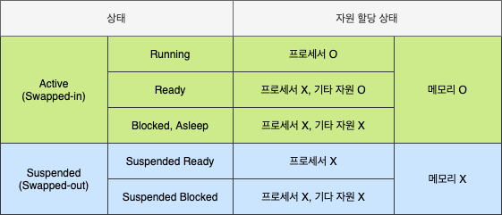
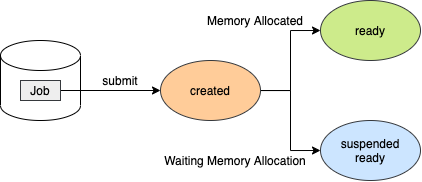
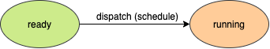
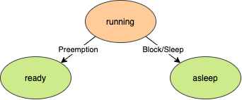
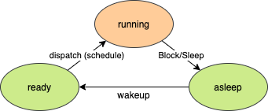
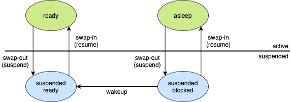
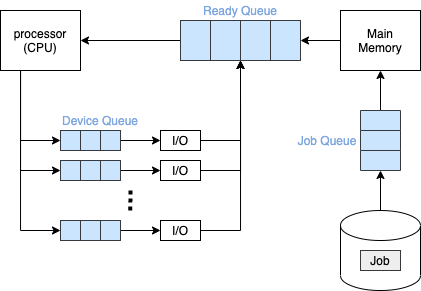
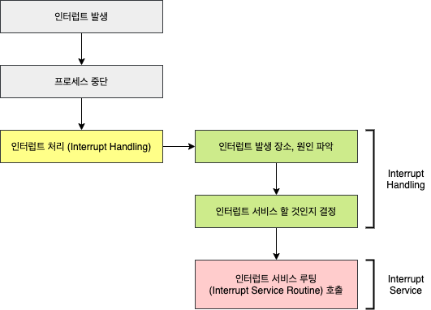

# 프로세스 관리

## 1. 프로세스의 개념

- 커널에 등록되고 커널의 관리하에 있는 **실행중인 프로그램**입니다.
- 각종 자원들을 요청, 할당, 반납하는 **능동적인 개체**(CActive Entity)입니다.
- **프로세스 관리 블록**(PCB)를 할당 받은 개체입니다.

### 1.1 프로세스의 종류

#### 1.1.1 역할로 구분

- **시스템(커널) 프로세스**: 모든 시스템 메모리와 프로세서의 명령에 액세스할 수 있는 프로세스입니다. 프로세스 실행 순서를 제어하거나 다른 사용자 및 커널(운영체제) 영역을 침범하지 못하게 감시하고, 사용자 프로세스를 생성하는 기능을 합니다.
- **사용자 프로세스**: 사용자 코드를 수행하는 프로세스입니다.

#### 1.1.2 병행 수행 방법으로 구분

- **독립 프로세스**: 다른 프로세스에 영향을 주지 않거나 다른 프로세스의 영향을 받지 않으면서 수행하는 병행 프로세스입니다.
- **협력 프로세스**: 다른 프로세스에 영향을 주거나 다른 프로세스에서 영향을 받는 병행 프로세스입니다.

## 2. PCB (Process Contorl Block)

OS가 프로세스 관리에 필요한 정보를 저장하는 곳으로, 프로세스 생성과 함께 생성됩니다. PCB가 관리하는 정보는 다음과 같습니다.

- **PID**(Process Identification Number): 프로세스 고유 식별 번호
- **스케줄링 정보**: 프로세스 우선순위 등과 같은 스케줄링 관련 정보
- **프로세스 상태**: 자원 할당, 요청 정보 등
- **메모리 관리 정보**: Page Table, Segment Table 등
- **입출력 상태 정보**: 할당 받은 입출력 장치, 파일 등에 대한 정보 등
- **문맥 저장 영역**(Context Save Area): 프로세스의 레지스터 상태를 저장하는 공간 등
- **계정 정보**: 자원 사용 시간 등을 관리

## 3. 프로세서의 상태 (Process States)

### 3.1 Created State

- **작업**(Job)을 커널에 등록합니다. 프로세스가 생성됨고 PCB가 할당됩니다.
- 가용 메모리 공간을 체크하고 프로세스 상태를 **Ready** 혹은 **Suspended Ready**로 전이합니다.

### 3.2 Ready State

- 프로세서 외에 다른 모든 자원을 할당 받은 상태입니다.
- 프로세서 할당을 대기하며, 즉시 실행 가능한 상태입니다.

### 3.3 Running State

- 프로세서와 필요한 자원을 모두 할당 받은 상태입니다.

### 3.4 Blocked/Asleep State

- 프로세스가 끝나지 않은 시점에서 프로세서 외에 다른 자원을 기다리는 상태입니다.
- 자원 할당은 System Call에 의해 이루어집니다.
- 다시 프로세서를 할당 받기 위해 ready 상태로 돌아가야 합니다.

### 3.5 Suspended State

- 메모리를 할당 받지 못한(빼앗긴) 상태입니다.
- Memory Image를 Swap Device에 보광합니다.

### 3.6 Terminated/Zombie State

- 프로세스 수행이 끝난 상태입니다.
- 모든 자원을 반납 후, 커널 내에 일부 PCB 정보만 남아 있는 상태입니다.
- 이후 프로세스 관리를 위해 정보가 수집됩니다.

## 4. 프로세스 큐 (Process Queue)

프로세스는 수행하면서 상태가 여러 번 변하는데 이에 따라 서비스를 받아야하는 곳이 다릅니다. 그리고 프로세스는 일반적으로 여러 개가 한 번에 수행되므로 그에 따른 순서가 필요합니다. 이러한 순서를 대기하는 곳을 **큐**(Queue)라고 합니다.

- **Job Queue**: 디스크에 있는 프로그램이 실행되기 위해 메인 메모리의 할당 순서를 기다리는 큐입니다.
- **Ready Queue**: 프로세서 할당 순서를 기다리는 큐입니다.
- **Device Queue**: 프로세서 외에 다른 자원의 장치를 기리는 큐입니다. 자원에 따라 가각 관리됩니다.

## 5. 인터럽트 (Interrupt)

- 예상치 못한, 외부에서 발생한 이벤트입니다.
- 인터럽트의 종류는 다음과 같습니다.
  - I/O interrupt
  - Clock interrupt
  - Console interrupt
  - Program check interrupt
  - Machine check interrupt
  - Inter-process interrupt
  - System call iterrupt

## 6. Context Switching (문맥 교환)

- **Context**: 프로세스와 관련된 정보들의 집합
  - CPU register context => CPU
  - Code & Data, Stack, PCB => Memory
- **Context Saving**: 현재 프로세스의 Register Context를 저장하는 작업
- **Context Resoring**: Register Context를 프로세스로 복구하는 작업
- **Context Switching**: 실행 중인 프로세스의 Context를 저장(Context Saving)하고,앞으로 실행 할 프로세스의 Context를 복구(Context Resotring)하는 일
  - 커널의 개입으로 이루어집니다.

### 6.1 Context Switch Overhead

- Context Switching에 소요되는 비용은 OS마다 다르지만, OS의 성능에 큰 영향을 줍니다.
- 따라서 불필요한 Context Switching을 줄이는 것이 중요합니다.
  - **스레드**(Thread) 사용 등

## 7. 출처

- [운영체제 강의 - HCP Lab.KOREATECH](https://www.youtube.com/watch?v=EdTtGv9w2sA&list=PLBrGAFAIyf5rby7QylRc6JxU5lzQ9c4tN&index=1)
- [운영체제 KOCW 양희재 교수님 강의 정리 - codemcd](https://velog.io/@codemcd/%EC%9A%B4%EC%98%81%EC%B2%B4%EC%A0%9COS-5.-%ED%94%84%EB%A1%9C%EC%84%B8%EC%8A%A4-%EA%B4%80%EB%A6%AC)
