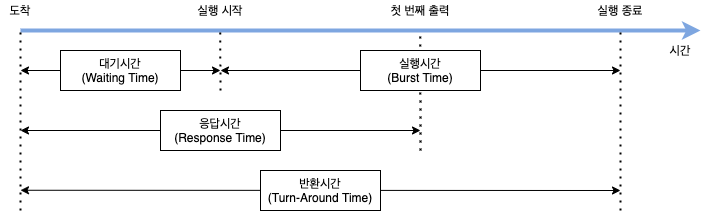
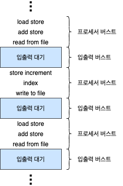
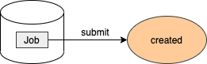
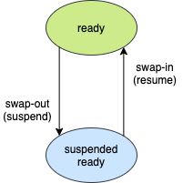
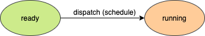
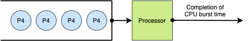
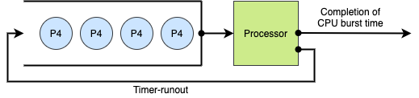
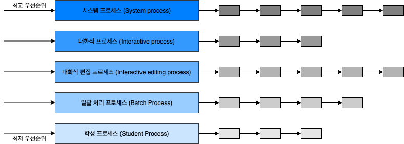
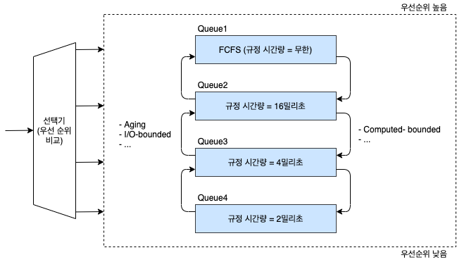

# 스케줄링

## 1. 멀티프로그래밍 (Multi-programming)

- 멀티프로그래밍은 메인 메모리에 여러개의 프로세스를 상주시켜, 단일 프로세서 환경에서 동시에 여러 프로세스가 동시에 실행되는 것처럼 처리하는 것을 말합니다.
- 메모리 관리 기법이나 CPU 스케줄링 기법을 사용해 자원을 할당 할 프로세스를 선택합니다.
- **시간 분할 관리**(Time Sharing)
  - 하나의 자원을 여러 슬레드들이 번갈아 가며 사용합니다.
  - 예) 프로세서(Processor)
- **공간 분할 관리**(Space Sharing)
  - 하나의 자원을 반할하여 동시에 사용합니다.
  - 예) 메모리(Memory)

## 2. 시스템 성능 지표

- **작업 처리량**(Throughput): 단위 시간 동안 완료된 작업의 수
- **자원 활용도**(Resource Utilization): 주어진 시간 동안 자원이 활용된 시간
- **반환 시간**(Turnaround Time): 작업 요청으로부터 모든 작업을 끝내고 종료하는데 걸린 시간
- **대기 시간**(Waitting Time): CPU를 점유하기 위해 Ready Queue에서 기다린 시간
- **응답 시간**(Response Time): 작업 요청으로부터 응답을 받을때까지의 시간

## 3. 스케줄링 기준 및 단계

### 3.1 스케줄링 기준 (Criteria)

#### 3.1.1 스케줄링 기법이 고려하는 항목

- 프로세스의 특성
  - I/O bound process or CPU bound process
- 시스템 특성
  - Batch system or Interactive system
- 프로세스의 긴급성
  - Hard-real time, Soft-real time, non-real time system
- 프로세스 우선순위
- 플소세스 총 실행 시간

#### 3.1.2 I/O bound process vs CPU bound process

Burst time은 스케줄링의 중요한 기준 중 하나입니다. Job scheduler는 I/O bound process와 CPU bound process를 적절히 분배해서 메모리에 할당해주어야 합니다.

- **프로세스 수행**: CPU 사용 + I/O 대기
- **CPU burst**: CPU 사용 시간
- **I/O burst**: I/O 대기 시간
- **I/O bound process**: I/O(입출력) 작업이 차지하는 비중이 높은 프로세스
- **CPU bound process**: CPU 작업(계산)이 차지하는 비중이 높은 프로세스

### 3.2 스케줄링 단계 (Level)

#### 3.2.1 장기 스케줄러(Long-term Scheduler or Job Scheduler)

시스템에 제출(커널에 등록) 할 **작업**(Job)을 결정합니다.

- 메모리와 디스크 사이의 스케줄링 담당합니다.
- 프로세스에 메모리(및 각종 리소스)를 할당(admit)합니다.
- **다중프로그래밍 정도**(Degree of Multiprogramming)를 제어합니다. (실행중인 프로세스의 수 제어)
- I/O bound process와 CPU bound process를 적절히 분배해서 메모리에 할당해주어야 합니다.
- **시분할 시스템**(time sharing system)에서는 장기 스케줄러가 없습니다. 그냥 곧바로 메모리에 올라가 ready 상태가 됩니다.

#### 3.2.2 중기 스케줄러(Medium-term Scheduler or Swapper)

- 여유 공간 마련을 위해 프로세스의 메모리 할당을 결정합니다. (swap-in/seap-out)
- 현 시스템에서 메모리에 너무 많은 프로그램이 동시에 올라가는 것을 조절해줍니다.
  - degree of Multiprograming 제어

#### 3.2.3 단기 스케줄러 (Short-term Scheduler or CPU Scheduler)

**프로세서**(Processor)를 할당할 **프로세스**(Process)를 결정합니다.

- CPU와 메모리 사이의 스케줄링 담당합니다.
- 프로세스에 CPU를 할당합니다. (Schduler Dispatch)
- 가장 빈번하게 발생하며, 매우 빨라야합니다.

## 4. 스케줄링 정책

### 4.1 Preemptive vs Non-preemptive

#### 4.1.1 Non-preemptive scheduling

- 한 프로세스가 한 번 프로세서를 점유했다면 스스로 반납할 떄까지 사용합니다.
  - I/O, 인터럽트, 프로세스 종료
- Context Switch Overhead가 적습니다.
- 잦은 우선순위 역전, 평균 응답 시간 증가

#### 4.1.2 Preemptive scheduling

- 프로세스가 점유한 프로세서를 다른 프로세스에게 빼앗길 수 있습니다.
  - 할당 시간 종료, 우선 순위가 높은 프로세스 등장
- Context Switch Overhead가 큽니다.
- Time-sharing system, real-time system 등에 적합합니다.

### 4.2 우선순위 (Priority)

#### 4.2.1 정적 우선순위 (Static Priority)

- 프로세스 생성시 결정된 우선순위가 유지됩니다.
- 구현이 쉽고, overhead가 적습니다.
- 시스템 환경 변화에 대한 대응이 어렵습니다.

#### 4.2.2 동적 우선순위 (Dynamic Priority)

- 프로세스의 상태 변화에 따라 우선순위가 변경됩니다.
- 구현이 복잡하고, 우선순위 재계산 overhead가 큽니다.
- 시스템 환경 변화에 유연한 대응이 가능합니다.

## 5. 기본 스케줄링 알고리즘

### 5.1 FCFS (First-Come-First-Service)

- Non-preemptive scheduling
- 도착 시간을 기준으로 먼저 도착한 프로세스를 먼저 처리하는 방식입니다.
- **자원 활용도**(Resource Utilization)가 높습니다.
- **평균 응답 시간**(Response Time)이 깁니다.
  - **Convoy Effect**: 수행시간이 긴 하나의 프로세스에 의해 다른 프로세스들이 긴 대기시간을 갖게 되는 현상입니다.
- Batch system에 적합하고, Interactive system에 부적합합니다.

#### 5.1.1 FCFS Practice

| Process ID | Arrival Time | Brust Time (BT) | Waiting Time (WT = TT - BT) | Turnaround Time (TT) | Normalized TT (NTT = TT / BT) |
| ---------- | ------------ | --------------- | --------------------------- | -------------------- | ----------------------------- |
| P1         | 0            | 3               | 0                           | 3                    | 3 / 3 = 1                     |
| P2         | 1            | 7               | 2                           | 9                    | 9 / 7 = 1.3                   |
| P3         | 3            | 2               | 7                           | 9                    | 9 / 2 = 4.5                   |
| P4         | 5            | 5               | 7                           | 12                   | 12 / 5 = 2.4                  |
| P5         | 6            | 3               | 11                          | 14                   | 14 / 3 = 4.7                  |

### 5.2 RR (Round Robin)

- Preemptive scheduling
- 도착 시간을 기준으로 먼저 도착한 프로세스를 먼저 처리하는 방식입니다.
- **자원 사용 제한 시간**(Time Quantum)이 있습니다.
  - 프로세스는 할당된 시간이 지나면 자원을 반납합니다. (Time-runout)
  - 특정 프로세스의 자원 **독점**(monopoly)를 방지합니다.
  - Context Swirch Overhead가 큽니다.
- 자원 사용 제한 시간은 시스템의 성능을 결정하는 핵심 요소입니다.
  - 자원 사용 제한 시간이 매우 크면 FCFS와 유사합니다.
  - 자원 사용 제한 시간이 매우 작으면 사용자는 모든 프로세스가 각각의 프로세서 위에서 실행되는 것처럼 느끼지만, Context Switch Overhead가 매우 커집니다.
- 대화형, 시분할 시스템에 적합합니다.

#### 5.2.1 RR Practice

**자원 사용 제한 시간**(Time Quantum) = 2
**평균 응답 시간**(Average Response Time) = 10.80

| Process ID | Arrival Time | Brust Time (BT) | Waiting Time (WT = TT - BT) | Turnaround Time (TT) | Normalized TT (NTT = TT / BT) |
| ---------- | ------------ | --------------- | --------------------------- | -------------------- | ----------------------------- |
| P1         | 0            | 3               | 2                           | 5                    | 5 / 3 = 1.7                   |
| P2         | 1            | 7               | 11                          | 18                   | 18 / 7 = 2.6                  |
| P3         | 3            | 2               | 2                           | 4                    | 4 / 2 = 2                     |
| P4         | 5            | 5               | 10                          | 15                   | 15 / 5 = 3                    |
| P5         | 6            | 3               | 9                           | 12                   | 12 / 3 = 4                    |

#### 5.2.2 RR Practice

**자원 사용 제한 시간**(Time Quantum) = 3
**평균 응답 시간**(Average Response Time) = 9.80

| Process ID | Arrival Time | Brust Time (BT) | Waiting Time (WT = TT - BT) | Turnaround Time (TT) | Normalized TT (NTT = TT / BT) |
| ---------- | ------------ | --------------- | --------------------------- | -------------------- | ----------------------------- |
| P1         | 0            | 3               | 0                           | 3                    | 3 /3 = 1                      |
| P2         | 1            | 7               | 12                          | 19                   | 19 / 7 = 2.7                  |
| P3         | 3            | 2               | 3                           | 5                    | 5 / 2 = 2.5                   |
| P4         | 5            | 5               | 9                           | 14                   | 14 / 5 = 2.8                  |
| P5         | 6            | 3               | 5                           | 8                    | 8 / 3 = 2.7                   |

### 5.3 SPN (Shortest-Process-Next)

- Non-preemptive scheduling
- **실행 시간**(Burst time)이 가장 작은 프로세스를 먼저 처리하는 방식입니다.
- 평균 대기시간을 최소화하여 많은 프로세스들에게 빠른 응답 시간을 제공합니다.
- 시스템 내 프로세스 수를 최소화합니다.
  - 스케줄링 부하 감소, 메모리 절약으로 시스템 효울을 향상시킵니다.
- **무한 대기 현상**(Starvation)이 발생합니다. 실행 시간이 긴 프로세스는 자원을 할당 받지 못 할 수 있습니다.
- 정확한 실행시간을 알 수 없으므로, 실행시간 예측 기법이 필요합니다.

#### 5.3.1 SPN Practice

| Process ID | Arrival Time | Brust Time (BT) | Waiting Time (WT = TT - BT) | Turnaround Time (TT) | Normalized TT (NTT = TT / BT) |
| ---------- | ------------ | --------------- | --------------------------- | -------------------- | ----------------------------- |
| P1         | 0            | 3               | 0                           | 3                    | 3 / 3 = 1                     |
| P2         | 1            | 7               | 12                          | 19                   | 19 / 7 = 2.7                  |
| P3         | 3            | 2               | 0                           | 2                    | 2 / 2 = 1                     |
| P4         | 5            | 5               | 0                           | 5                    | 5 / 5 = 1                     |
| P5         | 6            | 3               | 4                           | 7                    | 7 / 3 = 2.3                   |

### 5.4 SRTN (Shortest Remaining Time Next)

- Preemtive scheduling
- SPN의 변형으로 잔여 실행 시간이 더 적은 프로세스가 ready 상태가 되면 선점됩니다.
- SPN의 장점이 극대화됩니다.
- 잔여 실행을 계속 추적해야 하는 overhead가 발생합니다.
- Context Switching Overhead
- 구현 밑 사용이 비현실적입니다.

### 5.5 HRRN (High-Response-Ratio-Next)

- Non-preemptive scheduling
- SPN의 변형으로 Aging Concept를 추가했습니다. 프로세스의 대기 시간을 고려하여 기회를 제공합니다.
- **응답률**(Response Ratio)이 가장 높은 프로세스를 먼저 처리하는 방식입니다.
  - 응답률 = (WR + BT) / BT
- SPN의 장점을 유지하면서 Starvation을 방지합니다.
- 하지만 실행 시간 예측 기법은 여전히 필요합니다. (overhead)

| Process ID | Arrival Time | Brust Time (BT) | Waiting Time (WT = TT - BT) | Turnaround Time (TT) | Normalized TT (NTT = TT / BT) |
| ---------- | ------------ | --------------- | --------------------------- | -------------------- | ----------------------------- |
| P1         | 0            | 3               | 0                           | 3                    | 3 / 3 = 1                     |
| P2         | 1            | 7               | 2                           | 9                    | 9 / 7 = 1.29                  |
| P3         | 3            | 2               | 7                           | 9                    | 9 / 2 = 4.5                   |
| P4         | 5            | 5               | 15                          | 15                   | 15 / 5 = 3                    |
| P5         | 6            | 3               | 6                           | 9                    | 9 / 3 = 3                     |

### 5.6 MLQ (Multi-Level Queue)

- 작업(or 우선순위)별 별도의 Ready Queue를 가집니다.
  - 최초 배정 된 Queue를 벗어나지 못합니다.
  - 각각의 Queue는 자신만의 스케줄링 기법을 사용합니다.
- Queue 사이에는 우선순위 기반의 스케줄링을 사용합니다.
  - fixed-priority preemptive scheduling
- 빠른 응답시간을 가집니다.
- 여러 개의 Queue 관리 등 스케줄링 Overhead가 큽니다.
- 우선순위가 낮은 Queue는 Starvation 현상이 발생할 수 있습니다.

### 5.7 MFQ (Multi-Level Feedback Queue)

- 프로세스의 Queue간 이동이 허용된 MLQ입니다.
- Feedback을 통해 우선 순위를 조정합니다.
  - Dynamic-priority preemptive scheduling
- 프로세스에 대한 사전 정보 없이 SPN, SRTN, HRRN 기법의 효과를 볼 수 있습니다.

- 각 준비 큐마다 시간 할당량을 다르게 배정할 수 있습니다.
  - 프로세스의 특성에 맞는 형태로 시스템 운영이 가능합니다.
- 입출력 위주 프로세스들을 상위 단계의 큐로 이동하여 우선 순위를 높일 수 있습니다.
  - 프로세스가 block될 때 상위의 준비 큐로 진입하게 됩니다.
  - 시스템 전체의 평균 응답 시간을 줄이며, 입출력 작업을 분산 시킵니다.
- 대기 시간이 지정된 시간을 초과한 프로세스들을 상위 큐로 이동할 수 있습니다.
  - 에이징 기법

## 6. 출처

- [운영체제 강의 - HCP Lab.KOREATECH](https://www.youtube.com/watch?v=EdTtGv9w2sA&list=PLBrGAFAIyf5rby7QylRc6JxU5lzQ9c4tN&index=1)
- [운영체제 KOCW 양희재 교수님 강의 정리 - codemcd](https://velog.io/@codemcd/%EC%9A%B4%EC%98%81%EC%B2%B4%EC%A0%9COS-6.-CPU-%EC%8A%A4%EC%BC%80%EC%A4%84%EB%A7%81)
