# 프로세스 동기화

## 1. 동기화

- 현대 컴퓨터의 메모리에는 여러 프로세스가 존재하며 서로 독립적으로 동작합니다.
  - **비동기적**(Asynchronous): 프로세스들이 서로에 대해 모릅니다.
  - **병행정**9Concurrnet): 여러 개의 프로세스들이 동시에 시스템에 존재합니다.
- 병행 수행중인 비동기적 프로세스들이 하나의 공유 자원 또는 데이터에 접근할 때, 문제가 발생할 수 있습니다.
- 이런 환경에서 프로세스 동기화는 여러 프로세스가 공유하는 자원의 일관성을 유지하는 것입니다.
  - **공유 데이터**(Shared Data): 여러 프로세스들이 공유하는 데이터
  - **임계 영역**(Critical Section): 공유 데이터를 접근하는 **코드 영역**(Code Segment)
  - **상호배제**(Mtual Exclusion): 둘 이사으이 프로세스가 동시에 **임계 영역**(Critical Section)에 진입하는 것을 막는 것

## 2. 상호배제 (Mutual Exclusion)

### 2.1 Mutal Exclusion Primitives

- **상호배제**(Mutual Exclusion): Ciritical Sesction(CS)에 프로세스가 있으면, 다른 프로세스의 진입을 금지합니다.
- **진행**(Progress): CS 안에 있는 프로세스 외에는, 다른 프로세스가 CS에 진입하는 것을 방해 하면 안됩니다.
- **한정대기**(Bounded Waiting): 프로세스의 CS 진입은 유한시간 내에 허용되어야 합니다.

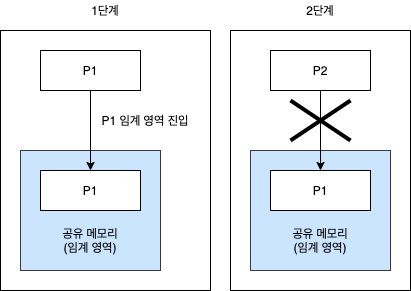

### 2.2 Mutual Exclusion Methods

- **enterCS()**
  - Critical Section 진입 전 검사하는 함수입니다.
  - 다른 프로세스가 Critical Section 안에 있는지 검사합니다.
- **exitCS()**
  - Critical Section을 벗어알 때의 후처리 과정입니다.
  - Critical Section을 벗어남을 시스템에 알립니다.

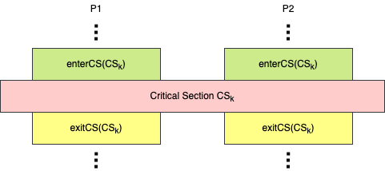

## 3. SW Solution

- 속도가 느립니다.
- 구현이 복잡합니다.
- ME primitive 실행 중 preemption 될 수 있습니다.
- **Busy Waiting**: 공유 자원을 사용할 수 있는지 없는지 계속해서 무한 루프를 돌면서 조건문을 체크하는 방식입니다. (Inefficient)

### 3.1 Dekker's Algorithm

- Two Process ME를 보장하는 최초의 알고리즘입니다.

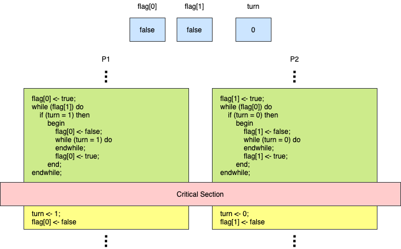

### 3.2 Peterson's Algorithm

- Dekker's Algorithm 보다 간단하게 구현했습니다.

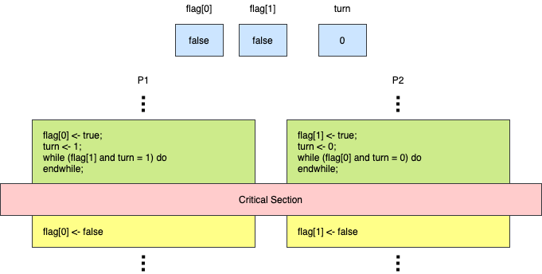

### 3.3 Dijkstra's Algorithm

- 최초로 프로세스 n개의 상호배제 문제를 소프트웨어적으로 해결했습니다.
- 실행 시간이 가장 짧은 프로세스에 프로세서를 할당하는 세마포 방법이빈다.
- 가장 짧은 평균 대기시간을 제공합니다.

| flag[] 값 | 의미                                                           |
| :-------: | -------------------------------------------------------------- |
|   idle    | 프로세스가 임계 지역 진입을 시도하고 있지 않을 때              |
|  want-in  | 프로세스의 임계 지역 진입 시도 1단계일 때                      |
|   in-CS   | 프로세스의 임계 지역 진입 시도 2단계 및 임계 지역 내에 있을 때 |

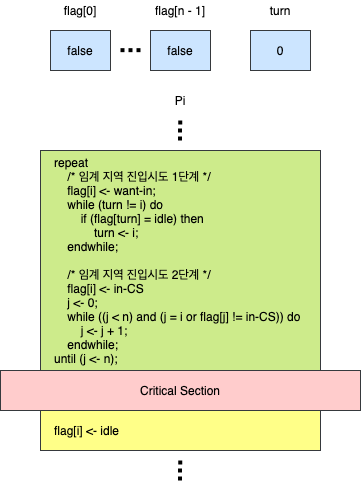

## 4. HW Solution

- 구현이 간단합니다.
- Busy Waiting (Inefficient)

### 4.1 TestAndSet(TAS) Instruction

- Test와 Set을 한번에 수행하는 기계어입니다.
  - Atomicity, Indivisible
  - 실행 중 Interrupt를 받지 않습니다. (Preemption 되지 않습니다.)
- Bussy Waiting (Inefficient)

```
// 모든 과정이 한번에 수행됩니다.
boolean TestAndSet (boolean *target) {
  boolean temp = *target; // 이전 값 기록
  *target = true; // true로 설정
  return temp // 이전 값 반환
}
```

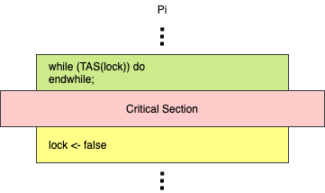

## 5. OS Suportted SW Solution

### 5.1 Spinlock

- 정수 변수입니다.
- 초기화, P(), V() 연산으로만 접근이 가능합니다.
  - OS Support(Indivisible, Atomicity) 연산입니다.
  - 전체가 한 Instruction Cycle에 수행되니다.
- 멀티 프로세서 시스템에서만 사용 가능합니다.
- Bussy Waiting (Inefficient)

```
P(S) {
  while (S <= 0) do
  endwhile;
  S <- S - 1;
}

V(S) {
  S <- S + 1;
}
```

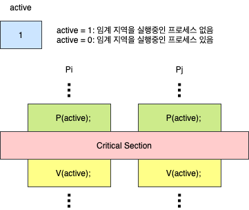

### 5.2 Semaphore

- 1965년 Dijkstra가 제안했습니다.
- Busy Waiting 문제를 해결했습니다.
- Semaphore Queuq에 대한 wake-up 순서는 비결정적입니다.

#### 5.2.1 음이 아닌 정수형 변수

- 임의의 S 변수 하나에 Ready Queue 하나가 할당됩니다.
- 초기화 연산, P(), V()로만 접근이 가능합니다.
  - OS Support(Indivisible, Atomicity) 연산입니다.
  - **초기화**: S 변수에 초기값을 부여하는 연산
  - **P**(Probern): 검사 연산
  - **V**(Verhogen): 증가 연산

```
P(S) {
  if (S > 0)
    then S <- S - 1;
    else wait on the queue Q;
}

V(S) {
  if waiting processes on Qs)
    then wakeup one of them;
    else S <- S + 1;
}
```

#### 5.2.2 Semphore 종류

- Binary Semaphore
  - S가 0과 1 두 종류의 값만 갖는 경우입니다.
  - 상호배제나 프로세스 동기화의 목적으로 사용됩니다.
- Counting Semaphore
  - S가 0이사의 정수값을 가질 수 있는 경우입니다.
  - Producer-Consumer 문제 등을 해결하기 위해 사용합니다.

#### 5.2.3 Mutual Exclusion


#### 5.2.4 Process Synchronization

Process들 병행적이고 비동기적으로 수행될 때, 프로세스들의 실행 순서를 맞춥니다.

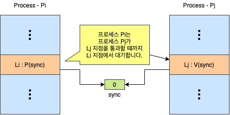

#### 5.2.5 Producer-Consumer Problem with Single Buffer

- **생산자 프로세스**(Producer Process): 메시지를 생성하는 프로세스 그룹
- **소비자 프로세스**(Consumer Process): 메시지를 전달받는 프로세스 그룸

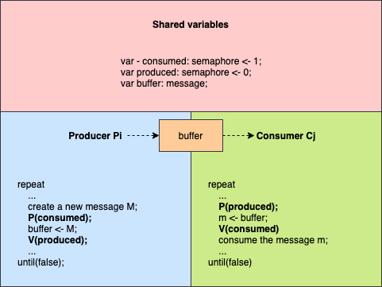

#### 5.2.6 Producer-Consumer Problem with N-Buffers

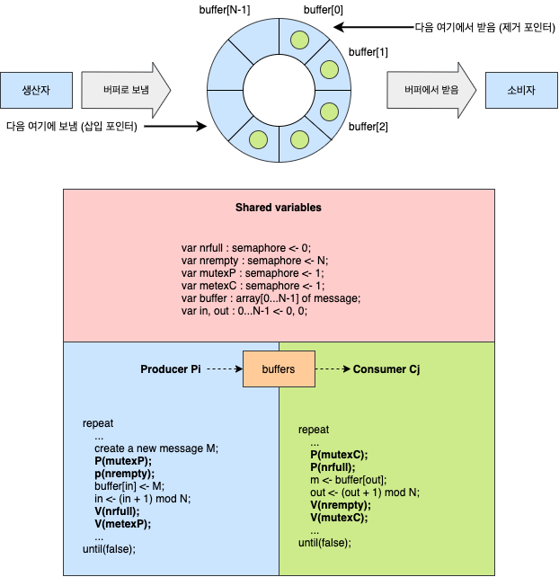

### 5.3 Eventcount / Sequencer

- 은행의 번호표와 비슷한 개념입니다.
- Busy Waiting 문제를 해결했습니다.
- Starvation 문제를 해결했습니다.
  - FIFO Scheduling for Queue
- Semaphore 보다 더 Low-Level Control이 가능합니다.

#### 5.3.1 용어 정리

- **Sequencer**
  - 정수형 변수입니다.
  - 생성시 0으로 초기화되고, 감소하지 않습니다.
  - 발생 사건들의 순서를 유지합니다.
  - ticket() 연산으로만 접근 가능합니다.
- **ticket(S)**
  - 현재까지 ticket() 연산이 호출 된 횟수를 반환합니다.
  - OS Support(Indivisible, Atomicity) 연산입니다.
- **Eventcount**
  - 정수형 변수입니다.
  - 생성시 0으로 초기화되고, 감소하지 않습니다.
  - 특정 사건의 발생 횟수를 기록합니다.
  - read(E), advance(E), awatit(E, v) 연산으로만 접근 가능합니다.
- **read(E)**
  - 현재 Eventcount 값을 반환합니다.
- **advance(E)**
  - E <- E + 1
  - E를 기다리고 있는 프로세스를 깨웁니다. (wake-up)
- **await(E, v)**
  - v는 정수형 변수입니다.
  - if(E < v)이면 E에 연결된 Queue에 프로세스를 전달 및 CPU Scheduler를 호출합니다.

#### 5.3.2 Mutual Exclusion

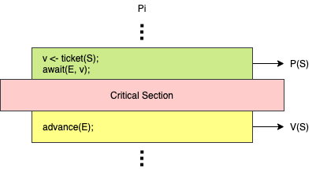

#### 5.3.3 Producer-Consumer Problem

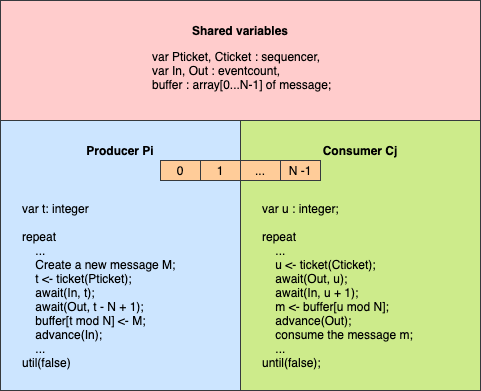

## 6. Language-Level Solution

### 6.1 Monitor

- High-Level Mechnism입니다.
- Deadlock 등 Error 발생 가능성이 낮고, 사용하기 쉽습니다.
- 지원하는 언어에서만 사용 가능합니다.
- Critical Section 접근 코드를 생성하기 위해서 컴파일러가 OS를 이해하고 있어야 합니다.
- **상호배제**(Mutual Exclusion): 모니터 내에는 항상 하나의 프로세스만 진입 가능합니다.
- **정보은폐**(Information hiding): 공유 데이터는 모니터 내의 프로세스만 접근 가능합니다.

#### 6.1.1 Monitor의 구조

- **공유 자원**: 공유 데이터와 Critical Section의 조합
- **공유 자원 접근 함수**: wait(), signal() operations
- **진입 큐**(Entry Queue): 모니터 내의 procedure 수만큼 존재합니다.
- **조건 큐**:(Condition Queue): 모니터 내의 특정 이벤트를 기다리는 프로세스가 대기합니다.
- **신호 제공자 큐**(Signaler Queue): 모니터에 항상 하나의 신호제공자 큐가 존재합니다. signal() 명령을 실행한 프로세스가 임시 대기합니다.

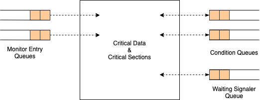

#### 6.1.2 자원 할당 문제

```
monitor resouceRiAllocatorl
var RilsAvailable : boolean,
    RilsFree : condition;

procedure requestR():
begin
  if (RilsAvailable) then
    RilsFree.wait();
  RilsAvailable <- false;
end;

procedure releaseR():
bdgin
  RilsAvailable <- true;
  RilsFree.signal();
end;

begin
  RilsAvailable <- true
end;
```

1. 자원 R 사용 가능하고, Monitor 안에 프로세스 없습니다.
2. 프로세스 Pj가 모니터 안에서 자원 R을 요청합니다.
3. 자원 R이 Pj에게 할당 됩니다. Pj가 Monitor에서 나갑니다
4. 프로세스 pk와 pm이 R을 요청합니다. (Condition Queue Push)
5. Pj가 R을 반환합니다. (Signaler Queue Push)
6. signal 호출에 의해 Pk가 wake-up 됩니다. (Condition Queue Pop)
7. 자원 R이 Pk에게 할당 됩니다. Pk가 Monitor에서 나갑니다.
8. Pj가 모니터 안으로 돌아와서, 남은 작업을 수행합니다. (Signaler Queue Pop)

#### 6.1.3 Producer-Consumer Problem

```
monitor ringbuffer;
var buffer : array[0...N-1] of message,
    validBufs : 0...N;
    in : 0...N-1;
    out: o...N-1,
    bufHasData, bufHasSpace : condition;

procedure fillBuf(var data : message):
begin
  if (validBufs = N) then bufHasSpace.wait();
  buffer[in] <- data;
  validBufs <- validBufs + 1;
  in <- (in + 1) mod N;
  vufHasData.signal();
end;

procedure emptyBuf(var data : message):
begin
  if (validBufs = 0) then bufHasData.wait();
  data <- buffer[0];
  validBufs <- validBufs -1;
  out <- (out + 1) mod N;
  bufHasSpace.signal();
end;

begin
  validBufs <- 0;
  in <- 0;
  out <- 0;
end;
```

#### 6.1.4 Dining Philosopher Problem

5명의 철학자들이 생각하는 일, 스파게티 먹는 일만을 반복합니다. 포크는 철학자들 사이에 하나씩 존재하며, 스파게티를 먹기 위해서는 좌우 포크 2개 모두 들어야 합니다. 여기서 공유 자원은 스파게티와 포크입니다.

```
monitor dining_philosophers;
var numForks : array[0...4] of integer,
    ready : array[0...4] of condition,
    i : integer;

procedure pickup(var me : integer):
begin
  if (numForks[me] != 2) then ready[me].wait();
  numForks[right(me)] <- numForks[right(me)] - 1;
  numForks[left(me)] <- numForks[left(me)] - 1;
end;

procedure putdown(var me : integer):
begin
  numForks[right(me)] <- numForks[right(me)] + 1;
  numForks[left(me)] <- numForks[left(me)] + 1;
  if (numForks[right(me)] = 2) then ready(right(me)).signal();
  if (numForks[left(me)] = 2) then ready(left(me)).signal()
end;

begin
  for i <- 0 to do
    numForks[i] <- 2;
end
```

## 7. 출처

- [운영체제 강의 - HCP Lab.KOREATECH](https://www.youtube.com/watch?v=EdTtGv9w2sA&list=PLBrGAFAIyf5rby7QylRc6JxU5lzQ9c4tN&index=1)
