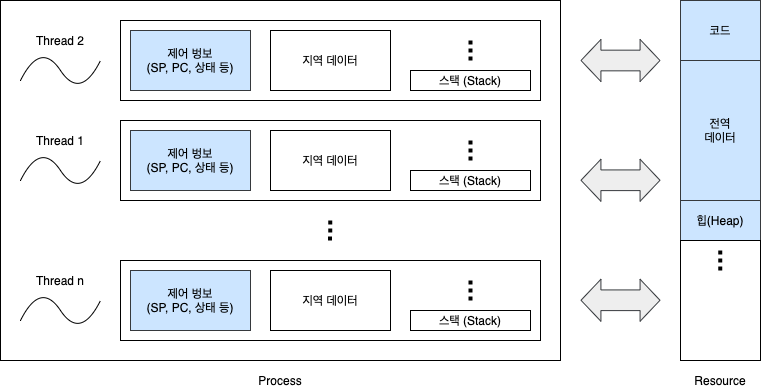
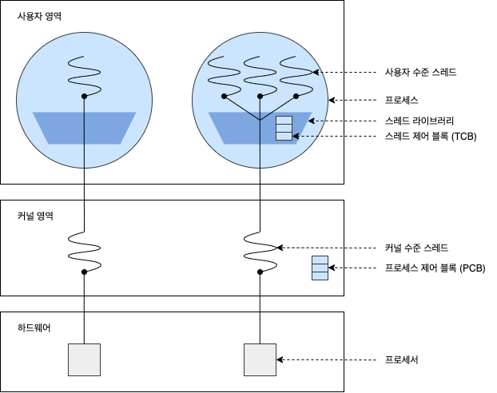
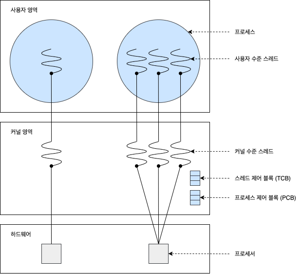

# 스레드 관리

## 1. 스레드의 개념

스레드는 프로세스의 실행 단위라고 할 수 있습니다. 프로세스는 이러한 스레드를 한 개 이상으로 나눌 수 있습니다. 스레드는 프로그램 카운터와 스택 포인터 등을 비롯한 쓰레드 실행 환경 정보(Context 정보), 지역 데이터, 스택을 독립적으로 가지면서 코드, 전역 데이터, 힙을 다른 쓰레드와 공유합니다.

### 1.1 스레드의 장점

- **사용자 응답성**(Responsiveness): 일부 스레드의 처리가 지연되어도, 다른 스레드는 작업을 계속 처리 가능합니다.
- **자원 공유**(Resource Sharing): 자원을 공유해서 효율성이 증가합니다. (커널의 개입을 피할 수 있습니다)
- **경재성**(Economy): 프로세스 컨텍스트 스위칭보다 쓰레드 컨텍스트 스위칭이 오버헤드가 적습니다.
- **멀티 프로세서 활용**(Multi-Processor): 병렬처리를 통해 성능과 효율이 향상됩니다.

## 2. 스레드의 구현

### 2.1 사용자 수준 스레드 (다대일 매핑)

사용자 수준 스레드는 사용자 영역의 **스레드 라이브러리**로 구현하고, 스레드와 관련된 모든 행위를 사용자 영역에서 하므로 커널이 스레드의 존재를 알지 못합니다. 여기서 스레드 라이브러리는 스레드의 생성과 종료, 스레드 간의 메시지 전달, 스레드의 스케줄링과 컨텍스트 등 정보를 보관합니다.

사용자 수준 스레드에서는 스레드 교환에 커널이 개입하지 않아 커널에서 사용자 영역으로 전환할 필요가 없습니다. 그리고 커널은 스레드가 아닌 프로세스를 한 단위로 인식하고 프로세서를 할당합니다. 다수의 사용자 수준 스레드가 커널 수준 스레드 한 개에 매핑되므로 다대일 스레디 매핑이라고 합니다.

#### 2.1.1 사용자 수준 스레드의 장점

- **이식성이 높음:** 커널에 독립적으로 스케줄링을 할 수 있어 모든 운영체제에 적용할 수 있습니다.
- **오버헤드가 적음:** 스케줄링이나 동기화를 하려고 커널을 호출하지 않으므로 커널 영역으로 전환하는 오버헤드가 줄어듭니다.
- **유연한 스케줄링 가능:** 커널이 아닌 스레드 라이브러리에서 스레드 스케줄링을 제어하므로 응용 프로그램에 맞게 스케줄링할 수 있습니다.

#### 2.1.2 사용자 수준 스레드의 단점

- **시스템의 동시성을 지원하지 않음:** 스레드가 아닌 프로세스 단위로 프로세서를 할당하여 다중 처리 환경을 갖춰도 스레드 단위로 다중 처리를 하지 못합니다. 동일한 프로세스의 스레드 한개가 대기 상태가 되면 이 중 어떤 스레드도 실행하지 못합니다.
- **확장에 제약이 따름:** 커널이 한 프로세스에 속한 여러 스레드에 프로세서를 동시에 할당할 수 없어 다중 처리 시스템에서 규모를 확장하기가 어렵습니다.
- **스레드 간 보호 불가능:** 스레드 간 보호에 커널의 보호 방법을 사용할 수 없습니다. 스레드 라이브러리에서 스레드 간 보호를 제공해야 프로세스 수준에서 보호가 가능합니다.

### 2.2 커널 수준 스레드 (일대일 매핑)

커널 수준 스레드는 사용자 수준 스레드의 한계를 극복하는 방법으로, 커널이 스레드와 관련된 모든 작업을 관리합니다. 한 프로세스에서 다수의 스레드가 프로세서를 할당받아 병행으로 수행하고, 스레드 한 개가 대기 상태가 되면 동일한 프로세스에 속한 다른 스레드로 교환이 가능합니다. 이 때도 커널이 개입하므로 사용자 영역에서 커널 영역으로 전환이 필요합니다. 커널 수준 스레드는 사용자 수준 스레드와 커널 수준 스레드가 일대일로 매핑됩니다. 따라서 사용자 수준 스레드를 생성하면 이에 대응하는 커널 스레드를 자동으로 생성합니다.

커널 수준 스레드는 커널이 직접 스케줄링하고 실행하기에 사용자 수준 스레드의 커널 자원이 부족한 문제를 해결할 수 있지만, 커널이 전체 프로세스와 스레드 정보를 유지하여 오버헤드가 커집니다. 대신 커널이 각 스레드를 개별적으로 관리할 수 있어 동일한 프로세스의 스레드들을 병행으로 수행할 수 있습니다. 동일한 프로세스에 있는 스레드 중 한 개가 대기 상태가 되더라도 다른 스레드를 실행할 수 있다는 장점이 있습니다. 하지만 이 과정에서도 커널 영역으로 전환하는 오버헤드가 발생하고 스케줄링과 동기화를 하려면 더 많은 자원이 필요합니다.

### 2.3 혼합형 스레드 (다대다 매핑)

혼합형 스레드는 사용자 수준 스레드와 커널 수준 스레드를 혼합한 구조입니다. 이는 시스템 호출을 할 때 다른 스레드를 중단하는 다대일 매핑의 사용자 수준 스레드와 스레드 수를 제한하는 일대일 매칭의 커널 수준 스레드 문제를 극복하는 방법입니다. 즉, 사용자 수준 스레드는 커널 수준 스레드와 비슷한 경량 프로세스에 다대다로 매핑되고, 경량 프로세스는 커널 수준 쓰레드와 일대일로 매핑됩니다. 결국 다수의 사용자 수준 스레드에 다수의 커널 스레드가 다대다로 매핑됩니다.

프로세스 하나에는 경량 프로세스가 하나 이상 있고, 경량 프로세스에는 이에 대응하는 커널 스레드가 한개 있습니다. 그리고 자원과 입출력 대기를 하려고 경량 프로세스 단위로 대기하므로 프로세스는 입출력을 완료할 때까지 대기할 필요가 없습니다. (다른 경량 프로세스는 대기상태가 이니기 때문입니다) 어떤 경량 프로세스가 입출력 완료를 기다리더라도 동일한 프로세스에서 다른 경량 프로세스를 실행할 수 있기 때문입니다.

## 3. 출처

- [운영체제 강의 - HCP Lab.KOREATECH](https://www.youtube.com/watch?v=EdTtGv9w2sA&list=PLBrGAFAIyf5rby7QylRc6JxU5lzQ9c4tN&index=1)
- [Interview_Question_for_Beginner - JaeYeopHan](https://github.com/JaeYeopHan/Interview_Question_for_Beginner/tree/master/OS#%EB%A9%80%ED%8B%B0-%EC%8A%A4%EB%A0%88%EB%93%9C)
- [운영체제 - 쓰레드란?(Thread,사용자 수준 쓰레드, 커널 수준 쓰레드, 혼합형 쓰레드) - 코딩스타트](https://coding-start.tistory.com/199?category=809051)
