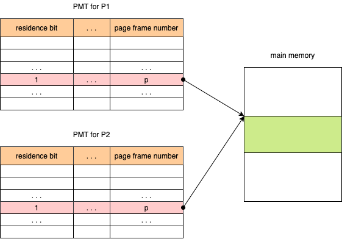

# 가상 메모리

- Non-continuous allocation
- 사용자 프로그램을 여러 개의 block으로 분할합니다.
- 실행 시, 필요한 block들만 메모리에 적재합니다.
  - 나머지 block들은 swap device에 존재합니다.

## 1. Continuous allocation

- **상대 주소**(Relative address): 프로그램의 시작 주소를 0으로 가정한 주소
- **재배치**(Relocation): 메모리 할당 후, 할당된 주소에 따라 상대 주소들을 조정하는 작업

## 2. Non-continuous allocation

- **Address mapping**: Virtual address -> Real address
  - **가상 주소**(Virtual address): 연속된 메모리 할당을 가정한 주소
  - **실제 주조**(Real address): 실제 메모리에 적제된 주소
- 사용자/프로세스는 실행 프로그램 전체가 메모리에 연속적으로 전재되었다고 가정하고 실행 할 수 있습니다.

### 2.1 Block Mapping

- 사용자 프로그램을 block 단위로 분활/관리 합니다.
- Kernel 공간에 프로세스마다 하나의 **BMT**(Block map table)을 가지며, address mapping 정보 관리합니다.

1. 프로세스의 BMT에 접근합니다.
2. BMT에서 block b에 대한 항목(Entry)를 찾습니다.
3. Residence bit을 검사합니다. Residence bit은 해당 블록이 메모리에 적재되었는지 여부를 표현합니다.
   1. Residence bit이 0인 겨우 swap device에서 해당 블록을 메모리로 가져옵니다.
   2. BMT에서 b에 대한 Real address 값 a를 확인합니다.
4. 실제 주소를 계산합니다.
5. 실제 주소를 이용하여 메모리에 접근합니다.

## 3. Paging System

- 프로그램을 같은 크기의 블록으로 분할합니다.
  - **Page**: 프로그램의 분활된 block
  - **Page Frame**: Page와 같은 크기로 분할된 메모리의 분할 영역
- 논리적 분할이 아닌, 크기에 따른 분할입니다.
  - Page 공유 및 보호 과정이 복잡합니다.
- External fragmentation은 발생하지 않으나, Internal Fragmentation은 발생 가능합니다.
- 메모리 통합/압축이 불필요합니다.
- 프로그램의 논리적 구조를 고려하지 않고 분할합니다.

### 3.1 Address Mapping

- Vitual Address를 사용합니다.
- PMT(Page Map Table)을 사용합니다.

#### 3.1.1 Direct mapping

- Block mapping 방법과 유사합니다.
- PMT를 조회하기 위해서 메모리 접근 횟수가 2배가 됩니다.
- PMT를 위한 메모리 공간이 필요합니다.

1. 해당 프로세스의 PMT가 저장되어 있는 주소 b에 접근합니다.
2. 해달 PMT에서 page p에 대한 entry를 찾습니다.
3. 찾아진 entry의 존재 비트를 검사합니다.
   1. Resdience bit이 0인 경우, swap device에서 해당 page를 메모리에 적재합니다.
   2. 해당 entry에서 page frame 번호 z를 확인합니다.
4. z와 가상 주소의 변위 d를 사용하여 실제 주소 r을 형성합니다.
5. 실제 주소 r로 주기억장치에 접근합니다.

#### 3.1.2 Associative mapping

- TLB(Translation Look-aside Buffer)에 PMT를 적재합니다.
- PMT를 병렬 탐색합니다.
- 하드웨어 비용이 비싸서, 큰 PMT를 다루기 어렵습니다.
- Low overhead, High speed

#### 3.1.3. Hybrid direct/associative mapping

- 두 기법을 혼합하여 HW 비용은 줄이고, associative mapping의 장점은 활용합니다.
- 작은 크기의 TLB를 사용합니다.
  - PMT: 메모리(커널 공간)에 저장합니다.
  - TLB: 최근 사용된 page들에 대한 Entry를 저장합니다.
- **지역성**(Locality) 활용합니다.
  - 프로그램의 수행과정에서 한번 접근한 영역을 다시 접근(Temporal locality) 또는 인접 역역을 다시 접근(Spatial locality)할 가능성이 높습니다.
- 프로세스의 PMT가 TLB에 적제되어 있는지 확인합니다.
  - TLB에 적재되어 있는 경우, Residence bit을 검사하고 page frame 번호를 확인합니다.
  - TLB에 적제되어 있지 않은 경우, Direct mapping으로 page frame 번호를 확인합니다. 그리고 해당 PMT Entry를 TLB에 적재합니다.

### 3.2 Memory Management

- **Page frame**: Page와 같은 크기로 미리 분할하여 관리/사용
- **Frame table**: Page frame당 하나의 Entry
  - **Link filed**: For free list (사용 가능한 fp들을 연결)
  - **AV**: Free list header (free list의 시작점)

### 3.3 Page Sharing

- 여러 프로세스가 특정 page를 공유 가능합니다.

#### 3.3.1 Data Sharing

#### 3.3.2 Procedure page sharing

프로세스들이 shared page에 대한 정보를 PMT의 같은 Entry에 저장하도록 합니다.

### 3.4 Page protection

여러 프로세스가 page를 공유 할 댸, Protection bit를 사용합니다.

- 타당/비타당(V) 비트: 메인 메모리의 적재 여부
- 읽기(R) 비트: 읽기 여부
- 쓰기(W) 비트: 쓰기 여부
- 실행(E) 비트: 실행 여부

## 4. Segmentation System

- 프로그램을 논리적 block(segment)으로 분할합니다. Block의 크기가 서로 다를 수 있습니다.
- 메모리를 미리 준할하지 않습니다. (VPM과 유사)
- Sharing/Protection이 용이합니다.
- Address mapping 및 메모리 관리의 overhead가 큽니다.
- Internal fragmetation이 발생하지 않지만, External Fragmentation이 발생할 수 있습니다.

### 4.1 Address Mapping

- Vitual Address를 사용합니다.
- SMT(Segment Map Table)을 사용합니다.
- Address mapping mechanism이 Paging system과 유사합니다.

1. 프로세스의 SMT가 저장되어 있는 주소 b에 접근합니다.
2. SMT에서 segent s의 entry를 찾습니다.
3. 찾은 entry에 대해 다음 단계들을 순차적으로 실행합니다.
   1. 존재 비트가 0인 경우, swap device로부터 해당 segment를 메모리에 적재합니다.
   2. 변위가 segment 길이보다 큰 경우 (d > l), **sgement overflow exception**
   3. 허가되지 않은 연산일 경우 (protection bit filed 검사), **segment protection exception**
4. 실제 주소 r을 계산합니다. (a + d)
5. r로 메모리에 접근합니다.

## 5. Hybrid Paging/Segmenatation

- Paging과 Segmentation의 장점을 결합합니다.
- 논리 단위의 segment로 분할하고, 각 segment를 고정된 크기의 page들로 분할합니다.
- page 단위로 메모리에 적재합니다.

### 5.1 Address Mapping

- Vitual Address를 사용합니다.
- SMT와 PMT를 모두 사용합니다.
  - 각 프로세스 마다 하나의 SMT를 갖습니다.
  - 각 segment마다 하나의 PMT를 갖습니다.
- 장점
  - Page sharing/protection이 쉽습니다.
  - 메모리 할당/관리 overhead가 작습니다.
- 단점
  - 메모리 소모가 큽니다.
  - Address mappin 과정이 복잡합니다.
  - Direct mapping의 경우 메모리 접근이 3배로 늘어나, 성능이 저하될 수 있습니다.

## 6. 출처

- [운영체제 강의 - HCP Lab.KOREATECH](https://youtu.be/YCfP9I4K-8Y)
