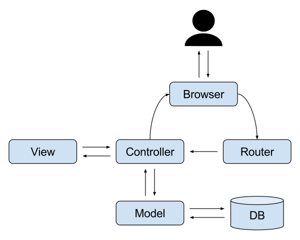

# MVC

MVC는 Model, View, Controller의 약자입니다. 하나의 어플리케이션, 프로젝트를 구성할 때 그 구성요소를 세가지의 역할로 구분한 패턴입니다.

## 1. 구성

### 1.1 Model (모델)

데이터와 관련된 작업을 원활하게 수행하기 위해 필요한 물리적 객체, 규칙, 작업들을 정의해 놓은 것이 Model입니다. 데이터를 추출하거나 저장, 삭제, 엡데이트, 변환 등의 비지니스 로직을 수행합니다. Model은 **DTO**와 **DAO**로 분류할 수 있습니다. Model은 Controller와 View에 의존하지 않아야 합니다. 즉, Model 내부에 Controller와 View에 관련된 코드가 있으면 안됩니다.

- **DAO**(Data Access Object): Database의 data에 접근을 위한 객체입니다. Database에 접근하는 로직과 비즈니스 로직을 분리하기 위해 사용합니다.
- **DTO**(Data Transfer Object): 계층간 데이터 교환을 위한 겍체를 말합니다. 일반적인 DTO는 로직을 갖고 잇지 않은 순수한 데이터 객체이며 속성과 그 속성에 접근하기 위한 `getter`, `setter` 메소드만 깆습니다.

### 1.2 View (뷰)

컨트롤러로부터 받은 값을 가지고 사용자에게 출력할 화면을 만드는 일을 합니다. View는 Model에만 의존해야 하고, Controller에는 의존하면 안됩니다. 즉, View 내부에 Model의 코드만 있을 수 있고, Controller의 코드가 있으면 안 됩니다.

### 1.3 Controller (컨트롤러)

Model과 View를 연결 시켜주는 다리 역할을 함과 동시에 프로그램의 작동 순서나 방식을 제어합니다. 클라이언트의 요청을 받았을 때, 그 요청에 대해 실제 업무를 수행하는 모델 컴포넌트를 호출합니다. 또한 클라이언트가 보낸 데이터가 있다면, 모델에 전달하기 쉽게 데이터를 가공합니다. 모델이 업무를 마치면 그 결과를 뷰에게 전달합니다. Controller는 Model과 View에 의존해도 됩니다. 즉, Controller 내부에는 Model과 View의 코드가 있을 수 있습니다.

## 2. 장점

서로 분리되어 각자의 역할에 집중할 수 있게 애플리케이션을 개발하면, 유지보수성, 확장성, 유연성이 증가하고 중복 코딩이 최소화됩니다.

## 3. 단점

MVC 패턴의 단점은 View와 Model 사이의 의존성이 높다는 것입니다. View와 Model의 높은 의존성은 애플리케이션이 커질수록 복잡해지고 설계 시간이 오래 걸립니다.

## 4. 출처

- [MVC 아키텍쳐에 대한 이해 - 글쓰는 개발자 \_Jbee](https://asfirstalways.tistory.com/180)
- [MVC 패턴 - ystone](https://velog.io/@ljinsk3/Concept-MVC-Pattern)
