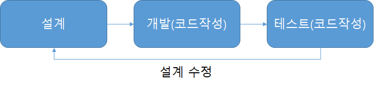
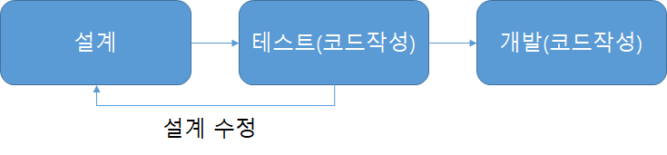

# TDD

Test-Driven Development(TDD)는 매우 짧은 사이클의 반복에 의존하는 소프트웨어 개발 프로세스이다. 우선 개발자는 요구되는 새로운 기능에 대한 자동화된 테스트케이스를 작성하고 해당 테스트를 통과하는 가장 간단한 코드르 작성한다. 일단 테스트를 통과하는 코드를 작성하고 상황에 맞게 리팩토링하는 과정을 거치는 것이다. 말 그대로 **테스트 코드 작성을 주도하는 개발방식**인 것이다.

##### 기본의 개발 프로세스

##### Test-Driven Development 프로세스

## 1. 요구 사항에 집중

테스트 주도형 개발에선, 새로운 기능을 추가하기 전 테스트를 먼저 작성합니다. **테스트를 작성하기 위해서, 개발자는 해당 기능의 요구사항과 명세를 분명히 이해**하고 있어야 합니다. 이는 사용자 케이스와 사용자 스토리 등으로 이해할 수 있으며, 이는 개발자가 코드를 작성하기 전에 보다 요구사항에 집중할 수 있도록 도와줍니다.

## 2. 객체 지향적인 코드 개발

테스트 코드를 먼저 작성한다면 **좀 더 명확한 기능과 구조를 설계**할 수 있습니다. 각각의 함수를 정의할 때 각각의 기능들에 대해서 철저히 구조화 시켜 코드를 작성할 수 있게 됩니다. 그 이유는 테스트의 용이성을 위해 복잡한 기능을 한 함수에 모두 구현할 경우 테스트 방식이 복잡해지고 시간이 오래 걸리며 코드 수정이 되는 경우 테스트 코드를 재상용할 수 없게 되기 때문입니다. 자연스럽게 TDD의 목적인 코드의 재상용성을 보장하며 코드를 작성하게 됩니다.

결국 TDD는 **"모든 코드"가 재사용성 기반**으로 작성되어야 하기 때문에 보다 기본적으로 객체지향적인 코드가 되는 것입니다.

## 3. 설계 수정 시간 단축

앞에서 그림과 함께 설명한 것처럼 테스트 코드를 먼저 작성하기 때문에 최초 설계 안을 만족시키며 입출력 구조와 기능의 정의를 명확히 하게 되므로 설계의 구조적 문제를 바로 찾아내게 됩니다. 실제로 테스트 코드를 작성하면서 인터페이스나 클래스의 구조들을 많이 수정하게 됩니다. 그리고 미리 테스트 시나리오를 작성해봄으로써 코드 개발 전 기능을 구현하기 위한 예외 상황들을 미리 확인해보고 조사하게 되는 효과가 발생하여 예외 코드를 장성하기 쉬워집니다.

## 4. 디버깅 시간의 단축

기본적으로 단위 테스트 기반의 테스트 코드를 작성하기 때문에 추후 문제가 발생하였을 때 각각의 모듈 별로 테스트를 진행해보면 문제의 지점을 쉽게 찾아낼 수 있습니다. 만약 TDD 개발이 아니라면 특정 버그를 찾기 위해서 모든 영역의 코드들을 살펴봐야 할 것입니다. 문제가 발생할 수 있는 지점은 DB 영역, Application 영역, Data 영역, Memory 영역 등 다양하기 때문에 모든 영역을 통합 테스트하게 되면 쉽게 문제의 지점을 찾을 수 없게 됩니다. 하지만 TDD 개발로 인해 각각의 단위 테스트를 진행하게 된다면 영역을 분할하여 쉽게 찾아낼 수 있을 겁니다.

## 5. 유지 보수의 용이성

대부분의 개발자는 설계 및 코드 작성 시 기술적인 관점으로 바라보게 됩니다 .기술적인 관점이 나쁜 것은 아니지만 기능 자체의 실현에 목적을 두기 때문에 코드가 복잡해지고 테스트가 어려워집니다. TDD 개발로 인해 항상 그 테스트 요소들이 사용자 관점으로 정의되고 진행되기 때문에 입력과 출력의 흐름이 명확해지고 추후 구조의 변경 및 소스 수정 시 구조를 쉽게 파악하고 빠른 수정이 가능해집니다. 더불어 재사용 테스트도 쉽게 가능해집니다.

## 6. 테스트 문서의 대체 가능

대부분의 개발 프로젝트 진행 시 테스트를 진행하는 경우 단순 통합 테스트에 지나지 않습니다. 즉 내부적으로 개별적인 모듈들이 어떻게 테스트 되었는지 제공할 수 없습니다. 하지만 TDD를 구현하게 될 경우에 테스팅을 자동화 시킴과 동시에 보다 정확한 테스트 근거를 산출할 수 있습니다.

## 7. 출처

- [TDD(Test-driven Development) 소개 - 소프트웨어로 안전한 세상을 꿈꾸다](https://m.blog.naver.com/PostView.nhn?blogId=suresofttech&logNo=221569611618&proxyReferer=https:%2F%2Fwww.google.com%2F)
- [Interview_Question_for_Beginner- JaeYeopHan](https://github.com/JaeYeopHan/Interview_Question_for_Beginner/tree/master/Development_common_sense)
