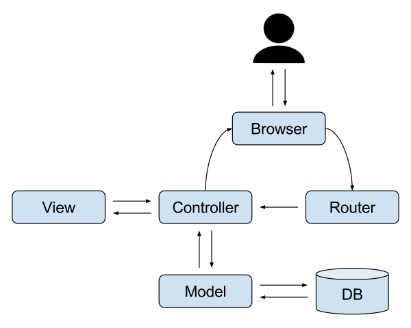

# 디자인 패턴

디자인 패턴이란 개발 과정에서 공통으로 발생하는 문제를 해결하기 위해 사용되는 패턴입니다. 저명한 소프트웨어 엔지니어 마틴 파울러는 디자인 패턴을 **절반만 완성된 것**이라고 표현합니다. 디자인 패턴은 코드로 구현된 구현체가 아니라 문제 해결을 위한 패턴이기 때문에 자신의 개발 환경에 맞게 구현하는 것은 개발자의 몫이기 때문입니다.

## 1. MVC

MVC는 Model, View, Controller의 약자입니다. 하나의 어플리케이션, 프로젝트를 구성할 때 그 구성요소를 세가지의 역할로 구분한 패턴입니다.

### 1.1 구성

#### 1.1.1 Model (모델)

데이터와 관련된 작업을 원활하게 수행하기 위해 필요한 물리적 객체, 규칙, 작업들을 정의해 놓은 것이 Model입니다. 데이터를 추출하거나 저장, 삭제, 엡데이트, 변환 등의 비지니스 로직을 수행합니다. Model은 **DTO**와 **DAO**로 분류할 수 있습니다. Model은 Controller와 View에 의존하지 않아야 합니다. 즉, Model 내부에 Controller와 View에 관련된 코드가 있으면 안됩니다.

- **DAO**(Data Access Object): Database의 data에 접근을 위한 객체입니다. Database에 접근하는 로직과 비즈니스 로직을 분리하기 위해 사용합니다.
- **DTO**(Data Transfer Object): 계층간 데이터 교환을 위한 겍체를 말합니다. 일반적인 DTO는 로직을 갖고 잇지 않은 순수한 데이터 객체이며 속성과 그 속성에 접근하기 위한 `getter`, `setter` 메소드만 깆습니다.

#### 1.1.2 View (뷰)

컨트롤러로부터 받은 값을 가지고 사용자에게 출력할 화면을 만드는 일을 합니다. View는 Model에만 의존해야 하고, Controller에는 의존하면 안됩니다. 즉, View 내부에 Model의 코드만 있을 수 있고, Controller의 코드가 있으면 안 됩니다.

#### 1.1.3 Controller (컨트롤러)

Model과 View를 연결 시켜주는 다리 역할을 함과 동시에 프로그램의 작동 순서나 방식을 제어합니다. 클라이언트의 요청을 받았을 때, 그 요청에 대해 실제 업무를 수행하는 모델 컴포넌트를 호출합니다. 또한 클라이언트가 보낸 데이터가 있다면, 모델에 전달하기 쉽게 데이터를 가공합니다. 모델이 업무를 마치면 그 결과를 뷰에게 전달합니다. Controller는 Model과 View에 의존해도 됩니다. 즉, Controller 내부에는 Model과 View의 코드가 있을 수 있습니다.

### 1.2 장점

서로 분리되어 각자의 역할에 집중할 수 있게 애플리케이션을 개발하면, 유지보수성, 확장성, 유연성이 증가하고 중복 코딩이 최소화됩니다.

### 1.3 단점

MVC 패턴의 단점은 View와 Model 사이의 의존성이 높다는 것입니다. View와 Model의 높은 의존성은 애플리케이션이 커질수록 복잡해지고 설계 시간이 오래 걸립니다.

## 2. MVP

MVP 패턴은 Model + View + Presenter를 합친 용어입니다. Model과 View는 MVC 패턴과 동일하고, Controller 대신 Presenter가 존재합니다. 이 패턴의 핵심 아이디어는 사용자 인터페이스(View)와 비즈니스로직(Model)을 분리하고, 서로간에 상호작용을 다른 객체(Presenter)에 위임해 서로의 영향을 최소화하는 것에 있습니다.

### 2.1 구성

#### 2.1.1 View

MVC에서는 클라이언트의 요청을 Controller가 받지만, MVP에서는 View에서 직접적인 접근을 담당합니다. View에서 발생하는 이벤트는 직접 핸들링 할 수 있으나, Presetner 위임하도록 합니다.

#### 2.1.2 Presenter

본질적으로 MVC의 컨트롤러와 같지만, 뷰에 직접 연결되는 것이 아니라 인터페이스로 연결된다는 점이 다릅니다. 이에 따라 MVC가 가진 테스트 가능성 문제와 함께 모듈화/유연성 문제 역시 해결합니다. 프레젠터는 View를 통해 사용자로 부터 입력받은 후, Model의 도움을 받아 데이터를 처리하고, 결과를 다시 View로 전달합니다.

## 3. MVVM

MVP 모델에서 파생된 디자인 패턴입니다. MVVM 패턴의 목표는 비즈니스 로직과 프레젠테이션 로직을 UI로부터 분리하는 것입니다. 비즈니스 로직과 프레젠테이션 로직을 UI로부터 분리하게 되면, 테스트, 유지보수, 재사용이 쉬워집니다.

### 3.1 구성

#### 3.1.1 뷰 모델

뷰 모델의 역할은 뷰가 사용할 메서드와 필드를 구현하고, 뷰에게 상태 변화를 알리는 것입니다. (뷰는 뷰 모델의 상태 변화를 옵저빙합니다.) 뷰 모델에서 제공하는 메서드와 필드가 UI에서 제공할 기능을 정의합니다. 하지만, 뷰가 이 기능을 어떻게 보여줄 것인지를 결정합니다.

일반적으로 뷰 모델과 모델은 일대다 관계를 형성합니다. 뷰 모델은 뷰가 쉽게 사용할 수 있도록 모델의 데이터를 가공해서 뷰에게 제공합니다. 예를 들어, 뷰에서 서로 다른 두 모델의 데이터를 활용한 데이터가 필요하다면 뷰에서 모델의 값을 조작해서 사용하는 것이 아니라, 뷰 모델에서 두 모델의 데이터를 가공하고 뷰에서는 오직 UI만 다루도록 해야합니다.

### 3.2 장점

- 뷰 모델이 모델과 뷰 사이의 어뎁터로서 변경이 생겼을 때 변경을 최소화할 수 있습니다.
- 모델과 뷰 모델이 뷰로부터 독립적입니다.
- 개발 기간 동안 개발자와 디자이너가 동시에 독립적으로(병렬적으로) 작업할 수 있습니다.

### 3.1 단점

- 거대하고 복잡한 앱을 위해서 고한된 디자인 패턴인 만큼, 소형 앱에서 사용하게 되면 오버헤드가 커집니다.
- 앱이 너무 거대해지면 앱의 메모리 소모가 데이터 바인딩때문에 커집니다.

## 4. 출처

- [MVC 아키텍쳐에 대한 이해 - 글쓰는 개발자 \_Jbee](https://asfirstalways.tistory.com/180)
- [MVC 패턴 - ystone](https://velog.io/@ljinsk3/Concept-MVC-Pattern)
- [MVP(Model-View-Presenter) 패턴 - 큐우](https://faith-developer.tistory.com/71)
- [MVVM 패턴 - Hugo.log](https://velog.io/@k7120792/Model-View-ViewModel-Pattern)
