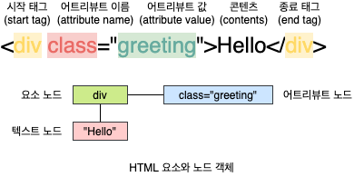
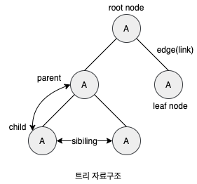
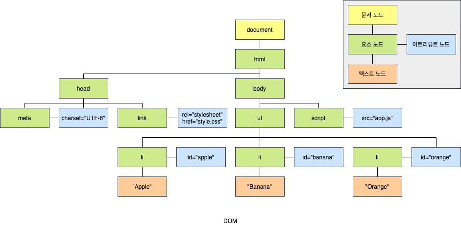
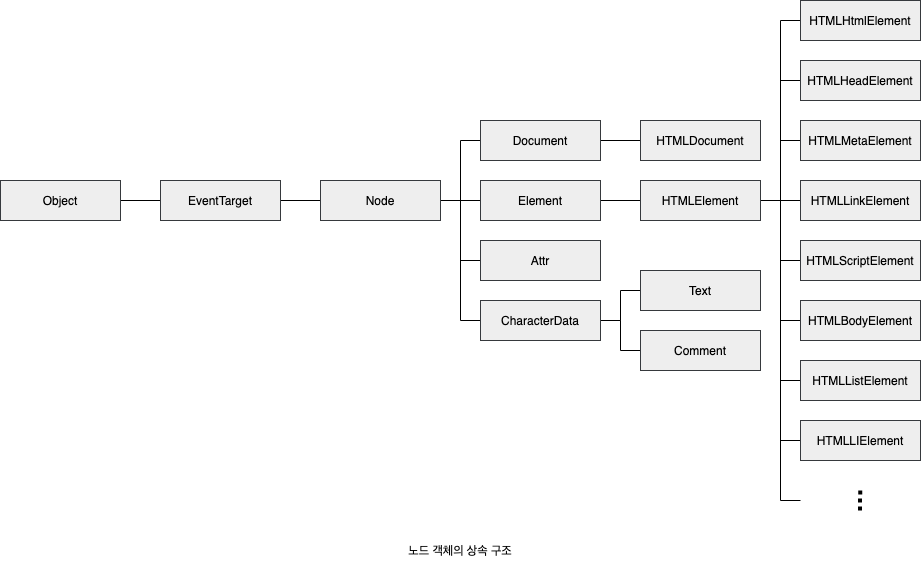

# Node

## 1. HTML 요소와 노드 객체

**HTML 요소**(HTML Element)는 HTML 문서를 구성하는 개별적인 요소를 의미합니다. HTML 요소는 렌더링 엔진에 의해 파싱되어 DOM을 구성하는 요소 노드 객체로 변환됩니다. 이떄 HTML 요소의 어트리뷰트는 어트리뷰트 노드로, HTML 요소의 텍스트 콘텐츠는 텍스트 노드로 변환됩니다.

HTML 문서는 HTML 요소들의 집합으로 이뤄지며, HTML 요소는 중첩 관계를 갖습니다. 즉, HTML 요쇼의 콘텐츠 영역(시작 태그와 종료 태그 사이)에는 텍스트뿐만 아니라 다른 HTML 요소도 포함할 수 있습니다. 이때 HTMl 요소 간에는 중첩 관계에 의해 계층적인 **부자**(Parnet-Child) 관계가 형성됩니다. 이러한 HTMl 요소 간의 부자 관계를 반영하여 HTML 문서의 구성 요소인 HTML 요소를 객체화한 모든 노드 객체들을 트리 자료 구조로 구성합니다.

노드 객체들로 구성된 트리 자료구조를 **DOM**(Document Object Model)이라 합니다. 노드 객체의 트리로 구조화되어 있기 때문에 DOM을 DOM 트리라고 부르기도 합니다.

##### 트리 자료구조

**트리 자료구조**(Tree data structure)는 노드들의 계층 구조로 이뤄집니다. 즉, 트리 자료구조는 **부모 노드**(Parent Node)dhk **자식 노드**(Child Node)로 구성되어 노드 간의 계층적 구조(부자, 형제 관계)를 표현하는 비선형 자료구조를 말합니다. 트리 자료구조는 하나의 최상위 노드에서 시작합니다. 최상위 노드는 부모 노드가 없으며, **루트 노드**(Root Node)라 합니다. 루트 노드는 0개 이상의 자식 노드를 갖습니다. 자식 노드가 없는 노드를 **리프 노드**(Leaf Node)라 합니다.

## 2. 노드 객체의 타입

DOM은 노드 객체의 계층적인 구조로 구성됩니다. 노드 객체는 종류가 있고 상속 구조를 갖습니다. 노드 객체는 총 12개의 종류(노드 타입)가 있습니다. 이 중에서 중요한 노드 타입은 4가지 입니다. 이 4가지 노드 타입 외에도 주석을 위한 Comment 노드, DOCTYPE을 위한 DocumentType 노드, 복수의 노드를 생성하여 추가할 때 사용하는 DocuemntFragment 노드 등이 있습니다.

### 2.1 문서 노드 (Document Node)

문서 노드는 DOM 트리의 최상위에 존재하는 루트 노드로서 `document` 객체를 가리킵니다. `document` 객체는 브라우저가 렌더링한 HTML 문서 전체를 가리키는 객체로 전역 객체 `window`의 `document` 프로퍼티에 바인딩되어 있습니다. 따라서 문서 노드는 `window.document` 또는 `document`로 참조할 수 있습니다.

브라우저 환경의 모든 자바스크립트 코드는 `script` 태그에 의해 분리되어 있어도 하나의 전역 객체 `window`를 공유합니다. 따라서 모든 자바스크립트 코드는 전역 객체 `window`의 `document` 프로퍼티에 바인딩되어 있는 하나의 `document` 객체를 바라봅니다. 즉 HTML 문서당 `document` 객체는 유일합니다.

문서 노드, 즉 `doucment` 객체는 DOM 트리의 루트 노드이므로 DOM 트리의 노드들에 접근하기 위한 **진입점**(Entry Point) 역할을 담당합니다. 즉, 요소, 어트리뷰트, 텍스트 노드에 접근하려면 문서 노드를 통해야 합니다.

### 2.2 요소 노드 (Element Node)

요소 노드는 HTML 요소를 가리키는 객체입니다. 요소 노드는 HTML 요소 간의 중첩에 의해 부자 관계를 가지며, 이 부자 관계를 통해 정보를 구조화합니다. 따라서 요소 노드는 문서의 구조를 표현한다고 할 수 있습니다.

### 2.3 어트리뷰트 노드 (Attribute Node)

어트리뷰트 노드는 HTML 요소의 어트리뷰트들 가리키는 객체입니다. 어트리뷰트 노드는 어트리뷰트가 지정된 HTML 요소의 요소 노드와 **형제**(Sibiling) 관계를 갖습니다. 단, 요소 노드는 부모 노드와 연결되어 있지만 어트리뷰트 노드는 부모 노드와 연결되어 있지 않고 형제 노드인 요소 노드에만 연결되어 있습니다. 따라서 어트리뷰트 노드에 접근하여 어트리뷰트를 참조하거나 변경하려면 먼저 형제 노드인 요소 노드에 접근해야 합니다.

### 2.4 텍스트 노드 (Text Node)

텍스트 노드는 HTML 요소의 텍스트를 가리키는 객체입니다. 요소 노드가 문서의 구조를 표현한다면 텍스트 노드는 문서의 정보를 표현한다고 할 수 있습니다. 텍스트 노드는 요소 노드의 자식 노드이며, 자식 노드를 가질 수 없는 **리프 노드**(Leaf Node)입니다. 즉, 텍스트 노드는 DOM 트리의 최종단입니다. 따라서 텍스트 노드에 접근하려면 먼저 부모 노드인 요소 노도에 접근해야 합니다.

## 3. 노드 객체의 상속 구조

DOM을 구성하는 노드 객체는 자신의 구조와 정보를 제어할 수 있는 DOM API를 사용할 수 있습니다. 이를 통해 노드 객체는 자신의 부모, 형제, 자식을 탐색할 수 있으며, 자신의 어트리뷰트와 텍스트를 조작할 수도 있습니다. DOM을 구성하는 노드 객체는 ECMAScript 사양에 정의된 **표준 빌트인 객체**(Standard Built-in Object)가 아니라 브라우저 환경에서 추가적으로 제공하는 **호스트 객체**(Host Object)입니다. 하지만 노드 객체도 자바스클비트 객체이므로 프로토타입에 의한 상속 구조를 갖습니다.

이를 프로토타입 체인 관점에서 살펴보면, `input` 요소를 파싱하여 객체화한 `input` 요소 노드 객체는 프로토타입 체인에 있는 모든 프로토타입의 프로퍼티나 메서드를 상속받아 사용할 수 있습니다.

| input 요소 노드 객체의 특성                                                | 프로토타입을 제공하는 객체 |
| -------------------------------------------------------------------------- | -------------------------- |
| 객체                                                                       | `Object`                   |
| 이벤트를 발생시키는 객체                                                   | `EventTarget`              |
| 트리 자료구조의 노드 객체                                                  | `Node`                     |
| 브라우저가 렌더링할 수 있는 웹 문서의 요소(HTML, XML, SVG)를 표현하는 객체 | `Element`                  |
| 웹 문서의 요소 중에서 HTML 요소를 표현하는 객체                            | `HTMLElement`              |
| HTML 요소 중에서 `input` 요소를 표현하는 객체                              | `HTMLInputElement`         |

## 4. 출처

- 모던 자바스크립트 Deep Dive - 이웅모
