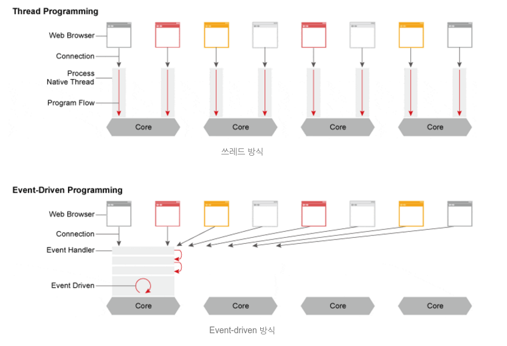

# Nginx

**Apache**보다 동작이 단순하고, 전달자 역할만 하기 때문에 동시접속 처리에 특화된 웹 서버 프로그램입니다.

## 1. 역할

### 1.1 HTTP 서버로서의 역할

웹 서버는 HTML, CSS, Javascript, 이미지와 같은 정보를 웹 브라우저에 전송하는 역할을 합니다.

### 1.2 리버스 프록시 역할

클라이언트가 가짜 서버에 요청(request)을 하면, 프록시 서버인 **Nginx**가 배후 서버(reverse server)인 **응용프로그램 서버**로부터 데이터를 가져오는 역할을 합니다. 웹 응용프로그램 서버에 리버스 프록시(Nginx)를 두는 이유는 요청(request)에 대한 버퍼링이 있기 때문입니다. 클라이언트가 직접 App 서버에 요청하는 경우, 프로세스 1개가 응답 대기 상태가 되어야 하지만, 프록시 서버를 두면 요청을 **배분**할 수 있습니다.

### 1.3 처리 방식

Nginx는 비동기 처리 방식(Event-Drive) 방식을 채택하고 있습니다.



## 2. 설치하기

### 2.1 Ubuntu

1.  필수 구성 요소 설치

        sudo apt install curl gnupg2 ca-certificates lsb-release

2.  안정적인 nginx 패키지 저장소 설정

        echo "deb http://nginx.org/packages/ubuntu `lsb_release -cs` nginx" \
            | sudo tee /etc/apt/sources.list.d/nginx.list

3.  패키지의 신뢰성을 확인할 수 있도록 **공식 nginx 서명 키** 가져오기

        curl -fsSL https://nginx.org/keys/nginx_signing.key | sudo apt-key add -

4.  올바른 키가 있는지 확인

        sudo apt-key fingerprint ABF5BD827BD9BF62

5.  출력은 다음과 같이 전체 지문 **573B FD6B 3D8F BC64 1079 A6AB ABF5 BD82 7BD9 BF62**를 포함해야 합니다.

        pub   rsa2048 2011-08-19 [SC] [expires: 2024-06-14]
              573B FD6B 3D8F BC64 1079  A6AB ABF5 BD82 7BD9 BF62
        uid   [ unknown] nginx signing key <signing-key@nginx.com>

6.  nginx 설치

        sudo apt update
        sudo apt install nginx

## 3. 자체서명 SSL 인증서 생성

1.  리눅스를 설치했다면 아마도 openssl 패키지가 설치되어 있을겁니다.

        rpm -qa openssl

2.  개인키를 생성합니다.

        openssl genrsa -des3 -out server.key 2048

3.  인증요청서를 생성합니다.

        openssl req -new -key server.key -out server.csr

4.  키에 패스워드가 들어있으면 서버 구동시마다 물어봅니다. 제거하더라고 SSL 암호화 통신에 문제가 없으니 개인키에 패스워드를 제거합니다.

        cp server.key server.key.origin
        openssl rsa -in server.key.origin -out server.key

5.  인증서 생성

        openssl x509 -req -days 365 -in server.csr -signkey server.key -out server.crt

6.  /etc/nginx/ssl로 이동

        cp server.key /etc/nginx/ssl/server.key
        cp server.crt /etc/nginx/ssl/server.crt

7.  snippets/self_signed.conf 생성

        ssl_certificate /etc/nginx/ssl/server.crt;
        ssl_certificate_key /etc/nginx/ssl/server.key;

## 4. 보안설정

꼭 `ssl.conf`라는 이름일 필요 없고, 따로 빼지 않아도 상관없습니다. 다만 설정문 내용이 라우팅 설정 파일 안에 작성되어야 하는 것이 중요합니다. `ssl.conf`라는 이름의 파일을 만들어 거기에 보안 설정을 적고 다시 그 파일을 라우팅 설정 파일에 `include`하는 것을 단순한 방법론일 뿐입니다.

### 4.1 dhparam.pem 암호화 파일 생성하기

파일 이름을 보통 `dhparam.pem`으로 짓지만 4096비트임을 표시하기 위해 `dhparam-4096.pem`으로 지어도 됩니다.

```bash
sudo openssl dhparam -out /etc/nginx/dhparam.pem 4096
```

암호화 수준은 2048, 4096처럼 컴퓨터공학에서 쓰이는 숫자 단위로만 쓸 수 있고, 높을 수록 암호를 풀 수 있는 시간이 오래걸려 보안이 강합니다. 대신 HTTPS 성능도 느려집니다.

### 4.2 ssl.comf 파일 생성하기

보안 설정이 들어갈 ssl.conf를 만들고 이후 nginx 라우팅 설정파일에 include 합니다.

```bash
sudo touch /etc/nginx/snippets/ssl.conf
sudo chmod 644 /etc/nginx/snippets/ssl.conf
```

### 4.3 ssl.conf 파일에 nginx 보안 설정문 작성

```
ssl_session_timeout 1d;
ssl_session_cache shared:SSL:50m;
ssl_session_tickets off;

ssl_protocols TLSv1 TLSv1.1 TLSv1.2 TLSv1.3; ## 보안 등급 버전
ssl_dhparam /etc/nginx/dhparam.pem;
ssl_ciphers ECDHE-RSA-AES256-GCM-SHA512:DHE-RSA-AES256-GCM-SHA512:ECDHE-RSA-AES256-GCM-SHA384:DHE-RSA-AES256-GCM-SHA384:ECDHE-RSA-AES256-SHA384; ##강력한 알고리즘 사용
ssl_ecdh_curve secp384r1;

ssl_prefer_server_ciphers on;
ssl_stapling on;
ssl_stapling_verify on;

resolver 8.8.8.8 8.8.4.4; ## 구글이 제공하는 네임서버로 인증서 발급업체와 통신
add_header Strict-Transport-Security "max-age=15768000; includeSubdomains; preload";
add_header X-Content-Type-Options nosniff;

## iframe 사용 옵션. 하나만 사용 ##
add_header X-Frame-Options "SAMEORIGIN"; ## 같은 도메인에서만 iframe 허용
# add_header X-Frame-Options DENY; ## 모든 도메인에서 iframe 허용
# add_header X-Frame-Options "ALLOW-FROM https://example.com"; ## 특정 도메인에서만 허용
```

## 5. 라우팅 파일 수정하기

default.conf를 수정합니다.

##### /etc/nginx/conf.d/default.conf

```
server {
    listen 80 default_server;
    listen       [::]:80 default_server;
    server_name  _;
    return 301 https://$host$request_uri;
}

server {
    listen       443 ssl http2 default_server;
    listen       [::]:443 ssl http2  default_server;

    include snippets/self-signed.conf;
    include snippets/ssl-params.conf;

    # server_name  localhost;
    server_name  _;

    # charset koi8-r;
    # access_log  /var/log/nginx/host.access.log  main;

    location / {
        root   /usr/share/nginx/html;
        index  index.html index.htm;
    }

    # ...
}
```

응용 프로그램 서버를 추가할 떄는 다음과 같이 작성합니다.

##### /etc/nginx/conf.d/sample.conf

```
server {
    listen 443 ssl http2;
    server_name <앱 서버 도메인입력. https:// 제외>;
#    location / {
#        root   /var/www/html;
#        index  index.html index.htm index.nginx-debian.html;
#    }
    access_log /var/log/nginx/datahub.access.log main;
     location / {
        proxy_set_header X-Real-IP $remote_addr;
        proxy_set_header X-Forwarded-For $proxy_add_x_forwarded_for;
        proxy_set_header Host $http_host;
        proxy_set_header X-NginX-Proxy true;
        proxy_pass http://127.0.0.1:<앱 포트 번호 입력>/;
        proxy_redirect off;
    }
    gzip on;
    gzip_comp_level 2;
    gzip_proxied any;
    gzip_min_length 1000;
    gzip_disable    "MSIE [1-6]\."
    gzip_types text/plain text/css application/json application/x-javascript text/xml application/xml application/xml+rss text/javascript;
}
```

## 6. nginx 시작

- 테스트

        sudo nginx -t

- 시작

        sudo service nginx start

- 재시작

        sudo service nginx restart

- 종료

        sudo service nginx stop

## 7. 출처

- [Nginx 이해하기 및 기본 환경설정 세팅하기 - 경영학도의 좌충우돌 코딩](https://whatisthenext.tistory.com/123)
- [리눅스 자체서명 SSL 인증서 생성 - ZETAWIKI](https://zetawiki.com/wiki/%EB%A6%AC%EB%88%85%EC%8A%A4_%EC%9E%90%EC%B2%B4%EC%84%9C%EB%AA%85_SSL_%EC%9D%B8%EC%A6%9D%EC%84%9C_%EC%83%9D%EC%84%B1)
- [nginx 웹서버의 SSL 보안설정과 HTTPS 라우팅설정 방법(www 도메인 리다이렉팅) - 스위프트 코딩](https://swiftcoding.org/nginx-routing-conf)
- [nginx](https://nginx.org/en/linux_packages.html)
