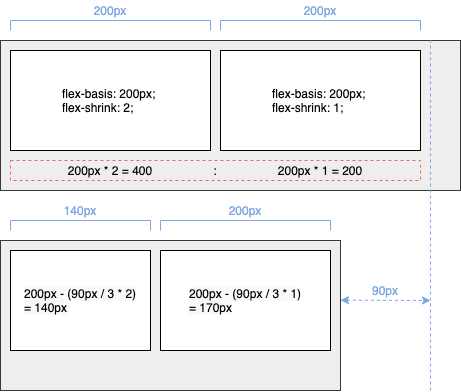

# Flexible Box

## 1. 구성

**Flex**는 요소 크기가 불분명하거나 동적인 경우에도, 각 요소를 정렬할 수 있는 효율적인 방법을 제공하빈다. Flex는 **Container**와 **Items**라는 두가지 개념으로 나뉩니다. Container는 Items를 감싸는 부모 요소이며, 각 **Item**을 정렬하기 위해서 Container가 필수입니다.

## 2. Flex Container

Flex Container를 위한 속성들은 다음과 같습니다.

| 속성            | 의미                                            |
| --------------- | ----------------------------------------------- |
| display         | Flex Container를 정의합니다.                    |
| flexd-direction | Flex Itmes의 주 축을 설정합니다.                |
| flex-wrap       | Flex Items의 여러 줄 묶음을 설정합니다.         |
| justify-content | 주 축의 정렬 방법을 설정합니다.                 |
| align-content   | 교차 축의 정렬 방법을 설정합니다. (2줄 이상)    |
| align-items     | 교차 축에서 Item의 정렬 방법을 설정합니다.(1줄) |

### 2.1 display

Flex Container를 정의합니다. 여기서 말하는 수직과 수평 쌓임은 Items가 아니라 Container입니다. 두 값의 차이는 내부의 Items에 영향을 주지 않습니다.

| 값            | 의미                                       | 기본값 |
| ------------- | ------------------------------------------ | ------ |
| `flex`        | Block 특성의 Flex Container를 정의합니다.  |        |
| `inline-flex` | inline 특성의 Flex Container를 정의합니다. |        |

```css
.flex-contaioner {
  display: flex;
}
```

## 2.2 flex-direction

Items의 주 축을 설정합니다. 값 `row`는 Items를 수평축으로 표시하므로 이때는 주 축이 수평이며, 교차 축은 수직이 됩니다. 반대로 값 `column`은 Items를 수직축으로 표시하므로 주 축은 수직이며 교차 축은 수평이 됩니다. 즉, 방향에 다라 주 축과 교차 축이 달라집니다.

| 값               | 의미                                            | 기본값 |
| ---------------- | ----------------------------------------------- | :----: |
| `row`            | Items를 수평축(왼쪽에서 오른쪽)으로 표시합니다. |   O    |
| `row-revers`     | Items를 `row`의 반대 축으로 표시합니다.         |        |
| `column`         | Items를 수직축(위에서 아래)으로 표시합니다.     |        |
| `column-reverse` | Items를 `cloumn`의 반대 축으로 표시합니다.      |        |

```css
.flex-container {
  display: flex;
  flex-direction: row;
}
```

### 2.3 flex-wrap

Items의 여러 줄 묶음을 설정합니다.

| 값             | 의미                                                 | 기본값 |
| -------------- | ---------------------------------------------------- | :----: |
| `nowrap`       | 모든 Items를 여러 줄로 묶지 않습니다. (한 줄에 표시) |   O    |
| `wrap`         | Items를 여러 줄로 묶습니다.                          |        |
| `wrap-reverse` | Items를 `wrap`의 역 방향으로 여러 줄로 묶습니다.     |        |

```css
.flex-container {
  display: flex;
  flex-wrap: nowrap;
}
```


### 2.4 flex-flow

이 속성은 단축 속성으로 Flex Items의 주축을 설정하고 Items의 여러 줄 묶음도 설정합니다.

| 값             | 의미                                       | 기본값   |
| -------------- | ------------------------------------------ | -------- |
| flex-direction | Item의 주 축을 설정합니다.                 | `row`    |
| flex-wrap      | Item의 여러 줄 묶음(줄 바꿈)을 설정합니다. | `nowrap` |

```css
.flex-container {
  display: flex;
  flex-flow: row-reverse wrap;
}
```

### 2.5 justify-content

주 축의 정렬 방법을 설정합니다. **시작점**(flex-start)과 **끝점**(flex-end)라는 개념은 주축이나 교차 축의 시작하는 지점과 끝나는 지점을 지칭합니다. 방향에 따라 시작점과 끝점이 달라집니다.

| 값              | 의미                                                                                         | 기본값 |
| --------------- | -------------------------------------------------------------------------------------------- | :----: |
| `flex-start`    | Items를 시작점으로 정렬합니다.                                                               |   O    |
| `flex-end`      | Items를 끝점으로 정렬합니다.                                                                 |        |
| `center`        | Items를 가운데로 정렬합니다.                                                                 |        |
| `space-between` | 시작 Item은 시작접에, 마지막 Item은 끝점에 정렬되고 나머지 Items는 사이에 고르게 정렬됩니다. |        |
| `space-around`  | Items를 균등한 여백을 포함하여 정렬합니다.                                                   |        |

```css
.flex-container {
  display: flex;
  justify-content: flex-start;
}
```


### 2.6 align-content

교차 축의 정렬 방법을 설정합니다. 주의할 점은 `flex-wrap` 속성을 통해 Items가 여러 줄(2줄 이상)이고 여백이 있을 경우만 사용할 수 있습니다.

| 값              | 의미                                                                                          | 기본값 |
| --------------- | --------------------------------------------------------------------------------------------- | :----: |
| `stretch`       | Conatiner의 교차 축을 채우기 위해 Items를 늘립니다.                                           |   O    |
| `flex-start`    | Items를 시작점으로 정렬합니다.                                                                |        |
| `flwx-end`      | Items를 끝점으로 정렬합니다.                                                                  |        |
| `center`        | Items를 가운데로 정렬합니다                                                                   |        |
| `space-between` | 시작 Item은 시작점에, 마지막 Item은 끝점에 정렬되고, 나머지 Items는 사이에 고르게 정렬됩니다. |        |
| `space-arround` | Items를 균등한 여백을 포함하여 정렬합니다.                                                    |        |

```css
.flex-container {
  display: flex;
  flex-wrap: wrap;
  align-content: stretch;
}
```


### 2.7 align-items

교차 축에서 Items가 한 줄일 경우 정렬 방법을 설정합니다. 주의할 점은 Items가 `flex-wrap`을 통해 여러 줄(2줄 이상)일 경우에는 `align-content` 속성이 우선합니다. 따라서 `align-items`를 사용하려면 `align-content` 속성을 기본값(`stretch`)으로 설정해야 합니다.

| 값           | 의미                                                | 기본값 |
| ------------ | --------------------------------------------------- | :----: |
| `stretch`    | Container의 교차 축을 채우기 위해 Items를 늘립니다. |   O    |
| `flex-start` | Items를 각 줄의 시작점으로 정렬합니다.              |        |
| `flex-end`   | Items를 각 줄의 끝점으로 정렬합니다.                |        |
| `center`     | Items를 가운데로 정렬합니다.                        |        |
| `baseline`   | Items를 문자 기준선에 정렬합니다.                   |        |

```css
.flex-container {
  display: flex;
  align-items: stretch;
}
```


## 3. Flex Items

Flex Items를 위한 속성들은 다음과 같습니다.

| 속성        | 의미                                                   |
| ----------- | ------------------------------------------------------ |
| order       | Flex Item의 순서를 결정합니다.                         |
| flex-grow   | Flex Item의 증가 너비 비율을 설정합니다.               |
| flex-shrink | Flex Item의 감소 너비 비율을 설정합니다.               |
| flex-basis  | Flex Item의 기본 너비(공간 배분 전 너비)를 설정합니다. |
| flex        | flex-grow, flex-shrink, flex-basis의 단축 속성입니다.  |
| align-self  | 교차 축에서 item의 정렬 방법을 설정합니다.             |

### 3.1 order

Item의 순서를 설정합니다. HTML 구조와 상관없이 Item의 숫자를 지정하고 숫자가 클수록 순서가 밀립니다. 음수가 허용됩니다.

| 값   | 의미                      | 기본값 |
| ---- | ------------------------- | ------ |
| 숫자 | Item의 순서를 설정합니다. | `0`    |

```css
.flex-container {
  display: flex;
}

.flex-container .box1 {
  order: 2;
}

.flex-container .box2 {
  order: 1;
}
```

### 3.2 flex-grow

Item의 증가 너비 비율을 설정합니다. 숫자가 크면 더 많은 너비를 가집니다. Item이 가변 너비가 아니거나, 값이 `0`일 경우 효과가 없습니다.

| 값   | 의미                  | 기본값 |
| ---- | --------------------- | ------ |
| 숫자 | Item의 증가 너비 비율 | `0`    |

```css
.flex-container {
  display: flex;
}

.flex-container .box1 {
  flex-grow: 1;
}

.flex-container .box2 {
  flex-grow: 2;
}

.flex-container .box3 {
  flex-grow: 1;
}
```


### 3.3 flex-basis

Item의 기본 너비(공간 배분 전 너비)를 설정합니다. 값이 `auto`일 경우 `width`, `height` 등의 속성으로 Item의 너비를 설정할 수 있습니다. 하지만 단위 값이 주어질 경우 설정할 수 없습니다.

| 값     | 의미                      | 기본값 |
| ------ | ------------------------- | :----: |
| `auto` | 가변 Item과 같은 너비     |   O    |
| 단위   | px, em, cm 등 단위로 지정 |        |

```css
.flex-container {
  display: flex;
}

.flex-container .box1,
.flex-container .box2 {
  flex-grow: 1;
  flex-basis: auto;
}

.flex-container .box3 {
  flex-grow: 2;
  flex-basis: auto;
}
```


### 3.4 flex-shrink

item이 감소하는 너비의 비율을 설정합니다. 숫자가 크면 더 많은 너비가 감소합니다. item이 가변 너비가 아니거나, 같이 `0`일 경우 효과가 없습니다. `flex-shrink`는 요소의 너비에 영향을 받기 떄문에 계산하기 까다롭습니다. 영향을 받는다는 요소의 너비는 `width`, `height`, `flex-basis` 등으로 너비가 지정된 경우를 의미합니다. Container의 너비가 줄어 Item의 너비에 영향을 미치기 시작한 지점부터 줄어든 거리 만큼 감소 너비 비율에 맞게 Item의 너비가 줄어듭니다.

| 값   | 의미                                | 기본값 |
| ---- | ----------------------------------- | ------ |
| 숫자 | Item의 감소 너비 비율을 설정합니다. | `1`    |

```css
.flex-container {
  display: flex;
}

.flex-container .box1 {
  flex-basis: 200px;
  flex-shrink: 2;
}

.flex-container .box2 {
  flex-basis: 200px;
  flex-shrink: 1;
}
```



### 3.5 flex

Item 너비(증가, 감소, 기본)를 설정하는 단축 속성입니다. `flex-basis`의 기본값은 `auto`이지만 단축 속성인 `flex`에서는 기본값이 `0`입니다.

| 값          | 의미                                              | 기본값 |
| ----------- | ------------------------------------------------- | ------ |
| flex-grow   | Item의 증가 너비 비율을 설정합니다.               | `0`    |
| flex-shrink | Item의 감소 너비 비율을 설정합니다.               | `1`    |
| flex-basic  | Item의 기본 너비(공간 배분 전 너비)를 설정합니다. | `0`    |

```css
.flex-container {
  display: flex;
}

.flex-container .box1 {
  flex: 1 1 20px;
}

.flex-container .box2 {
  flex: 1 1;
}

.flex-conatiner .box3 {
  flex: 1 1 20px;
}
```

### align-self

교차 축에서 개별 Item의 정렬 방법을 설정합니다. 이 속성은 `align-items` 속성보다 우선입니다.

| 값           | 의미                                               | 기본값 |
| ------------ | -------------------------------------------------- | :----: |
| `auto`       | Container의 `align-items` 속성을 상속받습니다.     |   O    |
| `stretch`    | Container의 교차 축을 채우기 위해 Item을 늘립니다. |        |
| `flex-start` | Item을 각 줄의 시작점으로 정렬합니다.              |        |
| `flex-end`   | Item을 각 줄의 끝점으로 정렬합니다.                |        |
| `center`     | Item`을 가운데로 정렬합니다.                       |        |
| `baseline`   | Item을 문자 기준선에 정렬합니다.                   |        |

```css
.flex-container {
  display: flex;
  flex-wrap: wrap;
}

.flex-container .box1 {
  align-self: center;
}
```


## 4. 출처

- [Flexible Box - HEROPY Tech](https://heropy.blog/2018/11/24/css-flexible-box/)
