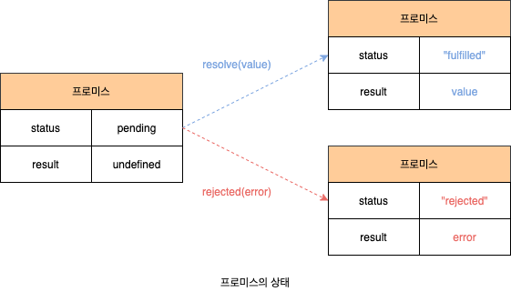

# Promise

자바스크립트는 비동기 처리를 위한 하나의 패턴으로 콜백 함수를 사용합니다. 하지만 전통적인 콜백 패턴은 콜백 헬로 인해 가동성이 나쁘고 비동기 처리 중 발생한 에러의 처리가 공란하여 여러 개의 보동기 처리를 한 번에 처리하는 데도 한계가 있습니다. ES6에서는 비동기 처리를 위한 또 다른 패턴으로 **프로미스**(Promise)를 도입했습니다. 프로미스는 전통적인 콜백 패턴이 가진 단점을 보완하며 비동기 처리 시점을 명확하게 표현할 수 있다는 장점이 있습니다.

## 1. 비동기 처리를 위한 콜백 패턴의 단점

### 1.1 콜백 헬

비동기 함수란 함수 내부에 비동기로 동작하는 코드를 포함한 함수를 말합니다. 비동기 함수를 호출하면 함수 내부의 비동기로 동작하는 코드가 완료되지 않았다 해도 기다리지 않고 즉시 종료됩니다. 즉, 비동기 함수 내부의 비동기로 동작하는 코드는 비동기 함수가 종료된 이후에 완료됩니다. 따라서 비동기 함수 내부의 비동기로 동작하는 코드에서 처리 결과를 외부로 반환하거나 상위 스코프의 변수에 할당하면 기대한 대로 동작하지 않습니다.

이처럼 비동기 함수는 비동기 처리 결과를 외부에 반환할 수 없고, 상위 스코프의 변수에 할당할 수도 없습니다. 따라서 비동기 함수의 처리 결과(서버의 응답 등)에 대한 후속 처리는 비동기 함수 내부에서 수행해야 합니다. 이때 비동기 함수를 범용적으로 사용하기 위해 비동기 함수에 비동기 처리 결과에 대한 후속 처리를 수행하는 콜백 함수를 전달하는 것이 일반적입니다. 필요에 따라 비동기 처리가 성공하면 호출될 콜백 함수와 비동기 처리가 실패하면 호출될 콜백 함수를 전달할 수 있습니다.

```javascript
const get = (url, successCallback, failureCallback) => {
  const xhr = new XMLHttpRequest();

  xhr.open("GET", url);
  xhr.send();

  xhr.onload = () => {
    if (xhr.status === 200) successCallback(JSON.parse(xhr.response));
    else failureCallback(xhr.status);
  };
};

get("https://jsonplaceholder.typicode.com/posts/1", console.log, console.error);
```

이처럼 콜백 함수를 통해 비동기 처리 결과에 대한 후속 처리를 수행하는 비동기 함수가 비동기 처리 결과를 가지고 또다시 비동기 함수를 로출해야 한다면 콜백 함수 호출이 중첩되어 복잡도가 높아지는 현상이 발생하는데, 이를 **콜백 헬**(Callback Hell)이라 합니다.

```javascript
get("/step1", (a) => {
  get(`/step2${a}`, (b) => {
    get(`/step3${b}`, (c) => {
      get(`/step4${c}`, (d) => {
        console.log(d);
      });
    });
  });
});
```

### 1.2 에러 처리의 한계

비동기 처리를 위한 콜백 패턴의 문제점 중에 가장 심각한 것은 에러 처리가 곤란하다는 것입니다. 에러는 **호출자**(Caller) 방향으로 전파됩니다. 즉, 콜 스택의 아래 방향(실행 중인 실행 컨텍스트가 푸시되기 직전에 푸시된 실행 컨텍스트 방향)으로 전파됩니다. 하지만 앞에서 살펴본 바와 같이 비동기 함수의 콜백 함수를 호출하는 것은 비동기 함수가 하닙니다. 따라서 비동기 함수의 콜백 함수가 발생시킨 에러는 `catch` 블록에서 캐치되지 않습니다.

```javascript
try {
  setTimeout(() => {
    throw new Error("Error!");
  }, 1000);
} catch (e) {
  console.log(e);
}
```

## 2. 프로미스의 생성

`Promise` 생성자 함수를 `new` 연산자와 함께 호출하면 프로미스(`Promise` 객체)를 생성합니다. ES6에서 도입된 Promise는 호스트 객체가 아닌 ECMAScript 사양에 정의된 표준 빌트인 객체입니다. `Promise` 생성자 함수는 비동기 처리를 수행할 콜백 함수를 인수로 전달받는데 이 콜백 함수는 `resolve`와 `reject` 함수를 인수로 전달받습니다.

`Promise` 생성자 함수가 인수로 전달받은 콜백 함수 내부에서 비동기 처리를 수행합니다. 이때 비동기 처리가 성공하면 콜백 함수의 인수로 전달받은 `resolve` 함수를 호출하고, 비동기 처리가 실패하면 `reject` 함수를 호출합니다.

```javascript
const promise = new Promise((resolve, reject) => {
  if (success) {
    resolve("result");
  } else {
    reject("failure reason");
  }
});
```

프로 미스는 다음과 같이 현재 비동기 처리가 어떻게 진행되고 있는지를 나타내는 **상태**(Status) 정보를 갖습니다.

| 프로미스의 상태 정보 | 의미                                  | 상태 변경 조건                   |
| -------------------- | ------------------------------------- | -------------------------------- |
| pending              | 비동기 처리가 아직 수행되지 않은 상태 | 프로미스가 생성된 직후 기본 상태 |
| fulfuled             | 비동기 처리가 수행된 상태(성공)       | `resolve` 함수 호출              |
| rejected             | 비동기 처리가 수행된 상태(실패)       | `reject` 함수 호출               |



이처럼 프로미스의 상태는 `resolve` 또는 `reject` 함수를 호출하는 것으로 결정됩니다. 프로미스는 pending 상태에서 fulfiled 또는 rejected 상태, 즉 settled 상태로 변화할 수 있습니다. 하지만 일단 settled 상태가 되면 더는 다른 상태로 변화할 수 없습니다.

## 3. 프로미스의 후속 처리 메서드

프로미스의 비동기 처리 상태가 변화하면 이에 따른 후속 처리를 해야 합니다. 예를 들어, 프로미스가 fulfilled 상태가 되면 프로미스의 처리 결과를 가지고 무언가를 해야 하고, 프로미슥다 rejected 상태가 되면 프로미스의 처리 결과(에러)를 가지고 에러 처리를 해야 합니다. 이를 위해 프로미스는 후속 메서듣 `then`, `catch`, `finally`를 제공합니다.

프로미스의 비동기 처리 상태가 변화하면 후속 처리 메서드에 인수로 전달한 콜백 함수가 선택적으로 호출됩니다. 이떄 후속 처리 메서드의 콜백 함수에 프로미스의 처리 결과가 인수로 전달됩니다. 모든 후속 처리 메서드는 프로미스를 반환하며, 비동기로 동작합니다.

## 3.1 Promise.prototype.then

`then` 메서드는 두 개의 콜백 함수를 인수로 전달받습니다.

- 첫 번쨰 콜백 함수는 프로미스가 fullfiled 상태(`resolve` 함수가 호출된 상태)가 되면 호출됩니다. 이때 콜백 함수는 프로미스의 비동기 처리 결과를 인수로 전달받습니다.
- 두 번째 콜백 함수는 프로미스가 rejected tkdxo(`reject` 함수가 호출된 상태)가 되면 호출됩니다. 이때 콜백 함수느 프로미스의 에러를 인수로 전달받습니다.

```javascript
new Promise((resolve) => resolve("fulfilled")).then(
  (v) => console.log(v),
  (e) => console.error(e)
);
```

`then` 메서드는 언제나 프로미스를 반환합니다. 만약 `then` 메서드의 콜백 함수가 프로미스를 반환하면 그 프로미스를 그대로 반환하고, 콜백 함수가 프로미스가 아닌 값을 반환하면, 그 값을 임묵적으로 `resolve` 또는 `reject`하여 프로미스를 생성해 반환합니다.

### 3.2 Promise.prototype.catch

`catch` 메서드는 한 개의 콜백 함수를 인수로 전달받습니다. `catch` 메서드의 콜백 함수는 프로미스가 rejected 상태인 경우만 호출됩니다.

```javascript
new Promise((_, reject) => reject(new Error("rejected"))).ctach((e) =>
  console.log(e)
);
```

`catch` 메서드는 `then(undefined, onRejected`과 동일하게 동작합니다. 따라서 `then` 메서드와 마찬가지로 언제나 프로미스를 반환합니다.

### 3.3 Promise.prototype.finally

`finally` 메서드는 한 개의 콜백 함수를 인수로 전달받습니다. `finally` 메서드의 콜백 함수는 프로미스의 성공(fulfilled) 또는 실패(rejected)와 상관없이 무조건 한 번 호출됩니다. `finally` 메서드는 프로미스의 상태와 상관없이 공통적으로 수행해야 할 처리 내용이 있을 때 유용합니다. `finally` 메서드도 `then`/`catch` 메서드와 마찬가지로 언제나 프로미스를 반환합니다.

```javascript
new Promsie(() => {}).finally(() => console.log("finally"));
```

## 4. 프로미스의 에러 처리

비동기 처리에서 발생하는 에러는 `then` 메서드의 두 번째 콜백 함수로 처리할 수 있으며, 후속 처리 메서드 `catch`를 사용해 처리할 수도 있습니다. `catch` 메서드를 호출하면 내부적으로 `then(undefined, onRejected)`을 호출합니다. 단, `then` 메서드의 두 번쨰 콜백 함수는 첫 번째 콜백 함수에서 발생한 에러를 캐치하지 못하고 코드가 복잡해져 가독성이 좋지 않습니다.

`catch` 메서드를 모든 `then` 메서드를 호출한 이후에 호출하면 비동기 처리에서 발생한 에러(rejected 상태)뿐만 아니라 `then` 메서드 내부에서 발생한 에러까지 모두 캐치할 수 있습니다. 또한 `tehn` 메서드에 두 번째 콜백 함수를 전달하는 것보다 `catch` 메서드를 사용하는 것이 가독성이 좋고 명확합니다. 따라서 에러 처리는 `then` 메서드에서 하지 말고 `catch` 메서드에서 하는 것을 권장합니다.

```javascript
// 두 번째 콜백 함수는 첫 번쨰 콜백 함수에서 발생한 에러를 캐치하지 못합니다.
new Promise((resolve) => resolve("fulfilled")).then(
  (v) => console.undefined(v),
  (e) => console.error(e)
);

// then 메서드 내부에서 발생한 에러까지 모두 캐치할 수 있습니다.
new Promise((resolve) => resolve("fulfilled"))
  .then((res) => console.undefined(res))
  .ctach((err) => console.error(e));
```

## 5. 프로미스 체이닝

프로미스는 프로미스 체이닝을 통해 비동기 처리 결과를 전달받아 후속 처리를 하므로 비동기 처리를 위한 콜백 패턴에서 발생하던 콜백 헬이 발생하지 않습니다. 다만 프로미스도 콜백 패턴을 사용하므로 콜백 함수를 사용하지 않는 것은 아닙니다.

```javascript
get("step1")
  .then((a) => get(`/step2${a}`))
  .then((b) => get(`/step3${b}`))
  .then((c) => get(`/step4${c}`))
  .then((d) => console.log(d))
  .catch((e) => console.error(e));
```

콜백 패턴은 가동성이 좋지 않습니다. 이 문제는 ES8에서 도입된 async/await를 통해 해결할 수 있습니다. async/await를 사용하면 프로미스의 후속 처리 메서드 없이 마치 동기 처리처럼 프로미스가 처리 결과를 반환하도록 구현할 수 있습니다. async/await도 프로미스를 기반으로 동작하므로 프로미스는 잘 이해하고 있어야 합니다. **46.6절 async/await**에서 자세히 살펴보도록 합니다.

## 6. 프로미스의 정적 메서드

`Promise`는 주로 생성자 함수로 사용되지만 함수도 객체이므로 메서드를 가질 수 있습니다. `Promise`는 5가지 정적 메서드를 제공합니다.

### 6.1 Promise.resolve / Promise.reject

`Promise.resolve`와 `Promise.reject` 메서드는 이미 존재하는 값을 래핑하여 프로미스를 생성하기 위해 사용합니다. `Priomise.resolve` 메서드는 인수로 전달받은 값을 `resolve`하는 프로미스를 생성합니다.

```javascript
const resolvedPromise = Promise.resolve([1, 2, 3]);
// const resolvedPromise = new Promise((resolve) => resolve([1, 2, 3]));

resolvedPromise.then(console.log); // [1, 2, 3]
```

`Promise.reject` 메서드는 인수로 전달받은 값을 `reject`하는 프로미스를 생성합니다.

```javascript
const rejectedPromise = Promise.reject(new Error("Error!"));
// const rejectedPromise = new Promise((_, reject) => reject(new Error("Error!")));

rejectedPromised.catch(console.log); // Error: Error!
```

### 6.2 Promise.all

`Promise.all` 메서드는 여러 개의 비동기 처리를 모두 **병렬**(Parallel) 처리할 때 사용합니다. `Promise.all` 메서드는 프로미스 요소를 갖는 배열 등의 이터러블을 인수로 전달받습니다. 그리고 전달받은 모든 프로미스가 모두 fulfilled 상태가 되면 모든 처리 결과를 배열에 저장해 새로운 프로미스를 반환합니다. `Promise.all` 메서드는 인수로 전달받은 배열의 모든 프로미스가 모두 fulfilled 상태가 되야 종료되므로, `Promise.all` 메서드가 종료하는 데 걸리는 시간은 가장 늦게 fulfilled` 상태가 되는 프로미스의 처리 시간보다 조금 더 깁니다.

```javascript
const requestData1 = () =>
  new Promise((resolve) => setTimeout(() => resolve(1), 3000));
const requestData2 = () =>
  new Promise((resolve) => setTimeout(() => resolve(2), 2000));
const requestData3 = () =>
  new Promise((resolve) => setTimeout(() => resolve(3), 1000));

Promise.all([requestData1(), requestData2(), requestData3()])
  .then(console.log) // [1, 2, 3] => 약 3초 소요
  .catch(console.error);
```

`Promise.all` 메서드는 인수로 전달받은 배열의 프로미스가 하나라도 rejected 상태가 되면 나머지 프로미스가 fulfilled 상태가 되는 것을 기다리지 않고 즉시 종료합니다.

```javascript
Promise.all([
  new Promise((_, reject) =>
    setTimeout(() => reject(new Error("Error 1")), 3000)
  ),
  new Promise((_, reject) =>
    setTimeout(() => reject(new Error("Error 2")), 2000)
  ),
  new Promise((_, reject) =>
    setTimeout(() => reject(new Error("Error 3")), 1000)
  ),
])
  .then(console.log)
  .catch(console.log); // Error: Error 3
```

`Promise.all` 메서드는 인수로 전달받은 이터러블의 요소가 프로미스가 아닌 경우 `Promise.resolve` 메서드를 통해 프로미스로 래핑합니다.

```javascript
Promise.all([
  1, // -> Promise.resolve(1)
  2, // -> Promise.resolve(2)
  3, // -> Promise.resolve(3)
]);
```

### 6.3 Promise.race

`Promise.race` 메서드는 `Promise.all` 메서드와 동일하게 프로미스를 요소로 갖는 배열 등의 이터러블을 인수로 전달받습니다. `Promise.race` 메서드는 `Promise.all` 메서드처럼 모든 프로미스가 fulfilled 상태가 되는 것을 기다리는 것이 아니라 가장 먼저 fulfilled 상태가 된 프로미스의 처리 결과를 `resolve`하는 새로운 프로미스를 반환합니다.

```javascript
Promise.race([
  new Promise((resolve) => setTimeout(() => resolve(1), 3000)),
  new Promise((resolve) => setTimeout(() => resolve(2), 2000)),
  new Promise((resolve) => setTimeout(() => resolve(3), 1000)),
])
  .then(console.log) // 3
  .catch(console.error);
```

에러가 발생하는 프로미스보다 먼저 fulfilled가 된 프로미스가 있으면 다른 프로미스의 에러는 무시됩니다.

### 6.4 Promise.allSettled

`Promise.allSettled` 메서드는 프로미스를 요소로 갖는 배열 등의 이터러블을 인수로 전달받습니다. 그리고 전달받은 프로미스가 모두 setteled 상태(비동기 처리가 수행된 상태, 즉 fulfilled 또는 rejected 상태)가 되면 처리 결과를 배열로 반환합니다. ES11(ECAMScript 2020)에 도입된 `Promise.allSettled` 메서드는 IE를 제외한 대부분의 모던 브라우저에서 지원합니다. `Promise.allSettled` 메서드가 반환한 배열에는 fulfilled 또는 rejected 상태와는 상관없이 `Promise.allSettled` 메서드가 인수로 전달받은 모든 프로미스들의 처리 결과가 모두 담겨 있습니다.

```javascript
Promise.allSettled([
  new Promise((resolve) => setTimeout(() => resolve(1), 21000)),
  new Promise((_, reject) =>
    setTimeout(() => reject(new Error("Error!")), 2000)
  ),
]).then(console.log);
/*
[
  { status: "fulfilled", value: 1},
  { status: "rejected", reason: Error: Error: at <anonymous>:3:54}
]
*/
```

## 7. 마이크로태스크 큐

마이크로태스크 큐는 태스크 큐와는 별도의 큐입니다. 마이크로태스크 큐에는 프로미스의 후속 처리 메서드의 콜백 함수가 일시 저장됩니다. 그 외의 비동기 함수의 콜백 함수나 이벤트 핸들러는 태스크 큐에 일시 저장됩니다. 콜백 함수나 이벤트 핸들러를 일시 저장한다는 점에서 태스크 큐와 동일하지만 마이크로태스크 큐는 태스크 큐보다 우선순위가 높습니다. 즉, 이벤트 루프는 콜 스택이 비면 먼저 마이크로태스크 큐에서 대기하고 있는 함수를 가져와 실행합니다. 이후 마이크로태스크 큐가 비면 태스크 큐에서 대기하고 있는 함수를 가져와 실행합니다.

```javascript
setTimeout(() => console.log(1), 0);

Promise.resolve()
  .then(() => console.log(2))
  .then(() => console.log(3));

// 2 -> 3 -> 1
```

## 8. 출처

- 모던 자바스크립트 Deep Dive - 이웅모
