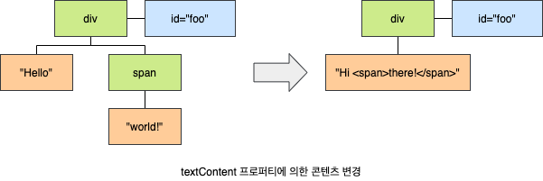
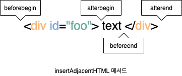

# innterHTML의 사용을 피해야 하는 이유

`Element.prototype.innerHTML` 프러퍼티는 setter와 getter 모두 존재하는 접근자 프로퍼티로서 요소 노드의 HTML 마크업을 취득하거나 변경합니다. 요소 노드의 `innerHTML` 프로퍼티를 참조하면 요소 노드의 콘텐츠 영역(시작 태그와 종료 태그 사이) 내에 포함된 모든 HTML 마크업을 문자열로 변환합니다. 요소 노드의 `innerHTML` 프로퍼티에 문자열을 할당하면 요소 노드의 모든 자식 노드가 제거되고 할당한 문자열에 포함되어 있는 HTML 마크업이 파싱되어 요소 노드의 자식 노드로 DOM에 반영됩니다.

```html
<!DOCTYPE html>
<html>
  <body>
    <div id="foo">Hello <span>world!</span></div>
    <script>
      const $foo = document.getElementById("foo");
      console.log($foo.innerHTML); // "Hello <span>world!</span>

      $foo.innerHTML = ""; // 노드 삭제
      $foo.innerHTML = "Hi <span>there!</span>"; // 노드 추가
    </script>
  </body>
</html>
```

## 1. 크로스 사이트 스크립트 공격

요소 노드의 `innerHTML` 프로퍼티에 할당한 HTML 마크업 문자열은 렌더링 엔진에 의해 파싱되어 요소 노드의 자식으로 DOM에 반영됩니다. 이때 **사용자로부터 입력받은 데이터**(Untrusted Input Data)를 그대로 `innerHTML` 프로퍼티에 할당하는 것은 **크로스 사이트 스크립트 공격**(Cross-Site Scripting Attacks, XSS)에 취약하므로 위험합니다. HTML 마크업 내에 자바스크립트 악성 코드가 포함되어 있다면 파싱 과정에서 그대로 실행될 가능성이 있기 때문입니다.

```javascript
const $foo = document.getElementById("foo");
$foo.innerHTML = "<script>alert(document.cookie)</script>";
```

HTML5는 `innerHTML` 프러퍼티로 삽입된 `script` 요소 내의 자바스크립트 코드를 실행하지 않습니다. 따라서 HTML5를 지원하는 브라우저에서 위 예제는 동작하지 않습니다. 하지만 `script` 요소 없이도 크로스 사이트 스크립팅 공격은 가능합니다. 다음의 간단한 크로스 스크립팅 공격은 모던 브라우저에서도 동작합니다.

```javascript
const $foo = document.getElementById("foo");
$foo.innerHTML = '';
```

이처럼 `innerHTML` 프로퍼티를 사용한 DOM 조작은 구현이 간단한고 직관적이라는 장점이 있지만 크로스 사이트 스크립팅 공격에 취약한 단점도 있습니다.

> **HTML 새니티제이션**(HTML Sanitization)은 사용자로부터 입력받은 데이터에 의해 발생할 수 있는 크로스 사이트 스크립팅 공격을 예방하기 위해 잠재적 위험을 제거하는 기능을 말합니다. 새니티제이션 함수를 직접 구현할 수도 있겠지만 [DOMPurify](https://github.com/cure53/DOMPurify) 라이브러리를 사용하는 것을 권장합니다. DOMPurify는 잠재적 위험을 내포한 HTML 마크업을 새니티제이션(살균)하여 잠재적인 위험을 제거합니다.

## 2. 비효율적인 자식 노드 추가

`innerHTML` 프러파티의 또 다른 잔점은 요소 노드의 `innerHTML` 프로퍼티에 `HTML` 마크업 문자열을 할당하는 경우 요소 노드의 모든 자식 도으를 제거하고 할당한 HTML 마크업 문자열을 파싱하여 DOM을 변경한다는 것입니다.

```javascript
const $fruits = document.getElementById("fruits");
$fruits.innerHTML += '<li class="banana">Banana</li>';
```

위 예제는 `#fruits` 요소에 자식 요소 `li.banana`를 추가합니다. 이떄 `#fruit` 요소의 자식 요소 `li.apple`은 아무런 변경이 없으므로 다시 생성할 필요가 없습니다. 다만 새롭게 추가할 `li.banana` 요소 노드만 생성하여 `#fruits` 요소의 자식 요소로 추가하면 됩니다. 위 예제를 얼핏 보면 그렇게 동작할 것처럼 보이지만 사실은 `#furits` 요소의 모든 자식 노드를 제거하고 새롭게 요소 노드들을 생성하여 `#fruits` 요소의 자식 요소로 추가합니다. 위 코드는 다음 코드의 축약 표현입니다.

```javascript
const $fruits = document.getElementById("fruits");
$fruits.innerHTML = $fruits.innerHTML + '<li class="banana">Banana</li>';
```

이처럼 `innerHTML` 프포퍼티에 HTML 마크업 문자열을 할당하면 유지되어도 좋은 기존의 자식 노드까지 모두 제거하고 다시 처음부터 새롭게 자식 노드를 생성하여 DOM에 반영합니다. 이는 효율적이지 않습니다. `innerHTML` 프로퍼티의 단점은 이뿐만이 아닙니다. `innerHTML` 프로퍼티는 새로운 요소를 삽입할 때 삽입될 위치를 지정할 수 없다는 단점도 있습니다. 이처럼 `innerHTML` 프로퍼티는 복잡하지 않은 요소를 새롭게 추가할 때 유용하지만 기존 요소를 제거하지 않으면서 위치를 짖정해 새로운 요소를 삽입해야 할 때는 사용하지 않는 것이 좋습니다.

## 3. textContent

`Node.porototype.textContent` 프로퍼티는 setter와 getter 모두 존재하는 접근자 프로퍼티로서 요소 노드의 텍스트와 모든 자손 노드의 텍스트를 모두 취득하거나 변경합니다. 요소 노드의 `textContent` 프로퍼티를 참조하면 요소 노드의 콘텐츠 영역(시작 태그와 종료 태그 사이) 내의 텍스트를 모두 반환합니다. 다시 말해, 요소 노드의 `childNodes` 프러퍼티가 반환한 모든 노드들의 텍스트 노드의 값, 즉 텍스트를 모두 반환합니다. 이떄 HTML 마크업은 무시됩니다. 요소 노드의 `textContent` 프로퍼티에 문자열을 할당하면 모든 자식 노드가 제거되고 할당한 문자열이 텍스트로 추가됩니다. 이떄 할당한 문자열에 HTML 마크업이 포함되어 있더라도 문자열 그대로 인식되어 텍스트로 취급됩니다. 즉, HTML 마크업이 파싱되지 않습니다.

```html
<!DOCTYPE html>
<html>
  <body>
    <div id="foo">Hello <span>world!</span></div>
    <script>
      const $foo = document.getElementById("foo");
      console.log($foo.textContent); // Hello world!

      $foo.textContent = "Hi <span>there!</span>";
    </script>
  </body>
</html>
```



## 4. insertAdjacentHTML 메서드

`Element.prototype.insertAdjacentHTML(position, DOMString` 메서드는 기존 요소를 제거하지 않으면서 위치를 지정해 새로운 요소를 삽입합니다. `insertAdjacentHTML` 메서드는 두 번째 인수로 전달한 HTML 마크업 문자열(DOMSring)을 파싱하고 그 결과로 생성된 노드를 첫 번째 인수로 전달한 위치(position)에 삽입할여 DOM에 반영합니다. 첫 번쨰 인수로 전달할 수 있는 문자열은 `beforebegin`, `afterbegin`, `beforeend`, `afterent`의 4가지 입니다.

`inertAdjacentHTML` 메서드는 기존 요소에는 영향을 주지 않고 새옵게 삽입될 요소만을 파싱하여 자식 요소로 추가하므로 `innerHTML` 프로퍼티보다 빠릅니다. 하지만 `innerHTML` 프로퍼티와 마찬가지로 `insertAdjacentHTML` 메서드는 HTML 마크업 문자열을 파싱하므로 크로스 사이트 스크립팅 공격에 취약하다는 점은 동일합니다.



```javascript
const $foo = document.getElementById("foo");

foo.insertAdjacentHTML("beforebegin", "<p>beforebegin</p>");
foo.insertAdjacentHTML("afterbegin", "<p>afterbegin</p>");
foo.insertAdjacentHTML("beforeend", "<p>beforeend</p>");
foo.insertAdjacentHTML("afterent", "<p>afterent</p>");
```

## 5. 출처

- 모던 자바스크립트 Deep Dive - 이웅모
