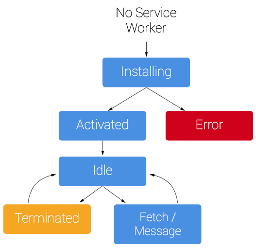

# 웹앱 매니페스트 & 서비스워커

어떠한 웹앱이 PWA가 되기 위해선 여러가지 조건을 충족하여야 합니다. 특히 웹앱 매니페스트와 서비스워커는 PWA에 필수적으로 포함되어야하는 요소입니다.

## 1. 웹앱 매니페스트

웹앱 매니페스트란 앱에 대한 정보를 담고있는 JSON 파일입니다. 배경색으 어떠한 색인지, 앱의 이름은 무엇인지, 홈 스크린 화면을 추가할 때 아이콘은 어떤 것인지 등의 정보를 담고 있습니다. 웹앱 매니페스트는 `manifest.json` 파일명을 대부분 사용합니다.

```json
{
  "short_name": "React App",
  "name": "Create React App Sample",
  "icons": [
    {
      "src": "favicon.ico",
      "size": "64x64 32x32 24x24 16x16",
      "type": "image/x-icon"
    }
  ],
  "start_url": "./index.html",
  "display": "standalone",
  "theme_color": "#000000",
  "background_color": "#ffffff"
}
```

- **short_name:** 사용자 홈 화면에서 아이콘 이름으로 사용
- **name:** 웹앱 설치 배너에 사용
- **icons:** 홈 화면에 추가할 때 사용할 이미지
- **start_url:** 웹앱 실행시 시작되는 URL 주소
- **display:** 디스플레이 유형 (fullscreen, standalone, browser 중 설정)
- **theme_color:** 상단 툴바의 색상
- **background_color:** 스플래시 화면 배경 색상
- **orientation:** 특정 방향을 강제로 지정(landscape, portrait 중 성정)

## 2. 서비스워커

서비스워커는 브라우저의 백그라운드에서 실행되는 자바스크립트 워커입니다. PWA는 네이티브 앱처럼 오프라인 상태에서도 사용가능하고, 푸시 알림(Notification) 기능도 사용할 수 있습니다. 이런 기능을 할 수 있도록 도와주는 것이 바로 서비스워커입니다. 향후에는 서비스워커에 **지오펜싱**(Zeofencing) 기능도 추가될 예정이라고 합니다.

### 2.1 생명 주기

서비스워커는 다음과 같은 생명 주기를 가집니다.



서비스워커를 설치하기 위해서는 먼저 등록을 해야합니다. 서비스워커 등록 코드는 `registerServiceWorker.js`에 이미 구현되어 있습니다. 등록을 하게 되면 브라우저가 백그라운드에서 서비스워커 설치를 시작하게 됩니다. 설치 단계 동안에는 정적 자원을 캐싱하는 일을 진행하게 되고, 모든 정적자원의 캐싱이 완료되고 나면 비로소 서비스워커 설치가 완료됩니다. 이렇게 서비스워커가 설치 되고, 활성화되고 나면 비로소 서비스워커가 기능을 할 수 있게 됩니다.

#### 2.1.1 서비스워커 등록 과정

`registerServiceWorker.js`에 구현되어 있는 `register()`, `registerValidSE()` 함수입니다.

###### registerServiceWorker.js

```javascript
export default function register() {
  if (process.env.NOND_ENV === "production" && "serviceWorker" in navigator) {
    const publicUrl = new URL(process.env.PUBLIC_URL, window.location);
    if (publicUrl.origin !== window.location.origin) {
      return;
    }
  }

  window.addEventListner("load", () => {
    const swUrl = `${process.env.PUBLIC_URL}/service-worker.js`;
    if (isLocalhost) {
      checkValidServiceWorker(swUrl);
      navigator.serviceWorker.ready.then(() => {
        console.log(
          "This web app is being served cache-first by a service " +
            "worker. To learn more, visit https://goo.gl/SC7cgQ"
        );
      });
    } else {
      registerValidSW(swUrl);
    }
  });
}

function registerValidSW(swUrl) {
  navigator.serviceWorker
    .register(swUrl)
    .then((registration) => {
      registration.onupdatefound = () => {
        const installingWorker = registration.installing;
        installingWorker.onstatechange = () => {
          if (installingWorker.state === "installed") {
            if (navigator.serviceWorker.controller) {
              console.log("New content is available; please refresh.");
            } else {
              console.log("Content is cached for offline use.");
            }
          }
        };
      };
    })
    .catch((error) => {
      console.error("Error during service worker registration:", error);
    });
}
```

프로젝트를 production 레벨로 실행(`yarn biuld`, `npm run build`)하면 서비스워커를 등록할 수 잇스비다. 실제 서비스워커는 개발자도구(F12)에서 Application 탭으의 Service Workers 메뉴에서 확인 가능합니다.

### 2.2 정적 자원 캐싱

서비스워커 설치단계에서는 정적 자원을 캐시한다고 설명했습니다. 서비스워커는 설치되고나면 브라우저와 서버 중간에 위치해 브라우저에서 보내는 요청들을 감시합니다. 이 때 요청에 대한 응답, 즉 자원이 캐싱되어 있다면 굳이 서버에서 받을 칠요 없이 캐싱된 자원을 리턴합니다. 그렇기 때문에 응답 시간도 현저히 줄어듭니다.

### 2.3 Network Disconnect

네트워크를 해제하고 접속하면 **404 Not Found** 에러가 발생하지 않고 네트워크가 연결되어 있을 때와 동일한 페이지를 보실 수 있습니다. 왜냐하면 보여지고 있는 자원들은 서버에서 받은 자원이 아닌 서비스워커로부터 받은 캐싱된 자원이기 때문입니다.

## 3. 출처

- [웹앱 매니페스트 & 서비스워커(Web App Manifest & Service Worker) - ALTENULL](https://altenull.github.io/2018/03/09/%EC%9B%B9%EC%95%B1-%EB%A7%A4%EB%8B%88%ED%8E%98%EC%8A%A4%ED%8A%B8-%EC%84%9C%EB%B9%84%EC%8A%A4%EC%9B%8C%EC%BB%A4-Web-App-Manifest-Service-Worker/)
