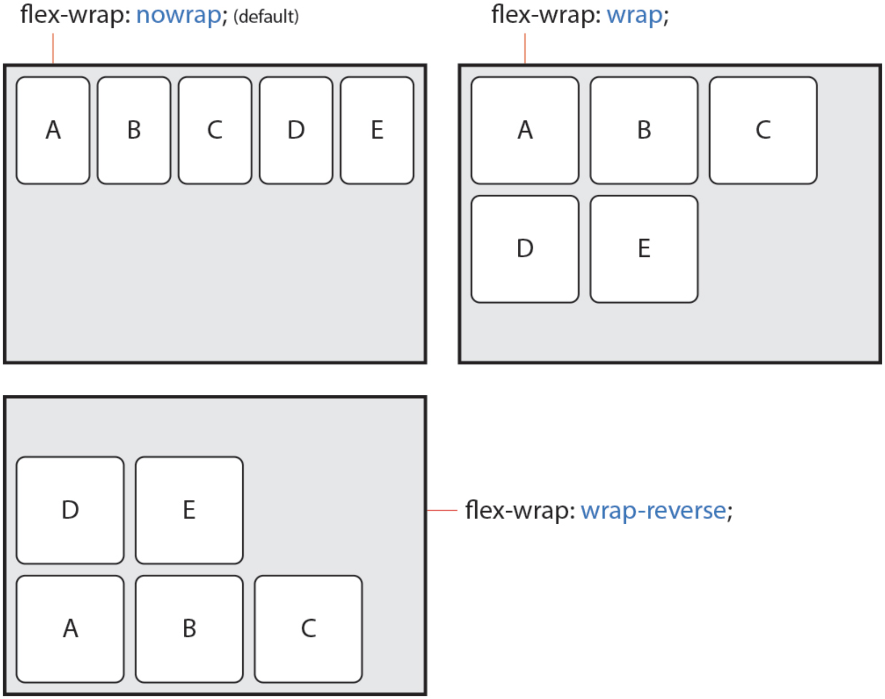
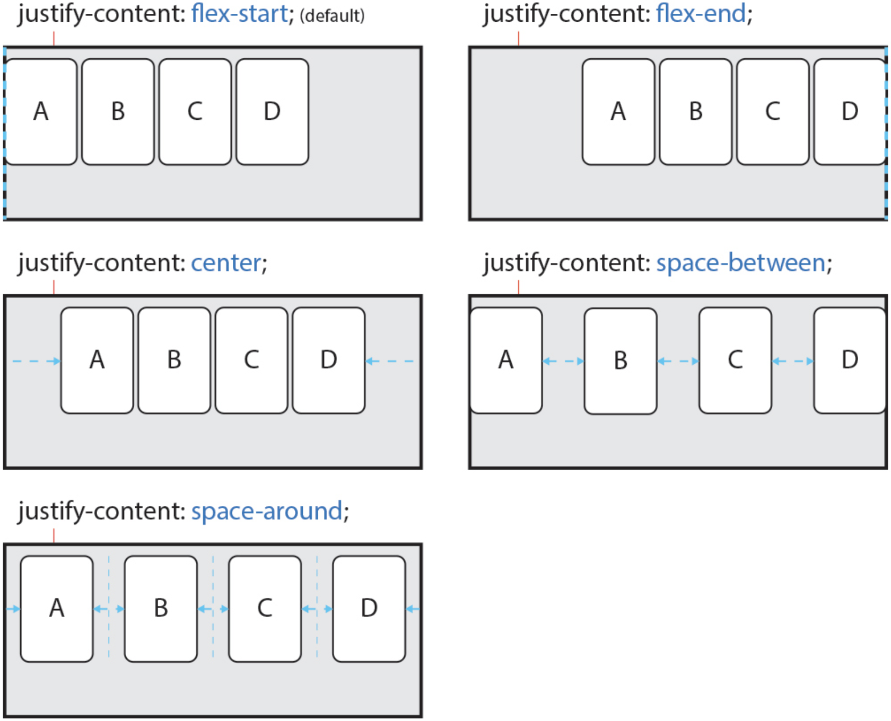
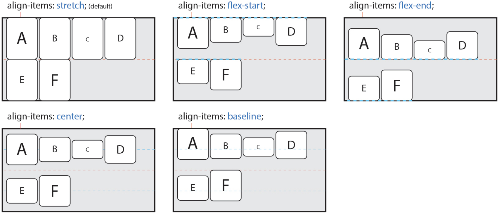
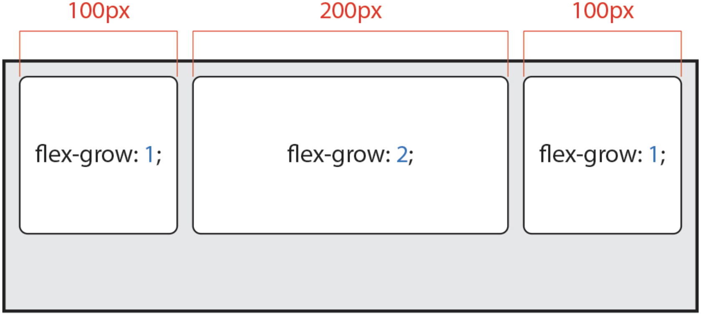
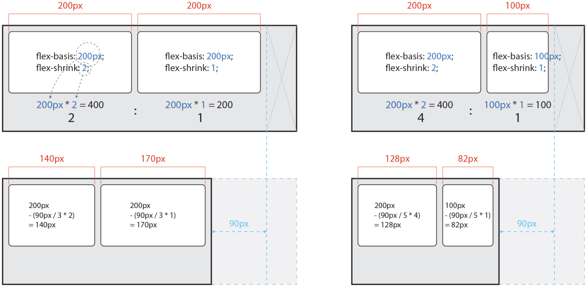
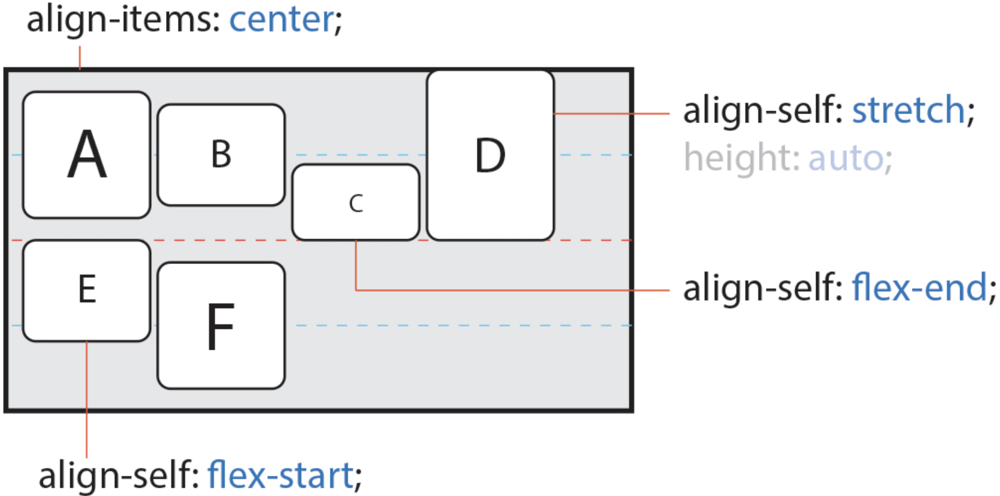

# Flexible Box

> **Flex**는 요소 크기가 불분명하거나 동적인 경우에도, 각 요소를 정렬할 수 있는 효율적인 방법을 제공합니다.

## 1. Flex 구성

**Flex**는 **Container**와 **Items**라는 두가지 개념으로 나뉩니다. **Container**는 **Items**를 감싸는 부모 요소아며, 각 **Item**을 정렬하기 위해서는 **Container**가 필수입니다.

## 2. Container

**Flex Container**를 위한 속성들은 다음과 같습니다.

속성             | 의미
----------------|----------------------------------------
display         | Flex Container를 정의
flex-dirrection | Flex Items의 주 축을 설정
flex-wrap       | Flex Items의 여러 줄 묶음 설정
flex-flow       | `flex-direction`과 `flex-wrap`의 단축 속성
justify-content | 주 축의 정렬 방법을 설정
align-content   | 교차 축의 정렬 방법을 설정 (2줄 이상)
align-items     | 교차 축에서 Item의 정렬 방법을 설정 (1줄)

### display

Flex Container를 정의합니다. 여기서 말하는 수직과 수평 쌓임은 **Items**가 아니라 **Container**입니다. 두 값의 차이는 내부의 Items에 영향을 주지 않습니다.

값           | 의미                             | 기본값
------------|----------------------------------|-----
flex        | Block 특성의 Flex Container를 정의  |
inline-flex | Inline 특성의 Flex Container를 정의 |

```css
.flex-container {
  display: flex;
}
```

### flex-direction

Items의 주 축을 설정합니다. 값 `row`는 Items를 수평축으로 표시하므로 이때는 **주 축**이 수평이며 **교차 축**은 수직이 됩니다. 반대로 값 `column`은 Items를 수직축으로 표시하므로 **주 축**은 수직이며 **교차 축**은 수평이 됩니다. 즉, 방향에 따라 **주 축**과 **교차 축**이 달라집니다.

값              | 의미                             | 기본값
---------------|----------------------------------|------
row            | Items를 수평축(왼쪽에서 오른쪽)으로 표시 | `row`
row-reverse    | Items를 `row`의 반대 축으로 표시      |
column         | Items를 수직축(위에서 아래)으로 표시    |
column-reverse | Items를 `column`의 반대 축으로 표시   |

```css
.flex-container {
  display: flex;
  flex-direction: row;
}
```

## flex-wrap

Items의 여러 줄 묶음을 설정합니다.

값            | 의미                                  | 기본값
-------------|---------------------------------------|---------
nowrap       | 모든 Items를 여러 줄로 묶지 않음(한 줄에 표시) | `nowrap`
wrap         | Items를 여러 줄로 묶음                    |
wrap-reverse | Items를 `wrap`의 역 방향으로 여러 줄로 묶음  |

```css
.flex-container {
  display: flex;
  flex-wrap: nowrap;
}
```



### flex-flow

이 속성은 단축 속성으로 **Flex Items**의 주축을 설정하고 **Items**의 여러 줄 묶음도 설정합니다.

값              | 의미                        | 기본값
---------------|-----------------------------|---------
flex-direction | Item의 주 축을 설정            | `row`
flex-wrap      | Item의 여러 줄 묶을(줄 바꿈) 설정 | `nowrap`

```css
.flex-container {
  display: flex;
  flex-flow: row-reverse wrap;
}
```

### justify-content

주 축의 정렬 방법을 설정합니다. **시작점**(flex-start)과 **끝점**(flex-end)라는 개념은 주축이나 교차 축의 시작하는 지점과 끝나는 지점을 지칭합니다. 방향에 따라 **시작점**과 **끝점**이 달라집니다.

값             | 의미                                                                   | 기본값
--------------|------------------------------------------------------------------------|-------------
flex-start    | Itmes를 시작점으로 정렬                                                    | `flex-start`
flex-end      | Items를 끝점으로 정렬                                                      |
center        | Items를 가운데 정렬                                                       |
space-between | 시작 Item은 시작점에, 마지막 Item은 끝점에 정렬되고 나머지 Items는 사이에 고르게 정렬됨 |
space-around  | Items를 균등한 여백을 포함하여 정렬                                           |

```css
.flex-container {
  display: flex;
  justify-content: flex-start;
}
```



### align-content

교차 축의 정렬 방법을 설적ㅇ합니다. 주의할 점은 `flex-wrap` 속성을 통해 Items가 여러 줄(2줄 이상)이고 여백이 있을 경우만 사용할 수 있습니다.

값             | 의미                                                                     | 기본값
--------------|-------------------------------------------------------------------------|-----------
stretch       | Container의 교차 축을 채우기 위해 Items를 늘림                                  | `stretch`
flex-start    | Items를 시작접으로 정렬                                                      |
flex-end      | Items를 끝점으로 정렬                                                       |
center        | Items를 가운데 정렬                                                         |
space-between | 시작 Item은 시작점에, 마지막 Item은 끝점에 정렬되고 나머지 Itemssms 사이에 고르게 정렬됨 |
space-around  | Items를 균등한 여백을 포함하여 정렬                                             |

```css
.flex-container {
  display: flex;
  flex-wrap: wrap;
  align-content: stretch;
}
```


### algin-items

교차 축에서 Items가 한 줄일 경우 정렬 방법을 설정합니다. 주의할 점은 Items가 `flex-wrap`을 통해 여러 줄(2중 이상)일 경우에는 `align-content` 속성이 우선합니다. 따라서 `align-items`를 사용하려면 `align-content` 속성을 기본값(`stretch`)으로 설정해야 합니다.

값          | 의미                                    | 기본값
-----------|-----------------------------------------|----------
stretch    | Container의 교차 축을 채우기 위해 Items를 늘림 | `stretch`
flex-start | Items를 각 줄의 시작점으로 정렬               |
flex-end   | Items를 각 주르이 끝점으로 정렬               |
center     | Items를 가운데 정렬                        |
baseline   | Items를 문자 기준선에 정렬                   |

```css
.flex-container {
  display: flex;
  align-items: stretch;
}
```



## 3. Flex Items

**Flex Items**를 위한 속성들은 다음과 같습니다.

속성         | 의미
------------|----------------------------------------------------
order       | Flex Item의 순서를 설정
flex-grow   | Felx Item의 증가 너비 비율을 설정
flex-shrink | Flex Item의 감소 너비 비율을 설정
flex-basis  | Flex Item의 (공간 배분 전) 기본 너비 설정
flex        | `flex-grow`, `flex-shrink`, `flex-basis`의 단축 속성
align-self  | 교차 축에서 Item의 정렬 방법을 설정

### order

Item의 순서를 설정합니다. HTML 구조와 상관없이 Item의 숫자를 지정하고 숫자가 클수록 순서가 밀립니다. 음수가 허용됩니다.

값  | 의미             | 기본값
----|-----------------|------
숫자 | Item의 순서를 설정 | `0`

```css
.flex-container {
  display: flex;
}

.box1 {
  order: 2;
}

.box2 {
  order: 1;
}
```

### flex-grow

Item의 증가 너비 비율을 설정합니다. 숫자가 크면 더 많은 너비를 가집니다. Item이 가변 너비가 아니거나, 값이 `0`일 경우 효과가 없습니다.

값  | 의미                     | 기본값
----|------------------------|-------
숫자 | Item의 증가 너비 비율을 설정 | `0`

```css
.flex-container {
  display: flex;
}

.box1 {
  flex-grow: 1;
}

.box2 {
  flex-grow: 2;
}

.box3 {
  flex-grow: 1;
}
```



### flex-basis

Item의 (공간 배분 전) 기본 너비를 설정합니다. 값이 `auto`일 경우 `width`, `height` 등의 속성으로 Item의 너비를 설정할 수 있습니다. 하지만 단위 값이 주어질 경우 설정할 수 없습니다.

값   | 의미                    | 기본값
-----|-----------------------|-------
auto | 가변 Item과 같은 너비     | `auto`
단위  | px, em, cm 등 단위로 지정 |

```css
.flex-container {
  display: flex;
}

.box1
.box2 {
  flex-grow: 1;
  flex-basis: auto;
}

.box13 {
  flex-grow: 2;
  flex-basis: auto;
}
```


### flex-shrink

Item이 감소하는 너비의 비율을 설정합니다. 숫자가 크면 더 많은 너비가 감소합니다. Item이 가변 너비가 아니거나, 값이 `0`일 경우 효과가 없습니다. `flex-shrink`는 요소의 너비에 영향을 받기 때문에 계산하기 까다롭습니다. 영향을 받는다는 요소의 너비는 `width`, `height`, `flex-basis` 등으로 너비가 지정된 경우를 의미합니다. Container의 너비가 줄어 Item의 너비에 영향을 미칠 결어, 영향을 미치기 시작한 지점부터 줄어든 거리 만큼 감소 너비 비율에 맞게 Item의 너비가 줄어듭니다.

값  | 의미                     | 기본값
----|------------------------|-------
숫자 | Item의 감소 너비 비율을 설정 | `1`

```css
.flex-container {
  display: flex;
}

.box1 {
  flex-basis: 200px;
  flex-shrink: 2;
}

.box2 {
  flex-basis: 200px;
  flex-shrink: 1;
}
```



### flex

Item 너비(증가, 감소, 기본)를 설정하는 단축 속성입니다. `flex-basis`의 기본값은 `auto` 이지만 단축 속성인 `flex`에서는 기본값이 `0`입니다.

값           | 의미                           | 기본값
------------|-------------------------------|--------
flex-grow   | Item의 증가 너비 비율을 설정        | `0`
flex-shrink | Item의 갑소 너비 비율을 설정        | `1`
flex-basis  | Item의 (공간 배분 전) 기본 너비 설정 | `0`

```css
.flex-container {
  display: flex;
}

.box1 {
  /* 증가너비 감소너비 기본너비*/
  flex: 1 1 20px;
}

.box2 {
  /* 증가너비 감소너비*/
  flex: 1 1;
}

.box {
  /* 증가너비 기본너비 (단위를 사용하면 flex-basis가 적용됩니다.*/
  flex: 1 1 20px;
}
```

### align-self

교차 축에서 개별 Item의 정렬 방법을 설정합니다. 이 속성은 `align-items` 속성보다 우선입니다.

값         | 의미                                    | 기본값
-----------|---------------------------------------|--------
auto       | Container의 `align-items` 속성을 상속받음  | `auto`
stretch    | Container의 교차 축을 채우기 위해 Item을 늘림 |
flex-start | Item을 각 줄의 시작점으로 설정               |
flex-end   | Item을 각 줄의 끝점으로 정렬                |
center     | Item을 가운데 정렬                        |
baseline   | Item을 문자 기준선에 정렬                   |

```css
.flex-container {
  display: flex;
  flex-wrap: wrap;
}

.box1 {
  align-self: center;
}
```



## 4. 출처

- [HEROPY Tech](https://heropy.blog/2018/11/24/css-flexible-box/)