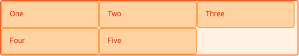
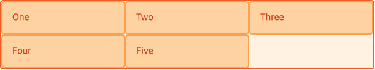
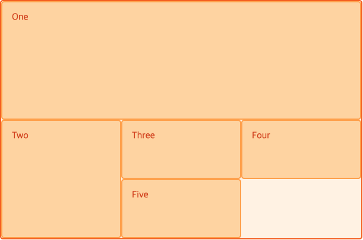
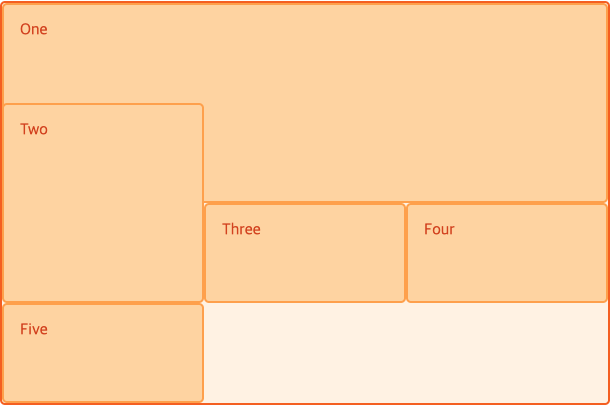
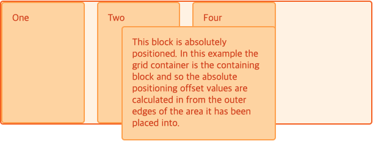
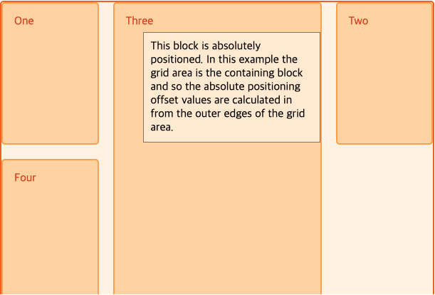
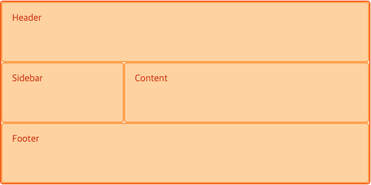
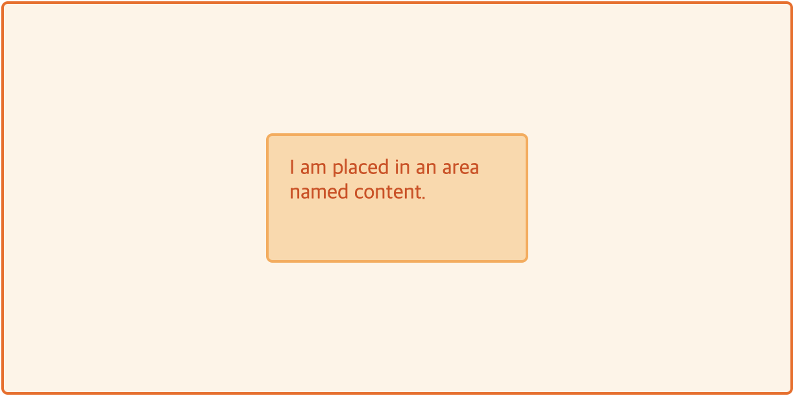

# CSS 그리드 레이아웃

> CSS에 2차원의 그리드 시스템을 도입햇씁니다. 그리드는 주요 페이지 영역을 설계하거나 작은 사용자 인터페이스 요소를 배치하는데 사용할 수 있습니다.

## 1. 그리드란?

그리드는 수평선과 수직선이 교차해서 이루어진 집합체입니다. 하나의 집합체는 새로 열을 그리고 다른 하나는 가로 행을 정의합니다. 각 요소는 이러한 열과 행으로된 라인을 따라 생성된 그리드에 배치할 수 있습니다.

### 고정되거나 혹은 유연한 트랙 크기

픽셀과 같은 명확한 단위를 써서 고정된 그리드를 만들거나 퍼센트 혹인 이런 목적에 적합하도록 설계된 새로운 `fr` 단위의 가변 크기를 지정해서 좀 더 유연한 성질의 그리드를 만들 수 있습니다.

### 아이템 배치

아이템은 라인 번호, 이름 또는 그리드 영역을 지정해서 그리드의 정확한 위치에 배치할 수 있습니다. 그리드는 또 명확하게 위치가 지정되지 않은 아이템을 알아서 적절히 배치하는 알고리즘도 가지고 있습니다.

### 콘텐츠를 담기 위한 추가 트랙의 생성

그리드 레이아웃으로 그리드를 명시적으로 정의할 수 있지만, 지정된 그리드 밖에 따로 추가되는 콘텐츠에 대응하여 필요에 따라 행과 열을 추가할 수 있습니다.

### 정령 제어

그리드에는 정렬 기능이 있어서 그리드 영역에 아이템을 배치한 후 어떻게 정렬할지, 그리고 전체 그리드가 정렬되는 방식을 제어할 수 있습니다.

### 겹치는 콘텐츠 제어

그리드 셀에 하나 이상의 아이템을 배치하거나 그리드 영역을 부분적으로 서로 겹치게 할 수 있습니다. 이렇게 생긴 중첩의 우선순위는 나중에 `z-index` 프로퍼티로 제어할 수 있습니다.

## 2. 그리드와 플랙스박스

**CSS 그리드 레이아웃**과 **CSS 플랙스박스 레이아웃**의 기본 차이점이라면, 플랙스박스는 한 줄로 된 행 혹은 열 방향의 레이아웃과 같이 일차원의 레이아웃을 염두에 두고 설계되었다는 점입니다. 하지만, 그리드는 행과 열 모두를 염두에 둔 2차원적 레이아웃을 고려해서 설계되었습니다. 그리드와 플랙스박스 둘 사이의 선택을 곤민할 때 다음 사항을 체크하세요.

- 레이아웃을 조정할 때 오직 가로 행 혹은 세로 열 만이 고려 대상이라면 플랙스박스를 사용하십시오.
- 레이아웃을 조정할때 가로 행과 세로 열 모두 염두에 두어야 한다면 그리드를 사용하십시오.
- 콘텐츠가 중심이면 플랙스박스, 레이아웃이 중심이면 그리드를 사용하십시오.

## 3. 그리드 컨테이너

**그리드 컨테이너**는 요소에 `display: grid` 또는 `display:inline-grid`를 선언하여 만듭니다. 이렇게 하면 해당 요소 바로 밑에있는 모든 자식 요소는 **그리드 아이템**이 됩니다.

```html
<div class="wrapper">
  <div>One</div>
  <div>Two</div>
  <div>Three</div>
  <div>Four</div>
  <div>Five</div>
</div>
```

```css
.wrapper {
  display: grid;
}
```


## 4. 그리드 트랙

그리드의 행과 열은 `grid-template-columns` 및 `grid-template-rows` 프로퍼티로 정의합니다. 이렇게 하면, **그리드 트랙**도 함께 정의됩니다. **그리드 트랙**은 그리드에 그려진 두 라인 사이의 공간을 나타냅니다.

```css
.wrapper {
  display: grid;
  grid-template-columns: 200px 200px 200px;
}
```



### fr 단위

트랙은 모든 종류의 길이 단위를 써서 정의할 수 있습니다. 새로 소개된 `fr` 단위는 그리드 컨테이너에 남아 있는 사용 가능한 공간의 일정 비율을 나타냅니다.

```css
.wrapper {
  display: grid;
  grid-template-columns: 1fr 1fr 1fr;
}
```



다음 예제에서는 `2fr` 크기의 트랙 하나와 `1fr` 트랙 두 개를 지정하였습니다. 사용 가능한 공간은 4개로 나뉘면서, 공간 두개는 첫 번쨰 트랙에 제공하고 나머지 공간 한 부분씩을 다음 두 트랙에 각각 제공합니다.

```css
.wrapper {
  display: grid;
  grid-template-columns: 2fr 1fr 1fr;
}
```

마지막 예시에서는 고정된 크기의 트랙과 비율 단위로 지정한 트랙이 섞여 있습니다. 첫 번쨰 트랙은 500 픽셀의 공간을 차지하므로 이 고정 너비는 사용 가능한 공간에서 제외됩니다. 나모지 공간은 3개의 부분으로 나뉘며 2개의 유연한 트랙에 비율에 맞게 할당됩니다.

```css
.wrapper {
  display: grid;
  grid-template-columns: 500px 1fr 2fr;
}
```

### repeat() 표기법으로 트랙 나열

많은 트랙을 포함하는 커다란 그리드는 `repeat()` 표기법을 사용하여 트랙의 전체 또는 일부분을 반복해서 나열해 줄 수 있습니다.

```css
.wrapper {
  display: grid;
  grid-template-columns: repeat(3, 1fr);
}
```

```css
.wrapper {
  display: grid;
  grid-template-columns: 1fr 1fr 1fr;
}
```

### 잠재적 그리고 명시적 그리드

**명시적 그리드**는 `grid-template-columns` 및 `grid-template-rows`로 직접 정의한 행과 열로 이루어진 그리드를 말합니다. 만약에 이렇게 정의된 그리드 밖에 무언가를 배치할 떈, 늘어난 콘텐츠 양 때문에 더 많은 그리드 트랙이 필요하고, 그리드는 **잠재적 그리드**에 새로운 행과 열을 만들게 됩니다. 이렇게 해서 생긴 트랙은 기본적으로 크기가 자동으로 정해지는데, 트랙 내부의 내용물에 따라 크기가 조정됩니다. 물론 잔재적 그리드에서 생성된 트랙의 크기는 `grid-auto-rows` 및 `grid-auto-columns` 프로퍼티를 써서 지정해줄 수도 있습니다.

```css
.wrapper {
  display: grid;
  grid-template-columns: repeat(3, 1fr);
  grid-auto-rows: 200px;
}
```

### 트랙 크기 조정과 minmax()

명시적 그리드를 설정하거나 자동으로 생성된 행이나 열의 크기를 정의할 때, 트랙의 최소 크기를 정해도 나중에 추가되는 콘텐츠에 맞게 늘어나도록 하고 싶을 때가 있을 겁니다. 이런 경우를 고려해서 그리드는 `minmax()` 함수를 제공하고 있습니다.

```css
.wrapper {
  display: grid;
  grid-template-columns: repeat(3, 1fr);
  grid-auto-rows: minmax(100px, auto);
}
```

## 5. 그리드 라인

그리드는 아이템을 배치할 때 쓸 수 있게 번호가 매겨진 라인을 다동으로 제공합니다. 아래 그림처럼, 그리드가 세 개의 세로 열과 두 개의 가로 행으로 이루어져 있다면, 네 개의 **Grid Line**이 Column으로 자리 잡게 됩니다.


### 라인을 이용한 아이템 배치

라인에 기반을 둔 배치 방법은 `grid-column-start`, `grid-columns-end`, `grid-row-start` 그리고 `grid-row-end` 프로퍼티를 써서 배치합니다. 나머지 아이템은 그리드 빈 자리에 자동으로 배치됩니다.

```html
<div class="wrapper">
  <div class="box1">One</div>
  <div class="box2">Two</div>
  <div class="box3">Three</div>
  <div class="box4">Four</div>
  <div class="box5">Five</div>
</div>
```

```css
.wrapper {
  display: grid;
  grid-template-columns: repeat(3, 1f);
  grid-auto-rows: 100px;
}

.box1 {
  grid-column-start: 1;
  grid-column-end: 4;
  grid-row-start: 1;
  grid-row-end: 3;
}

.box2 {
  grid-column-start: 1;
  grid-row-start: 3;
  grid-row-end: 5;
}
```



### 단축용법

`grid-column-start`와 `grid-column-end` 프로퍼티는 `grid-column`으로 합칠 수 있으며, `grid-row-start`와 `grid-row-end`는 `grid-row` 프로퍼티로 정의할 수 있습니다.

```html
<div class="wrapper">
  <div class="box1">One</div>
  <div class="box2">Two</div>
  <div class="box3">Three</div>
  <div class="box4">Four</div>
</div>
```

```css
.box1 {
  grid-column: 1;
  grid-row: 1 / 4;
}

.box2 {
  grid-column: 3;
  grid-row: 1 / 3;
}

.box3 {
  grid-column: 2;
  grid-row: 1;
}

.box4 {
  grid-column: 2 / 4;
  grid-row: 3;
}
```


우리는 여기서 한 발 더 나가 각 영역을 단 하나의 프로퍼티인 `grid-area`로 정의할 수 도 있습니다. `grid-area` 값의 순서는 다음과 같습니다.

- grid-row-start
- grid-column-start
- gird-row-end
- grid-column-end

```css
.box1 {
  grid-area: 1 / 1 / 4 / 2;
}
.box2 {
  grid-area: 1 / 3 / 3 / 4;
}
.box3 {
  grid-area: 1 / 2 / 2 / 3;
}
.box4 {
  grid-area: 3 / 2 / 4 / 4;
}
```

### 거꾸로 세기

그리드의 블록과 인라인 지점의 끝에서부터 거꾸로 셀 수도 있습니다.

```css
.box1 {
  grid-column-start: -1;
  grid-column-end: -2;
  grid-row-start: -1;
  grid-row-end: -4;
}
```

아이템을 그리드 전체에 걸치도록 늘리려 할 떄 유용한 방법으로는 다음과 같이 그리드의 시작과 끝의 라인을 지저해줄 수 있습니다.

```css
.item {
  grid-column: 1 / -1;
}
```

### span 키워드 사용법

번호를 붙여서 시작과 마지막 라인을 지정하는 법과 더불어, 시작 라인을 지정한 후 원하는 만큼의 영역을 가로질러 확장하는 트랙의 수를 지정해서 사용하실 수도 있습니다.

```css
.box1 {
  grid-column: 1;
  grid-row: 1 / span 3;
}
```

```css
.box1 {
  grid-column-start: 1;
  grid-row-start: 1;
  grid-row-end: span 3;
}
```

```css
.box1 {
  grid-column-start: 1;
  grid-row-start: span 3;
  grid-row-end: 4;
}
```

## 6. 그리드 셀

**그리드 셀**은 그리드에 있는 가장 작은 구성원입니다. 개념상 테이블에 있는 셀과 비슷합니다. 부모 요소에 그리드를 정의하면 자식 아이템은 지정된 그리드 셀에 각자 하나씩 나열되어 배치됩니다.

## 7. 그리드 영역

아이템은 행 또는 열 방향 어느 쪽으로든 하나 이상의 셀에 걸쳐있을 수 잇으며 이렇게 해서 **그리드 영역**을 만듭니다. 그리드 영역은 직사각형이여야 합니다.

## 8. 경계 여백

그디드 셀 사이의 **경계 여백** 혹은 **간격**은 `grid-column-gap` 및 `grdi-row-gap` 프로퍼티를 지정해서 생성할 수 있으며, 짧게 `grid-gap`으로 지정할 수도 있습니다.

```css
.wrapper {
  display: grid;
  grid-template-columns: repeat(3, ifr);
  grid-column-gap: 10px;
  grid-row-gap: 1rem;
}
```


### 그리드 간격의 단축용법

만약에 `grid-gap` 값으로 하나만 지정하면, 열과 행 간격 모두에 같이 적용됩니다. 그리고 두 개의 값을 지정하면, 처음 것은 `grid-row-gap`에 사용되고 두번재 것은 `grid-column-gap`에 사용됩니다.

```css
.wrapper {
  display: grid;
  grid-template-columns: repeat(3, 1fr);
  grid-template-rows: repeat(3, 100px);
  grid-gap: 1em 20px;
}
```

## 9. 중첩 그리드

**그리드 아이템**은 자기 자신이 그리드 컨테이너가 될 수 있습니다.

```html
<div class="wrapper">
  <div class="box box1">
    <div class="nested">a</div>
    <div class="nested">b</div>
    <div class="nested">c</div>
  </div>
  <div class="box box2"></div>
  <div class="box box3"></div>
  <div class="box box4"></div>
  <div class="box box5"></div>
</div>
```

## 10. z-index를 이용한 아이템 중첩도 조정

그리드 아이템은 서로 같은 셀을 차지할 수 있습니다.

```html
<div class="wrapper">
  <div class="box box1">One</div>
  <div class="box box2">Two</div>
  <div class="box box3">Three</div>
  <div class="box box4">Four</div>
  <div class="box box5">Five</div>
</div>
```

```css
.wrapper {
  display: grid;
  grid-template-columns: repeat(3, 1fr);
  grid-auto-rows: 100px;
}

.box1 {
  grid-column-start: 1;
  grid-column-end: 4;
  grid-row-start: 1;
  grid-row-end: 3;
}

.box2 {
  grid-column-start: 1;
  grid-row-start: 2;
  grid-row-end: 4;
}
```



### 중첩의 순서 조정

위치를 따로 지정한 아이템과 마찬가지로, 아이템이 위아래로 중첩되는 순서는 `z-index` 프로퍼티를 써서 제어할 수 있습니다.

```css
.wrapper {
  display: grid;
  grid-template-columns: repeat(3, 1fr);
  grid-auto-rows: 100px;
}

.box1 {
  grid-column-start: 1;
  grid-column-end: 4;
  grid-row-start: 1;
  grid-row-end: 3;
  z-index: 2;
}

.box2 {
  grid-column-start: 1;
  grid-row-start: 2;
  grid-row-end: 4;
  z-index: 1;
}
```


## 11. 그리드 정렬

그리드 레이아웃은 해당 그리드 영역을 기중으로 내부에 잇는 아이템들을 정렬합니다.

```html
<div class="wrapper">
  <div class="box1">One</div>
  <div class="box2">Two</div>
  <div class="box3">Three</div>
</div>
```

```css
.wrapper {
  display: grid;
  grid-template-columns: repeat(3, 1fr);
  align-items: end;
  grid-auto-rows: 200px;
}

.box1 {
  align-self: stretch;
}

.box2 {
  align-self: start;
}
```


## 12. 자동으로 채워지는 그리드 트랙

트랙의 목록을 생성할 때 반복 표기법과 `auto-fill` 및 `auto-fit` 프로퍼티를 사용하면 지정한 행과 열에 맞추면서 사용 가능한 공간을 비율에 따라 할당할 수 있습니다.

```html
<div class="wrapper">
  <div>One</div>
  <div>Two</div>
  <div>Three</div>
</div>
```

```css
.wrapper {
  display: grid;
  grid-template-columns: repeat(auto-fill, 200px);
}
```


### 변동 가능한 트랙의 수

그리드에서 `auto-fill`과 `minmax()` 함수를 결합해서 사용할 수 있습니다.

```html
<div class="wrapper">
  <div>One</div>
  <div>Two</div>
  <div>Three</div>
</div>
```

```css
.wrapper {
  display: grid;
  grid-template-columns: repeat(auto-fill, minmax(200px, 1fr));
}
```


## 13. 그리드와 단독으로 위치를 지정한 요소

그리드는 단독으로 위치 지정된 요소와 상호 작용하면서, 그리드 또는 끄리드 영역 내에 아이템을 배치할 때 유용하게 사용될 수 있습니다.

### 컨테이닝 블록으로서의 그리드 컨테이너

그리드 컨테이너를 컨테이닝 블록으로 만들려면, 다른 단독으로 위치를 지정한 아이템을 감싸고 잇는 요소를 컨테이닝 블록을 만들 때와 마찬가지로 컨테이너에 `position` 프로퍼티를 `relative`로 지정해야 합니다. 이렇게 하면, 그리드 아이템에 `position: absolute`를 지정할 경우 그리드 컨테이너가 컨테이닝 블록이 되며, 또 해당 아이템에 그리드 위치값이 추가로 지정되었을 때는, 배치된 그리드 영역이 컨테이닝 블록으로 작용합니다.

```html
<div class="wrapper">
  <div class="box1">One</div>
  <div class="box2">Two</div>
  <div class="box3">
    This bolck is absolutely positioned. In this example the grid container is
    the containing block and so the absolute positioning offset values are
    calculated in from the outer edges of the area it has been placed into.
  </div>
  <div class="box4">Four</div>
</div>
```

```css
.wrapper {
  display: grid;
  grid-template-columns: repeat(4, 1fr);
  grid-auto-rows: 200px;
  grid-gap: 20px;
  position: relative;
}

.box3 {
  grid-column-start: 2;
  grid-column-end: 4;
  grid-row-start: 1;
  grid-row-end: 3;
  position: absolute;
  top: 40px;
  left: 40px;
}
```



단독을 위치를 지정한 일반 아이템의 경우와 마찬가지로 문서 흐름에서 제외되면서, 자동 배치 규칙에 따라 해당 공간에 다른 아이템들을 배치하게 됩니다. 또한 이로 인해 아이템이 추가 행을 생성하지 않게 되면서 가로 행 3번 라인까지 확장하지 않게 되었습니다.

### 부모 요소로서의 그리드 컨테이너

만약 단독으로 위치를 지정한 자식 요속가 그리드 컨테이너에 속해 있지만, 해당 컨테이너가 위치를 참고하는 새로운 기준 요소로 정의되지 않았다면, 앞의 상황처럼 일반 배치 흐름에서 배제됩니다. 위치의 기준이 되는 요소는, 다른 레이아웃 방법에 공통 적용되는 것과 마찬가지로, 새로운 위치 기준 요소로 정의된 요소가 맟게 됩니다.

### 부모 요소가 그리드 영역일 때

만약에 단독으로 위치를 지정한 아이템이 그리드 영역 안에 자리 잡고 있다면, 해당 영역을 위치의 기준이 되는 요소로 정의할 수 있습니다.

```html
<div class="wrapper">
  <div class="box1">One</div>
  <div class="box2">Two</div>
  <div class="box3">
    Three
    <div class="abspos">
      This block is absolutely positioned. In this example the grid area is the
      containing block and so the absolute positioning offset values are
      calculated in from the outer edges of the grid area.
    </div>
  </div>
  <div class="box4">Four</div>
</div>
```

```css
.wrapper {
  display: grid;
  grid-template-columns: repeat(4, 1fr);
  grid-auto-rows: 200px;
  grid-gap: 20px;
}

.box {
  grid-column-start: 2;
  grid-column-end: 4;
  grid-column-start: 1;
  grid-column-end: 3;
  position: relative;
}

.abspos {
  position: absolute;
  top: 40px;
  left: 40px;
  background-color: rgba(255, 255, 255, 0.5);
  border: 1px solid rgba(0, 0, 0, 0, 0.5);
  color: #000;
  padding: 10px;
}
```



## 14. 그리드와 display: contents

아아팀에 `display: contents`를 지정하면 보통 해당 요소가 만드는 박스는 사라지고, 자식 요소의 박스가 한 단계 상승한 것처럼 그 자리를 차지하게 됩니다. 이 얘기는 그리드 아이템의 자식 요소가 그리드 아이템이 될 수도 있다는 뜻입니다.

```html
<div class="wrapper">
  <div class="box box1">
    <div class="nested">a</div>
    <div class="nested">b</div>
    <div class="nested">c</div>
  </div>
  <div class="box box2">Two</div>
  <div class="box box3">Three</div>
  <div class="box box4">Four</div>
  <div class="box box5">Five</div>
</div>
```

```css
.wrapper {
  display: grid;
  grid-template-columns: repeat(3, 1fr);
  grid-auto-rows: minmax(100px, auto);
}

.box1 {
  grid-column-start: 1;
  grid-column-end: 4;
  display: contents;
}
```


## 15. 그리드 영역의 이름 짓기

각 영역에 이름을 붙여서 정의할 수 있으며, 각 영역의 위치는 `grid-template-areas` 프로퍼티로 정의할 수 있습니다. 영역의 이름은 원하시는 것 아무거나 성택해서 사용할 수 있습니다.

```html
<div class="wrapper">
  <div class="header">Header</div>
  <div class="sidebar">Sidebar</div>
  <div class="content">Content</div>
  <div class="fotter">Footer</div>
</div>
```

```css
.header {
  grid-area: hd;
}

.footer {
  grid-area: ft;
}

.content {
  grid-area: main;
}

.slider {
  grid-area: sd;
}

.wrapper {
  display: grid;
  grid-template-columns: repeat(9, 1fr);
  grid-auto-rows: minmax(100px, auto);
  grid-template-areas:
    "hd hd hd hd   hd   hd   hd   hd   hd"
    "sd sd sd main main main main main main"
    "ft ft ft ft   ft   ft   ft   ft   ft";
}
```



### 그리드 셀 비워두기

셍을 공간으로 남겨주려면 마침표 글자(`.`)를 사용하면 됩니다.

```css
.wrapper {
  display: grid;
  grid-template-columns: repeat(9, 1fr);
  grid-auto-rows: minmax(100px, auto);
  grid-template-areas:
    "hd hd hd hd   hd   hd   hd   hd   hd"
    "sd sd sd main main main main main main"
    ".  .  .  ft   ft   ft   ft   ft   ft";
}
```


### 미디어 쿼리를 이용한 그리드 재정의

이 작업을 할 떄 주의할 점은 미디어 쿼리 밖에서 역역의 이름을 정의해야 한다는 것입니다.

```css
.wrapper {
  display: grid;
  grid-auto-rows: minmax(100px, auto);
  grid-template-columns: 1fr;
  grid-template-areas: 
    "hd"
    "main"
    "sd"
    "ft";
}

@media (min-width: 500px) {
  .wrapper {
    grid-template-columns: repeat(9, 1fr);
    grid-template-areas: 
      "hd hd hd hd   hd   hd   hd   hd   hd"
      "sd sd sd main main main main main main"
      "sd sd sd  ft  ft   ft   ft   ft   ft";
  }
}

@media (min-width: 700px) {
  .wrapper {
    grid-template-areas: 
      "hd hd hd   hd   hd   hd   hd   hd hd"
      "sd sd main main main main main ft ft";
  }
}
```

### 단축용법

단축용법을 쓰기 전에 꼭 명심해야 할 것은 단축용법은 단번에 많은 프로퍼티의 설정이 가능할 뿐만 아니라, 정의하지 않은 혹은 정의할 수 업슨ㄴ 것들도 그들의 초기값으로 재설정되도록 적용한다는 점입니다. 그러므로 단축용법을 사용할 땐 다른 곳에서 적용했던 것들이 재설정될 수 도 있다는 점을 주의하십시오.

### grid-template

`grid-template` 프로퍼티는 다음과 같은 프로퍼티들을 설정합니다.

- `grid-tempate-rows`
- `grid-tempate-columns`
- `grid-tempate-areas`

```css
.wrapper {
  display: grid;
  grid-template:
    "hd hd hd hd   hd   hd   hd   hd   hd" minmax(100px, auto)
    "sd sd sd main main main main main main" minmax(100px, auto)
    "ft ft ft ft   ft   ft   ft   ft   ft" minmax(100px, auto)
    / 1fr 1fr 1fr 1fr 1fr 1fr 1fr 1fr 1fr;
}
```

### grid

`grid` 단축용법은 한 발 더 나가 잠재저 끄리드를 정의하는데 사용되는 프로퍼티들도 같이 설정합니다.

- `grid-tempate-rows`
- `grid-template-columns`
- `grid-template-areas`
- `grid-auot-rows`
- `grid-auto-columns`
- `grid-auto-flow`

## 라인에 이름 짓기

`grid-template-rows` 그리고 `grid-template-columns` 프로퍼티로 그리드를 정의할 때 그리드에 있는 모든 라인 혹은 일부 라인들에 이름을 지어 줄 수 있습니다. 그리드를 정의할 때, 그리드 라인의 이름은 대괄호 안에 적어줍니다. 라인 이름은 원하시는 것 아묵거나 다 괜찮습니다.

```css
.wrapper {
  display: grid;
  grid-template-columns: [main-start] 1fr [content-start] 1fr [content-end] 1fr [main-end];'
  grid-template-rows: [main-start] 100px [content-start] 100px [content-end] 100px [main-end];
}

.box1 {
  grid-column-start: main-start;
  grid-row-start: main-start;
  grid-row-end: main-end;
}

.box2 {
  grid-column-start: content-end;
  grid-row-start: main-start;
  grid-row-end: content-end;
}

.box3 {
  grid-column-start: content-start;
  grid-row-start: main-start;
}

.box4 {
  grid-column-start: content-start;
  grid-column-end: main-end;
  grid-row-start: content-end;
}
```


### 라인에 여려개의 이름 지어주기

라인의 이름을 정할 때 하나 이사으이 이름을 붙여주고 싶을 때가 있는데, 예를 들어 slidebar-end 그리고 main-start를 함께 표기학고자 할 때가 있습니다. 이럴 땐 `[slidebar-end main-start]` 처럼 대괄호 안에 공백을 사이에 두고 이름을 추가하면 됩니다.

### 잠재적 그리드 영역 이름

이름은 아무거나 선택하실 수 있지만, 만약에 영역 주변에 있는 라인의 이름 끝에 `-start` 혹은 `-end`를 붙이면, 그리드 전체 이름 중 꼬리부분을 제외한 주요 이름만으로 명명된 영역을 생성하게 됩니다.

```css
.wrapper {
  display: grid;
  grid-template-columns: [main-start] 1fr [content-start] 1fr [content-end] 1fr [main-end];
  grid-template-rows: [main-start][ 100px [content-start] 100px [content-end] 100px [main-end];
}

.thing {
  grid-area: content;
}
```

```html
<div class="wrapper">
  <div class="thing">I am placed in an area named content.</div>
</div>
```



### 잠재적 그리드 라인 이름

이는 역으로도 작용합니다. 이름이 주어진 템플릿 영역은 그에 어울리는 이름이 붙여진 라인을 생성하면서, 이를 이용해서 아이템을 배치할 수 있습니다.


### 같은 이름을 가진 여러개의 라인 만들기

만약ㄱ에 그리드에 있는 모든 라인에 독자적인 이름을 지어 주길 원한다면, 트랙을 정의할 때 반복 용법을 사용하는 대신 대괄호 안에다 이름을 일일이 추가해줘야 해서 약간 장환한 트랙 정의를 작성하셔야 합니다. 반복 용법을 사용하게 되면 여러 라인이 같은 이름을 갖게 되는데, 이 또한 매우 유용합니다.

```css
.wrapperr {
  display: grid;
  grid-template-columns: repeat(12, [col-start] 1fr);
}
```

`col-start`라는 이름이 주어진 12개의 열 방향의 라인으로 구성된 그리드가 생성됩니다. 여러 개의 라인 이름을 `col-start`라는 이름으로 지어 주었끼 때문에 `col-start` 라인을 기준 시작 지점으로 아이템을 배치하게 되면 그리드는 첫 번째에 있는 `col-start`라는 이름의 라인을 사용합니다. 또 다른 라인을 가리키려면 이름과 함께 해당 라인의 번호를 더해주면 됩니다.

```css
.item {
  grid-column: col-start / col-start 5;
}
```

반복 용법은 트랙의 목록을 나열해서도 사용할 수 있으며, 오직 하나의 트랙 크기만 반복하도록 쓰실 필요는 없습니다.

```css
.wrapper {
  grid-template-columns: repeat(4, [col1-start] 1fr [col-end]);
}
```

그리드 레이아웃에서 **프레임 워틐**를 구현하는데 필요한 코드를 아래처럼 아주 간단하게 작성할 수 있습니다.

```css
.wrapper {
  display: grid;
  grid-gap: 10px;
  grid-template-columns: repeat(12, [col-start] 1fr);
}

.main-header,
.main-footer {
  grid-column: col-start / span 12;
}

.side1 {
  grid-column: col-start / span 3;
}

.content {
  grid-column: col-start 4 / span 6;
  grid-row: 2;
}

.side {
  grid-column: col-start 10 / span 3;
  grid-row: 2;
}
```

```html
<div class="wrapper">
  <header class="main-header">I am the header</header>
  <aside class="side1">I am sidebar 1</aside>
  <article class="content">I am the main article</article>
  <aside class="side2">I anm sidebar2</aside>
  <footer class="main-footer">I am the footer</footer>
</div>
```


## 17. 출처

- [MDN web docs](https://developer.mozilla.org/ko/docs/Web/CSS/CSS_Grid_Layout/Relationship_of_grid_layout)
