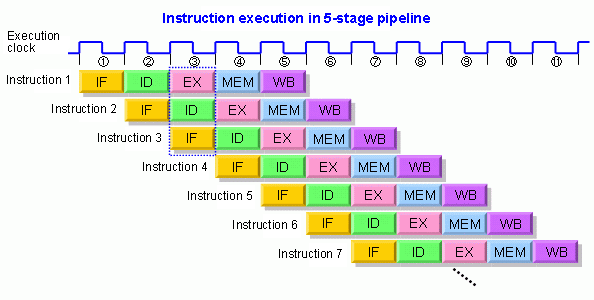
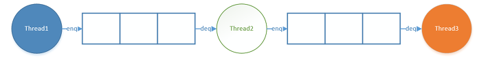

# 파이프라인

> 프로세서에서 성능을 높이기 위해서 명령어 처리 과정으로, 명령어 처리를 여러 단계로 나누어 동시에 수행하여 병렬화 시키는 것을 말합니다.

## 1. 동작 방식

매 클록마다 여러 명령어를 중복된 단계 없이 실행시킵니다. 아래는 5단계 파이프라인의 모습입니다.

## 2. 가장 효율적인 조건

- 각 단계별 처리 시간이 일정 해야합니다.
- 각 명령어의 처리 단계는 균일 해야합니다.

## 3. 헤저드의 종류

하지만 실제로는 처리 시간이 일정하지 않고 처리 단계가 균등하지 않아서 문자가 발생합니다. 이를 **해저드**라고 합니다.

### 구조 해저드

프로세서의 자원이 부족해서 발생합니다. 아래와 같이 **명령어 2**에서 `EXE`가 1클락에 안 끝날 경우, **명령어 3**에서 `WB`를 수행할 때 멈춤(stall)이 발생합니다. 또한 **명령어 4**에서는 `OF` 단계가 필요없는 명령어므로 `EXE`를 수행하려고 할 때 멈춤(stall)이 발생합니다.

### 데이터 헤저드

이전 명령어의 결과를 기반으로 다음 명령이 수행될 때 발생합니다.

### 컨트롤 헤저드

프로그램의 의존성에 의해서 발생합니다. 분기 분의 경우 해당 명령어 결과값이 나와야 다음 명형어가 수행되는데, 이때 해당 명령어가 끝날때까지 다음 명령어에 멈춤이 발생합니다.

## 4. 소프트웨어에서 파이프라인 기법 사용하기

만약 소프트웨어가 여러 단계로 독립적이게 구형될 수 있다면, 다음 방식으로 파이프라인을 구현할 수 있습니다.

1. 각 단계를 Thread 구형
2. 각 Thread를 queue로 연결

## 5. 출처

- [즐거운인생](https://doitnow-man.tistory.com/72)