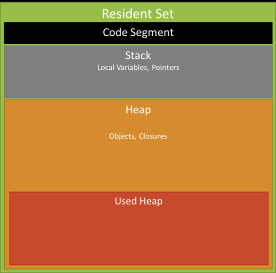

# Node.js 메모리 누수

> node.js가 어떻게 메모리를 관리하는지와 메모리와 관련된 문제를 어떻게 추적할 것인지에 대해서 다룹니다. php 플랫폼과 다르게, node.js 어플리케이션은 long-running 프로세스입니다. 이 점은 DB 커넥션을 한번 셋업하고나서 모든 request를 처리하기 위해 계속 재사용한다는 것에서 큰 장점을 가지고 있지만, 이 또한 많은 문제를 동반합니다.

## 메모리 누수란

메모리 누수는 어떠한 이유로 애플리케이션에서 더이상 사용되지 않음에도 불구하고, 운영체제나 사용 가능한 메모리 풀에 반환되지 않은 메모리라고 정의할 수 있습니다. 프로그래밍 언어들은 각기 다른 방법으로 메모리를 관리합니다. 이런 프로그래밍 언어 차원에서의 메모리 관리는 메모리 누수의 가능성을 많이 줄여줍니다. 하지만 프로그래밍 언어의 메모리 관리 시스템이 특정 메모리가 실제 사용중인지 미사용중인지 완벽히 구분해내는것은 사실상 불가능에 가깝습니다. 오직 그 코드를 작성한 개발자들만이 해당 메모리 조각을 운영체제로 반환시킬 수 있느닞 여부를 명확히 알 수 있습니다. 특정 프로그래밍 언어들은 개발자들이 좀 더 편리하게 메모리를 반환할 수 있도록 기능들을 제공하기도 합니다. 개발자들이 명시적으로 미사용 메모리를 반환해야하는 언어들도 있습니다.

## Node.js는 V8 자바스크립트 엔진으로 돌아가는 C++ 프로그램이다

Google V8은 초기에 구글 크롭을 위해 만든 자바스크립트 엔진입니다. 그러나 개별적으로도 사용이 가능합니다. V8은 node.js에 딱 맞게 만들어 졌습니다. 그리고 자바스크립트 플랫폼의 한 부분입니다. V8은 자바스크립트를 native code로 컴파일해서 실행합니다. 실행되는 동안 메모리를 필요한 만큼 할당하고 회수합니다. 이는 우리가 node.js의 메모리 관리에 대해서 논한다면 반드시 V8에 대해서 언급할 수 밖에 없다는 것을 뜻합니다.

## V8의 메모리 정책

실행되고 있는 프로그램은 항상 메모리의 빈 공간에 할당되어 나타납니다. 이 공간은 Resident Set이라고 불립니다. V8은 JVM과 비슷한 정책을 사용하며 메머리를 세그먼트로 나눕니다.



- **Code:** 실행될 실제 코드
- **Stack:** 힙에 있는 오브젝트를 참조하는 포인터와 함께 모드 value 타입을 포함 (integer, boolean과 같은 기본 요소)
- **Heap:** 오브젝트, 스트링, 클로저와 같은 레퍼런스 타입을 저장하기 위한 전용 메모리 세그먼트

Node.js내에서 현재 메머리 사용은 process.memoryUsage()를 이용해 쉽게 이용할 수 있다. 이 함수는 아래와 같은 요소를 포함하고 있는 오브젝트를 리턴합니다.

- Resident Size
- Total Size of the Heap
- Heap actually Used

자바스크립트는 `garbage collected` 언어 중 하나입니다. Garbage collected 언어들은 이전에 할당한 메모리를 애플리케이션에서 여전히 사용 중인지를 주기적으로 검사해 개발자들이 메모리 관리에 덜 신결쓸 수 있도록 도와줍니다. 다른 말로, `garbage collected` 언어들은 메모리 관리 문제를 '어떤 메모리가 여전히 필요한가?"에서 "어떤 메모리가 애플리케이션의 다른 코드에서 접근할 수 있는가?"로 축소할 수 잇게 해줍니다. 이 둘의 차이점은 미묘해 보이지만 매우 중요합니다. 할당ㄱ된 메모리가 미래에 사용되는지의 여부는 오직 개발자만이 알지만, 다른 코드에서 더 이상 접근되지 않는 메모리는 알고리즘적으로 결정할 수 있어 OS에 반환될 수 있도록 표시할 수 있습니다.

## 자바스크립트에서 메모리 관리

메모리를 사용하는 모든 프로그램은 메모리에 대한 메카니즘을 필요로합니다. C, C++에서는 malloc(), free()에 의해 이뤄집니다. 우리는 프로그램에 더이상 필요하지 않는 힙 메머리를 거둬들여하 합니다. 만약에 프로그램이 사용하지 않는 힙을 헤제하지 않고 지속한다면 프로그램 충돌이 발생할 것입니다. 우리는 이것을 `memory leak`이라고 합니다. native 데이터 구조는 원본이 수행했던 것과 완전히 다르게 V8에 의해 관리됩니다. 즉, 실제로 자바스크립트로 메모리가 할당, 회수 되지 않는 다는 것입니다. V8은 이 문제를 다루기 위해 `garbage collection` 메커니즘을 사용합니다.

Garbage collected 언어들은 이전에 할당한 메모리를 애플리케이션에서 여전히 사용 중인지를 주기적으로 검사해 개발자들이 메모리 관리에 덜 신결쓸 수 있도록 도와줍니다. 다른 말로, `garbage collected` 언어들은 메모리 관리 문제를 '어떤 메모리가 여전히 필요한가?"에서 "어떤 메모리가 애플리케이션의 다른 코드에서 접근할 수 있는가?"로 축소할 수 잇게 해줍니다. 이 둘의 차이점은 미묘해 보이지만 매우 중요합니다. 할당된 메모리가 미래에 사용되는지의 여부는 오직 개발자만이 알지만, 다른 코드에서 더 이상 접근되지 않는 메모리는 알고리즘적으로 결정할 수 있어 OS에 반환될 수 있도록 표시할 수 있습니다. 그러나 이런 정보 검색, 유지는 상당히 복잡합니다. 체인 형태로 참조되거나 복잡한 그래프 구조로 간접성을 가지고 있기 때문입니다. 그렇기에 `garbage collection`은 꽤 비용이 따르는 프로세스입니다. 이러한 문제를 해결하기 위해 V8은 두가지 타입의 `garbage collection`을 사용합니다.

- **Scavenge:** 빠르고 불완전합니다.
- **Mark-Sweep:** 느리지만 참조하지 않은 데이터를 회수합니다.

`process.memoryUsage()`를 통해 수집된 데이터를 재탐색하므로서 우리는 쉽게 `garbage collection` 타입의 차이점을 알 수 있다. `Scavenge Compact`가 `Mark-Sweep`보다 더 비번한게 동장하는 것을 볼 수 있습니다.

## 자바스크립트의 메모리 누수

`Garbage collected` 언어에서 메모리 누수의 주요 원인은 **에상치 못함 참조**입니다. 예상치 못한 참조가 무엇인지 이해하기 위해서는, 먼저 garbage collector가 어떤 방식으로 해당 메모리가 다른 코드에서의 접근을 판단하는지 알 필요가 있습니다.

### Mark-Sweep

1. `Garbage collector`는 **root**의 목록을 생성합니다. 루트는 일반적으로 코드에서 참도가 계속 유지되는 전역 변수들입니다. 자바스크립트에서는 **window** 갹채거 root가 되는 글로벌 변수의 대표적인 예입니다. window 객체는 항상 유지되기 때문에, `garbage collector`는 window 객체뿐만 아니라 그 자식 객체들도 항숭 유지될 것이라고 판단하고 폐기하지 않습니다.
2. 모든 루트들을 검사해 폐기되지 않도록 활성화 상태임을 표시합니다. 루트의 자식들도 재귀적으로 검사합니다. 결국 루트에서 도달될 수 있는 자식 객체들은 폐기되지 않습니다.
3. 활성화 상태로 표시되지 않은 모든 메모리 조각들은 이제 폐기될 수 있는 것으로 판단합니다. 그래서 `garbage collector`는 이 메모리들을 해제하여 OS에 반환합니다.

## 자바스크립트 메모리 누수 일반적인 형태

### 1. 우발적으로 생성된 전역 변수

자바스크립트 언어의 목표 중 하나는 Java와 유사하지만 초보ㄷ자들도 쉽게 사용할 수 잇는 언어를 만드는 것이었습니다. 그 방법중 하나가 자바스크립트가 선언되지 않은 변수드을 처리할 수 있도록 하는 것이었습니다. 선언되지 않은 변수는 global 객체 내부에 새로운 변수로 생성됩니다. 브라우저 환경에서 global 객체는 `window` 입니다.

아래 코드는

```javascript
function foo(arg) {
  bar = "this os a hidden global variable";
}
```

실제 다음과 같이 동작합니다.

```javascript
function foo(arg) {
  window.bar = "this os a hidden global variable";
}
```

또 다른 우발적인 전역 객체는 `this`를 통해 생성될 수 있습니다.

```javascript
function foo() {
  this.variable = "potential accidental global";
}

// foo 함수를 호출하면, this는 window 전역 객체를 가리키게 됩니다.
foo();
```

예상치 못한 전역 변수에 대해 이야기했지만, 코드 여기저기서 필요에 의해 명시적으로 전역 변수를 선언하여 사용하는 곳이 많습니다. 이들은 `null`로 처리하거나 재할당하지 않는 한 `garbage collecor`에 수집되지 않습ㄴ디ㅏ. 특히, 대용량 데이터를 일시적으로 저장하고 처리하기 위해 사용된 전역 변수는 더 신중하게 다뤄야합ㄴㅣ다. 전역 변수의 사용이 끝났다면, `null`로 처리하거나 재할당을 반드시 해야합니다. 전역 변수와 관령하여 메모리 사용 증간를 야기하는 일번적인 원인 중 하나는 캐시입니다. 캐시는 자주 사용되는 데이터들을 저장합니다. 이를 효율적으로 처리하기 위해 데이터가 커진다면 캐시 사이즈도 커지게 됩니다. 캐시는 수집되지 않기 때문에 캐시 사이즈가 점점 커진다면 방대한 메모리 사용을 야기시킬 수 있습니다.

### 2. 잊혀진 타이머와 콜백

자바스크립트에서 `setInterval`은 매우 흔하게 사용됩니다. 많은 라이브러리에서 observer을 제공하거나, callback을 가지는 기능들을 사용합니다. 이런 라이ㅡ러리의 대부분은 더 이상 사용이 안되면 자체적으로 callback에 대한 참조를 해제하도록 구현되어 있습니다. 하지만 `setInterval`의 경우 아래와 같은 형태를 많이 사용하니다.

```javascript
const someRes = getData();
setInterval(function () {
  const node = document.getElementById("Node");
  if (node) node.innerHTML = JSON.stringify(someRes);
});
```

위 예제를 통해 타이머 내부에서 참조된 노드 혹은 데이터가 더 이상 사용되지 않을 떄 발생할 수 있는 문제를 살펴보겠습니다. `node`는 미래에 제거되어질지도 모르는 객체를 나타냅니다. 만약 객체가 제거되면 `interval` 내부의 핸들러는 더 이상 필요가 없게 되지만, 여전히 계속 동작되어 `collector`에 의해 수집되지 않게 됩니다. 만약 `interval` 핸들러가 수집되지 않는다면, 이 핸들어에 의존되는 객체들도 수집되지 않게 됩니다. 이 말은 대량의 데이터를 저장하고 있을 수 있는 `someRes`도 수집되지 않게 됨을 의미합니다.

이러한 `observer` 형태의 경우, 더 이상 사용되지 않을 때 명시적으로 제거하는 것이 중요합니다. 이는 과거의 경우, 특정 브라우저들이 순환 참조를 잘 관리하지 못해 매우 중요한 요소 중 하나였습니다. 현재 대부분의 브라우저들은 `observer` 개게가 더 이상 사용되지 않으면 명시적으로 제거하지 않더라도 수집합니다. 하지만 이러한 `observer`들을 명시적으로 제거하는 것이 좋은 관행으로 남아 있습니다.

```javascript
const element = document.getElementById("button");
function onClick(event) {
  element.innerHtml = "text";
}

element.addEventListener("click", onClick);
element.removeEventListenr("click", onClick);
element.parentNode.reomveChild(element);
```

## 3. DOM 외부에서의 참조

종종 DOM 노드들을 자료구조 안에 저장하는 것이 유용할 대가 있습니다. 테이블에서 여러 행의 내용을 빠르게 업데이트하려는 경우를 가정합시다. 각 행의 DOM 노드들에 대한 참조를 맵이나 배열에 저장하는 것이 좋습니다. 이 경우 DOM 요소에 대한 참조는 DOM 트리와 맵, 2군데에서 유지됩니다. 만약 나중에 이 행들을 제거해야 할 경우 두 참조 모두 제거해야 합니다.

```javascript
const elements = {
  button: document.getElementById("button"),
  image: documenmt.getElementById("image"),
  text: document.getElementById("text"),
};

function doStuff() {
  image.src = "http://some.url/image";
  button.click();
  console.log(text.innerHTML);
}

function removeButton() {
  document.body.removeChild(document.getElementById("button"));
}
```

## 클로저

자바스크립트 개발에서 주요 요소 중 하나는 사위 스코프의 변수에 접근가능한 클로저입니다. Meteor 개발자들은 자바스크립트 런타임의 구현 방법으로 인해 메모리 누수가 가능한 **특정한 사례를 발견**했습니다.

```javascript
const theThing = null;
const replaceThing = function () {
  const originalThing = theThing;
  const unused = function () {
    if (originalThing) console.log("hi");
  };
  theThing = {
    longStr: new Array(10000000).join("*"),
    someMethod: function () {
      console.log("someMessage");
    },
  };
};
setInterval(replaceThing, 1000);
```

일단 `replaceThing`이 호출 되면 `theThing`은 커다란 배열과 새로운 클로져(`someMethod`)를 포한한 새로운 객체를 얻게 됩니다. 아직 `orginalThing`은 `unused` 변수가 갖고 있는 클로져에 의해 참조되고 있습니다. 기억할 점은 **한번 동일한 부모 스코프에 있는 클로져들에 대한 스코프가 생성되고 나면 이 것은 공유된다는 점**입니다. 위의 경우 `someMethod` 클로져를 위해 생성된 스코프는 `unused`와 공유되었습니다. `unused`는 `originalThing`에 대한 참조를 갖고 있습니다. `unused`가 다시 사용되지 않는다 해도 `someMehod`는 `theThing`을 통해 `replaceThing`의 스코프 바깥에서 사용될 수 있습니다. 그리고 `someMethod`는 `unused`와 클로져 스코프를 공유하기 때문에 `unused`가 `originalThing`에 대해 갖고 있는 참조 때문에 강제로 활성 상태가 유지됩니다. 이 떄문에 가비지컬렉션이 작동하지 않습니다.

## Garbage Collectors의 비관적인 동작

Garbage Collectors는 편리하지만 그 들만의 큭정 메커니증에 의해 동작합니다. 그 특징 중 하나는 비결정성입니다. 이 말은 GC는 예측이 불가능하단 뜻입니다. 언제 수집이 수행되는지 정확하게 예측할 수 없습니다. 즉, 경우에 따라서 프로그램에 요구되는 메모리보다 더 많은 메모리가 사용되고 있을 수 있습니다. 또 다른 경우 , 민감한 어플리케이션에서는 짧은 일시정지 혀상이 보이기도 합니다. 비록 비 결정성은 수집이 언제 수행될지 모른다는 것을 의미하지만, 대부분의 GC는 일반적으로 메모리 할당이 이뤄지는 경우에만 수집을 수행합니다. 만약 메모리 할당이 이뤄지지 않았으면 대부분의 GC는 유휴상태에 있게 됩니다. 아래와 같은 시나리오을 살표봅시다.

1. 사이즈가 큰 데이터 할당을 여러번 수행합니다.
2. Garbage Collector에 의해 대부분은 더 이상 접근되지 않는다라고 표시가 됩니다. (더 이상 사용하지 않는 경우 `null`로 초기화 했다고 가정)
3. 더 이상의 할당을 수행하지 않습니다.

이 시나리오에서 대부분의 GC들은 더 이상 수집을 수행하지 않습니다. 즉, 더 이상 접근되지 않는 데이터 셋들이 남아있음에도 불구하고 수집이 일어나지 않습니다. 이는 엄격히 메모리 누수는 아니지만, 일반적인 메모리 사용량보다 더 많은 메모리를 사용하게 됩니다.

## 참조

- [engineering.huiseoul.com](https://engineering.huiseoul.com/%EC%9E%90%EB%B0%94%EC%8A%A4%ED%81%AC%EB%A6%BD%ED%8A%B8%EB%8A%94-%EC%96%B4%EB%96%BB%EA%B2%8C-%EC%9E%91%EB%8F%99%ED%95%98%EB%8A%94%EA%B0%80-%EB%A9%94%EB%AA%A8%EB%A6%AC-%EA%B4%80%EB%A6%AC-4%EA%B0%80%EC%A7%80-%ED%9D%94%ED%95%9C-%EB%A9%94%EB%AA%A8%EB%A6%AC-%EB%88%84%EC%88%98-%EB%8C%80%EC%B2%98%EB%B2%95-5b0d217d788d)
- [medium.com/@Dongmin_Jang](https://medium.com/@Dongmin_Jang/node-js-memory-leak-%EB%A9%94%EB%AA%A8%EB%A6%AC-%EB%88%84%EC%88%98-ac32234cb9e0)
- [itstory.tk](https://itstory.tk/entry/%EC%9E%90%EB%B0%94%EC%8A%A4%ED%81%AC%EB%A6%BD%ED%8A%B8%EC%97%90%EC%84%9C-%EB%A9%94%EB%AA%A8%EB%A6%AC-%EB%88%84%EC%88%98%EC%9D%98-4%EA%B0%80%EC%A7%80-%ED%98%95%ED%83%9C)
